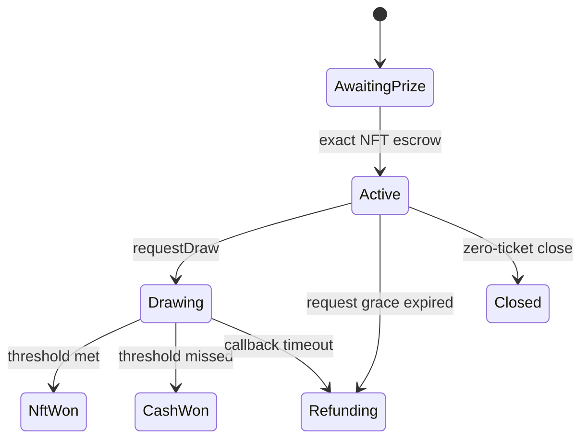

# raffle.fun

raffle.fun is an immutable NFT raffle protocol using factory-wide USDC and Pyth
Entropy v2. Each raffle escrows one ERC-721 prize, sells transferable ERC-721 tickets,
and settles through one of three simple bearer paths:

- burn the winning ticket for the NFT;
- burn the winning ticket for the cash fallback;
- burn refundable tickets for their exact purchase-price refunds.

There is no winner ownership snapshot and no ticket transfer freeze.

## Mechanics

1. A sponsor approves an NFT and calls `RaffleFactory.createRaffle`.
2. The factory constructor-deploys, registers, funds, and verifies a new independent
   `Raffle` atomically.
3. Buyers pay the factory-wide USDC token and receive sequential transferable tickets.
4. After the sale, anyone may pay Pyth Entropy's current fee to request the one draw.
5. The storage-only callback selects `(random % totalTickets) + 1` and records
   liabilities.
6. The current bearer burns the selected ticket for its NFT or cash award.

If nobody successfully requests randomness within three days of sale end, or an
accepted request receives no callback for two days, anyone calls `enableRefunds`.
Every current bearer can then burn up to 100 tickets per transaction for exact refunds.
No fee or sponsor proceeds are awarded on this failure path.

A zero-sale raffle can be closed by the sponsor before `endTime`, or by anyone at or
after `endTime`. The immutable sponsor recovery recipient then withdraws the NFT.

## One lifecycle enum



`Status` is both lifecycle and economic result. There is no second outcome enum.

## Economics

The displayed `ticketPrice` is the complete amount paid. A 5% fee is calculated once
from aggregate gross sales on every successful resolution—both NFT and cash outcomes:

```text
protocolFee      = floor(grossSales × 500 / 10_000)
distributablePot = grossSales − protocolFee
```

When the minimum-ticket threshold is met, the winning ticket redeems the NFT and the
sponsor receives the distributable pot. Below the threshold:

```text
winnerCash = floor(distributablePot × 8_000 / 10_000)
sponsorCash = distributablePot − winnerCash
```

The recovery recipient also withdraws the NFT in the cash branch. With 80 tickets at
1 USDC and a threshold of 100, treasury receives 4 USDC, the winning ticket redeems
60.80 USDC, and the sponsor receives 15.20 USDC plus the NFT.

The quote-token accounting identity is:

```text
accountedQuoteBalance
  = unsettledPot
  + remainingRefundLiability
  + winnerCashLiability
  + totalClaimableQuote
```

## Contracts

| Contract        | Purpose                                                        | Authority                                                                            |
| --------------- | -------------------------------------------------------------- | ------------------------------------------------------------------------------------ |
| `RaffleFactory` | deploys and atomically funds independent raffles               | two-step owner can pause future creation and set the treasury used by future raffles |
| `Raffle`        | prize escrow, ticket ERC-721, draw, liabilities, burns, claims | no administrator                                                                     |
| `RaffleLens`    | bounded registry-authenticated wallet views                    | read-only                                                                            |

The factory uses ordinary `CREATE`. There are no proxies, clones, initializers,
deterministic salts, address prediction, upgrades, settlement overrides, or broad
rescue functions.

Ticket transfers and fixed claimants reject known protocol destinations. A bounded
permissionless helper also recovers a ticket, quote claim, or prize right assigned to a
future code-less address that later becomes a registered raffle, but can pay only the
holding raffle's immutable recovery recipient. It is not an administrator rescue or
generic asset sweep.

Each factory has immutable `quoteToken`, `entropy`, and `callbackGasLimit` values.
Every existing raffle captures its treasury and all configuration permanently.

## Pyth Entropy v2

`requestDraw` refreshes the dynamic fee with `getFeeV2(callbackGasLimit)` and calls the
matching `requestV2(callbackGasLimit)` overload. The exact fee is forwarded; any
overpayment is returned immediately or the whole transaction reverts.

The callback authenticates Entropy, status, request-in-flight state, and sequence. It
performs bounded storage writes and no asset or user calls. Wrong, late, stale, and
duplicate callbacks are ignored. See [docs/RANDOMNESS.md](docs/RANDOMNESS.md) and the
[official Pyth request variants](https://docs.pyth.network/entropy/request-callback-variants).

## Bounds

| Bound                         |       Value |
| ----------------------------- | ----------: |
| tickets per purchase          |         100 |
| tickets per refund redemption |         100 |
| maximum start delay           |      7 days |
| maximum sale duration         |     30 days |
| request grace after sale      |      3 days |
| callback timeout              |      2 days |
| metadata URI                  | 2,048 bytes |
| lens batch                    |  64 raffles |

## Supported assets and limitations

The recovery guarantee assumes:

- an honest standards-compliant ERC-721 whose ownership and safe transfers remain
  available; and
- the configured exact-transfer, non-rebasing USDC whose transfers remain available.

Incoming and outgoing USDC operations verify balance deltas. Fee-on-transfer,
rebasing, frozen, or blacklisting tokens are unsupported.

No smart contract can guarantee recovery against a malicious or upgraded NFT, a
collection pause/burn/freeze/blacklist, a malicious or halted ERC-20, a stopped or
reorganized chain, lost keys, or unrelated NFTs forced in through unsafe
`transferFrom`. The protocol deliberately has no administrator rescue path for those
cases.

## Repository

```text
apps/web/             Next.js wallet UI and offline sandbox
packages/config/      chain and deployment records
packages/contracts/   Solidity contracts, deployment pipelines, tests
packages/sdk/         generated ABIs, actions, economics helpers
packages/subgraph/    GraphQL schema, mappings, Matchstick tests
deployments/          strictly validated deployment records
docs/                 architecture, economics, lifecycle, randomness, operations
```

## Toolchain

- Solidity `0.8.36`, exact pragma, Cancun target
- OpenZeppelin Contracts `5.6.1`
- Pyth Entropy Solidity SDK `2.2.1`
- Foundry plus Hardhat 3 / Viem
- Node `>=22.13 <23` and pnpm `11.18.0`

Solidity 0.8.36 is the latest stable compiler as of this review and its official
per-version bug list is empty; it also fixes the two medium-severity bugs present in
0.8.35. Cancun remains the deployment target because Base has supported its execution
features since Ecotone. OpenZeppelin 5.6.1 is pinned to the current stable audited tag
rather than the 5.7 release candidate, and Pyth Entropy SDK 2.2.1 is pinned to the
current published Solidity package.

Primary references: [Solidity 0.8.36 release](https://github.com/argotorg/solidity/releases/tag/v0.8.36),
[compiler bugs by version](https://github.com/argotorg/solidity/blob/develop/docs/bugs_by_version.json),
[Base Ecotone/Cancun support](https://docs.base.org/base-chain/specs/upgrades/ecotone/overview),
[OpenZeppelin releases](https://github.com/OpenZeppelin/openzeppelin-contracts/releases), and
[Pyth Entropy SDK package](https://www.npmjs.com/package/@pythnetwork/entropy-sdk-solidity).

Install with the frozen lockfile:

```bash
pnpm install --frozen-lockfile
git submodule update --init --recursive
```

Common validation commands:

```bash
pnpm format:check
pnpm lint
pnpm typecheck
pnpm build
pnpm test
pnpm contracts:coverage
pnpm contracts:gas
pnpm contracts:slither
```

Contract-specific commands:

```bash
pnpm --filter @raffle-fun/contracts test:foundry
pnpm --filter @raffle-fun/contracts test:hardhat
pnpm --filter @raffle-fun/contracts compile
pnpm --filter @raffle-fun/sdk sync:check
pnpm --filter @raffle-fun/subgraph codegen
pnpm --filter @raffle-fun/subgraph build
pnpm --filter @raffle-fun/subgraph test
```

Hardhat Ignition is the canonical deployment path. The Foundry script is an independent
constructor/state comparison. No public-network deployment is part of repository
validation. See [docs/DEPLOYMENT.md](docs/DEPLOYMENT.md).

## Security

The protocol has completed an internal adversarial hardening campaign and remains
independently unaudited. Fuzzing, invariants, differential models, mutation testing,
static analysis, fork checks, and integration tests are defense in depth, not proof of
production safety. See the [internal audit report](packages/contracts/audit/INTERNAL-AUDIT.md)
and [release checklist](packages/contracts/audit/RELEASE-CHECKLIST.md), and report
vulnerabilities privately as described in [SECURITY.md](SECURITY.md).
