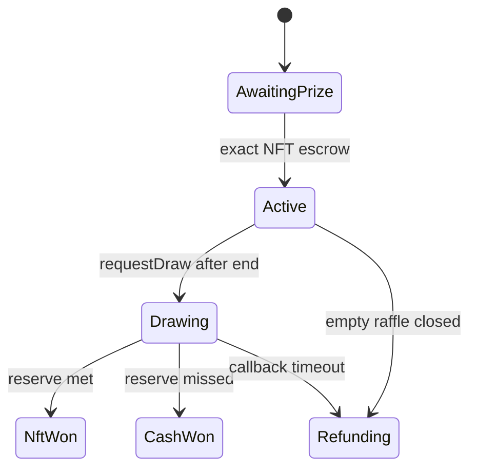

# raffle.fun

raffle.fun is an Ethereum NFT raffle protocol built around one-dollar USDC entries,
ERC-721 entry tickets, and Chainlink VRF v2.5. This repository contains the candidate
v1 protocol. It is not deployed and has not completed an independent audit.

## How it works

1. A sponsor approves an ERC-721 and calls `RaffleFactory.createRaffle` with an end
   time and a reserve expressed as a number of one-dollar entries.
2. The factory creates a fixed ERC-1167 clone, initializes and registers it, escrows
   the exact prize, and verifies the deposit atomically.
3. A buyer chooses any positive entry count, pays that many USDC, and receives one
   ERC-721 ticket containing a contiguous range of raffle numbers.
4. At the sale deadline, sales stop. Tickets remain transferable bearer claims. Anyone may then
   pay Chainlink's native direct-funding fee to request the one draw.
5. The authenticated callback records one winning entry. The ticket whose stored range
   contains that entry proves the winner without a search or per-entry storage.

A ticket receives a simple sequential ERC-721 ID, while its range is stored separately:

```text
ticket #3 -> { firstEntry: 34, lastEntry: 36 }
```

Buying 20 entries therefore mints one NFT covering 20 raffle numbers. Buying one
entry mints one NFT covering one number. There is no economic protocol cap and no
practical per-ticket cap; `uint128` is only the machine representation. Purchase,
draw, and winning-ticket verification remain O(1) regardless of entry count.

## Outcomes

Each entry costs exactly `1_000_000` raw units of the factory's immutable six-decimal
quote token: one USDC. The reserve is met when `totalEntries >= reserveEntries`, so
equality awards the NFT.

| Result           | Prize                                 | USDC pot                             |
| ---------------- | ------------------------------------- | ------------------------------------ |
| Reserve met      | winning ticket owner receives the NFT | 5% treasury, 95% sponsor             |
| Reserve missed   | sponsor receives the NFT back         | 5% treasury, 80% winner, 15% sponsor |
| Liveness failure | sponsor receives the NFT back         | every ticket refunds 100%            |

The fee is calculated once from the aggregate pot:

```text
protocolFee = floor(grossSales * 500 / 10_000)
netPot      = grossSales - protocolFee
```

The Chainlink callback only records the result and winning entry. Settlement later burns
the winning ticket and atomically allocates the pot. For an NFT result, the NFT goes to
the current ticket owner and 95% / 5% sponsor and protocol balances are recorded. For a
cash result, 80% goes directly to the current ticket owner, 15% is recorded for the
sponsor, 5% for the protocol, and the sponsor can independently recover the NFT.

Full refunds charge no fee. Refund execution is bounded by submitted tickets, not
their entry counts, and accepts at most 100 tickets per transaction.

The accounting identity is:

```text
accountedQuoteBalance
  = unsettledPot
  + remainingRefundLiability
  + sponsorProceeds
  + protocolFees
```

## Lifecycle



`Status` is the only lifecycle and outcome enum:

```text
AwaitingPrize, Active, Drawing, NftWon, CashWon, Refunding
```

An empty raffle enters `Refunding` with zero liability: the sponsor may do this before
the end, or anyone may do it at or after the end. Anyone can then return the NFT to the
immutable sponsor recipient.

A nonempty raffle never expires while waiting for someone to request randomness:
`requestDraw` remains callable after the sale until one request succeeds. After a request
is accepted, a fixed two-day callback deadline applies. If no valid callback arrives by
then, anyone may enable full refunds. At that boundary, a callback and refund transaction
can race; the first valid transaction included on Ethereum fixes the result. A valid
callback is final and never later changes into refunds.

## Settlement authority

An unburned ticket is a transferable bearer claim. Anyone may settle the winning ticket,
but the NFT or cash always goes to its current owner. The winning ticket is burned exactly
once. Refunds are owner-only, burn the submitted tickets, and always pay that owner.
Anyone may release sponsor proceeds, protocol fees, or the sponsor prize, but each release
always pays its immutable recipient.

NFT winner delivery deliberately uses ERC-721 `transferFrom`, followed by an
`ownerOf` postcondition, so a contract winner cannot veto fixed-owner settlement by
rejecting an ERC-721 receiver callback.

## Architecture and authority

| Contract        | Purpose                                                    | Authority                                     |
| --------------- | ---------------------------------------------------------- | --------------------------------------------- |
| `RaffleFactory` | creates and registers fixed-target ERC-1167 raffle clones  | two-step owner may pause only future creation |
| `Raffle`        | prize escrow, ticket ERC-721, draw, accounting, settlement | no administrator                              |

The factory's quote token, Chainlink wrapper, treasury, callback gas limit, request
confirmations, and implementation are immutable. Existing raffles have no owner,
upgrade path, mutable implementation pointer, settlement override, or generic rescue
function. Factory ownership cannot change an existing raffle.

The callback requests one word with a fixed 300,000 gas-unit limit and 30 confirmations.
That is an execution limit, not a gas-price cap: the native request quote changes with
gas prices. The callback performs bounded storage work only: no ticket loop, ERC-20 transfer, ERC-721
transfer, or user callback. Wrong, malformed, stale, synchronous, or duplicate
callbacks cannot settle a raffle.

See [architecture](docs/ARCHITECTURE.md), [lifecycle](docs/STATE-MACHINE.md),
[economics](docs/ECONOMICS.md), [randomness](docs/RANDOMNESS.md), and the
[threat model](docs/THREAT-MODEL.md).

## Supported assets and limitations

The production deployment must use official six-decimal USDC and the official
Ethereum Chainlink VRF v2.5 native direct-funding wrapper. The contracts verify exact
incoming and outgoing USDC balance deltas. Fee-on-transfer, rebasing, unavailable, or
otherwise non-exact quote tokens are unsupported.

Prize safety assumes an honest, standards-compliant ERC-721 whose `ownerOf` and
transfers remain available. A malicious or upgraded collection can lie, freeze, burn,
or refuse to move its NFT. A valid Chainlink result is final, so a broken prize contract
can block settlement; no contract can force a noncompliant NFT to leave escrow.

Chainlink VRF, Ethereum inclusion, USDC issuer controls, the prize collection, and
user key custody remain external dependencies. Thirty confirmations reduce reorg risk
but do not create an absolute economic guarantee for arbitrarily valuable prizes.
Chance-based prize distribution is regulated in many jurisdictions; legal review is
a separate release requirement.

## Repository

```text
apps/web/             Next.js wallet UI and offline sandbox
packages/config/      chain and validated deployment records
packages/contracts/   Solidity, deployment tooling, and security tests
packages/sdk/         generated ABIs, transaction actions, and math helpers
packages/subgraph/    range-ticket GraphQL indexing
deployments/          strict deployment-record schema
docs/                 protocol and operations documentation
```

## Toolchain and validation

- Solidity `0.8.36`, exact pragma, Cancun EVM target
- OpenZeppelin Contracts `5.6.1`
- Foundry plus Hardhat 3 / Viem
- Node `>=22.13 <23`, pnpm `11.18.0`

Install and validate with the frozen lockfile:

```bash
pnpm install --frozen-lockfile
git submodule update --init --recursive
pnpm format:check
pnpm lint
pnpm typecheck
pnpm build
pnpm test
pnpm contracts:coverage
pnpm contracts:gas
pnpm contracts:slither
```

Hardhat Ignition is the canonical deployment path; the Foundry script is an
independent comparison. No public-network deployment record is checked in. See the
[deployment runbook](docs/DEPLOYMENT.md), [monitoring specification](docs/MONITORING.md),
[incident-response runbook](docs/INCIDENT-RESPONSE.md), and
[Sepolia soak plan](docs/SEPOLIA-SOAK.md).

## Security status

The rewritten v1 is undergoing internal adversarial review and is not independently
audited or production-approved. Tests, fuzzing, stateful invariants, models, static
analysis, and fork checks are defense in depth, not proof of safety. Historical audit
reports apply only to the commits and architectures they name; they do not audit this
rewrite. Current release gates live in
[packages/contracts/audit/RELEASE-CHECKLIST.md](packages/contracts/audit/RELEASE-CHECKLIST.md).

Report vulnerabilities privately as described in [SECURITY.md](SECURITY.md).
