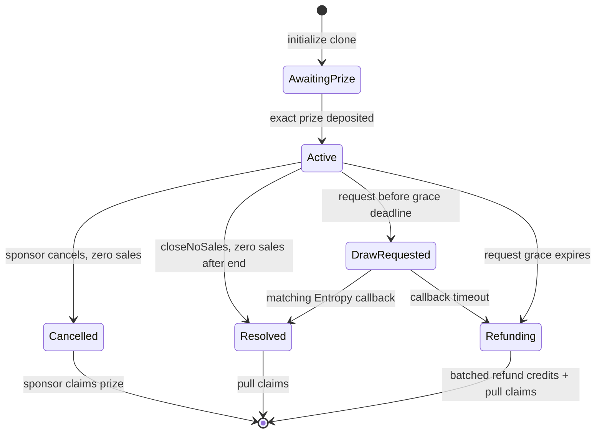
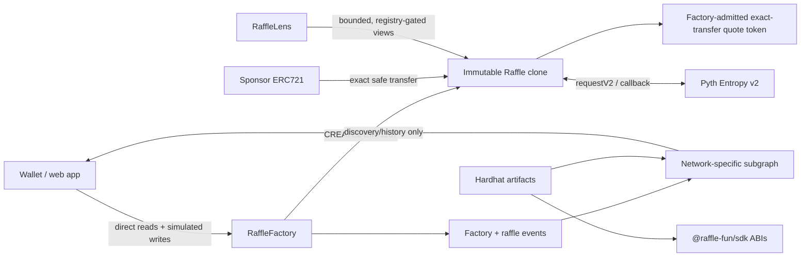
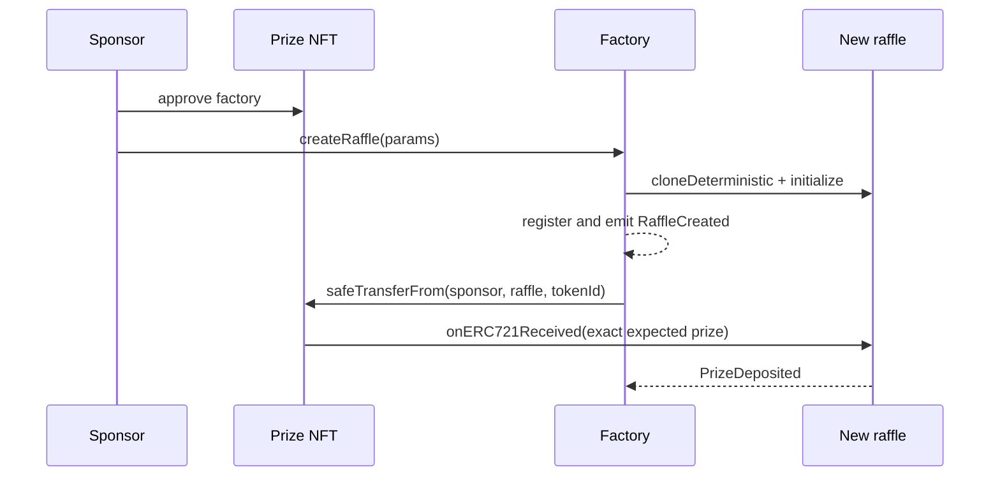
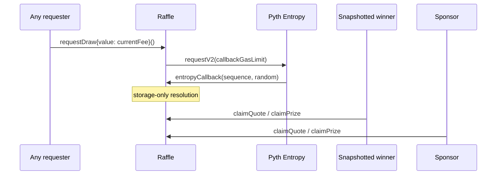

# raffle.fun

raffle.fun is a single-prize NFT raffle protocol for Base. A sponsor escrows one
ERC721 and selects a factory-verified exact-transfer ERC20 as the fixed payment token;
participants buy equal-chance ERC721 tickets. One Pyth Entropy v2 result selects the
winning ticket. The minimum-ticket threshold determines whether that winner receives
the NFT or a cash fallback. Fixed deadlines convert oracle liveness failure into exact
ticket-owner refunds and prize recovery.

> **Security status:** unaudited. The test suite, fuzzing, invariants, static analysis,
> and review in this repository are not an independent audit. Do not use this software
> with assets you cannot afford to lose.

Chance-based prize systems may require jurisdiction-specific legal review. This
software does not provide or claim regulatory compliance.

## Mechanic in plain language

1. A sponsor creates a non-upgradeable EIP-1167 raffle clone and deposits exactly one
   ERC721 prize.
2. During the inclusive `startTime` and exclusive `endTime`, buyers pay the advertised
   gross ticket price. Each ticket is a sequential ERC721 ID beginning at 1.
3. After the sale, anyone may pay the current Entropy fee to request the raffle's only
   random result before the fixed three-day request deadline.
4. The callback selects `(random % totalTickets) + 1`, snapshots that ticket's owner,
   chooses the economic branch, and creates pull claims. It transfers no asset.
5. If no request completes by that deadline, or an accepted request remains unresolved
   for two days, anyone opens deterministic refunds: no winner/fee/proceeds, exactly
   one ticket-price refund per sold ticket, and prize recovery.
6. Claimants independently pull quote tokens, excess native currency, and the prize.

## Roles

- **Sponsor:** owns and escrows the prize, fixes price/threshold/times and an immutable
  prize-recovery recipient, and receives sponsor-side normal settlement.
- **Buyer:** pays gross ticket cost; tickets may be minted to another recipient.
- **Ticket holder:** owns transferable odds before the draw request. The holder of the
  winning ticket at callback time is snapshotted as winner.
- **Protocol treasury:** receives the fixed 5% protocol fee when a raffle resolves.
- **Factory owner:** administers new creation, quote-token admission, and
  future treasury capture; it has no custody or settlement power over existing
  raffles.
- **Pyth Entropy:** supplies and replays the one requested random sequence.

## Outcomes

### Threshold met

`totalTickets >= minimumTickets`, including exact equality:

- winner claims the NFT;
- the protocol receives 5% of the gross pot;
- sponsor claims the remaining 95% distributable pot.

### Cash fallback

`totalTickets < minimumTickets`:

- the protocol receives 5% of the gross pot;
- winner claims `floor(distributablePot × 80%)`;
- sponsor claims the remainder and reclaims the NFT.

### No sales

After `endTime`, anyone calls `closeNoSales`; the fixed recovery recipient claims the
NFT and no quote claim is created. Before any sale, the sponsor may instead cancel.
Ticket 1 permanently removes that cancellation power.

### Failed draw and refunds

If no draw request successfully completes by `endTime + 3 days`, or no callback wins
by `drawRequestedAt + 2 days`, anyone enters `Refunding`. The fixed recovery recipient
claims the NFT. Permissionless batches of at most 100 ticket IDs credit exactly one
`ticketPrice` to each ticket's frozen owner. The protocol fee and sponsor proceeds are
zero. Uncredited tickets remain frozen; credited tickets may move as souvenirs.

## Fee model

All values use raw quote-token units and OpenZeppelin `Math.mulDiv`:

```text
purchase gross    = ticketPrice × quantity
gross pot         = sum of all purchase gross amounts
protocol fee      = floor(grossPot × 500 / 10,000)
distributable pot = grossPot − protocol fee
cash winner       = floor(distributablePot × 8,000 / 10,000)
sponsor cash      = distributablePot − cash winner
```

The displayed ticket price is the total paid. Purchases add their entire gross amount
to the unsettled pot. The single protocol fee is calculated once from the aggregate
pot at resolution, so fee rounding cannot be influenced by splitting purchases.

### Worked examples

With a gross price of 1 USDC:

| Scenario               |  Gross | Protocol | Distributable | Winner     | Sponsor          |
| ---------------------- | -----: | -------: | ------------: | ---------- | ---------------- |
| 120 sold / 100 minimum | 120.00 |     6.00 |        114.00 | NFT        | 114.00 USDC      |
| 80 sold / 100 minimum  |  80.00 |     4.00 |         76.00 | 60.80 USDC | NFT + 15.20 USDC |

The minimum is an outcome threshold, not a sales cap. The first example therefore
continues selling through the fixed closing time after ticket 100.

## Odds and transfers

Every ticket has equal probability. The last ticket is included and a one-ticket
raffle always selects ticket 1. `oddsFor(account)` returns
`ticketBalance × 1e18 / totalTickets`.

Tickets transfer normally while `Active` and freeze while `DrawRequested`. After a
failed draw, each ticket stays frozen until its refund is credited to its current
owner. Resolved or credited tickets may move as souvenirs without redirecting claims.

## State machine



Boundary details are in [docs/STATE-MACHINE.md](docs/STATE-MACHINE.md).

## Randomness

`requestDraw` reads `getFeeV2(callbackGasLimit)` and calls the matching
`requestV2(callbackGasLimit)` overload. State moves to `DrawRequested` before the
external oracle call. There is no second request, onchain fallback, block-derived
randomness, or admin-chosen result.

The callback:

- accepts only the configured Entropy contract through `IEntropyConsumer`;
- ignores stale, wrong-sequence, and duplicate callbacks without changing resolution;
- uses the inclusive ticket formula;
- performs bounded storage updates only;
- records the branch, amounts, claimant, winner, and ticket.

At the callback timeout boundary, callback and timeout are simultaneously valid; the
first included terminal transition wins and the other becomes harmless. Oracle
availability remains external until the deterministic failure deadline.
See [docs/RANDOMNESS.md](docs/RANDOMNESS.md).

## Architecture



### Contract map

| Contract        | Purpose                                                                      | Custody/admin                               |
| --------------- | ---------------------------------------------------------------------------- | ------------------------------------------- |
| `RaffleFactory` | Immutable implementation, clone registry, token admission, creation controls | Ownable2Step; never custodies raffle assets |
| `Raffle`        | Prize escrow, ticket ERC721, accounting, Entropy consumer, pull claims       | No admin, rescue, or upgrade path           |
| `RaffleLens`    | Bounded live views for registered clones                                     | Stateless and read-only                     |

More detail: [docs/ARCHITECTURE.md](docs/ARCHITECTURE.md).

## Creation, purchase, draw, and claim flows



```mermaid
sequenceDiagram
  participant B as Buyer
  participant Q as Quote token
  participant R as Raffle
  B->>Q: approve raffle (or wallet batch)
  B->>R: buyTickets(recipient, quantity)
  R->>R: validate live state and sale window
  R->>Q: safeTransferFrom gross once
  R->>R: verify exact balance delta
  R->>R: add gross to unsettled pot; mint sequential tickets
  R-->>B: TicketsPurchased + ERC721 Transfer events
```



## Monorepo

```text
apps/web              Next.js App Router product
packages/contracts    Canonical Solidity, Foundry, Hardhat, Ignition
packages/config       Chains, strict env schemas, deployment registry
packages/sdk          Generated ABIs, Viem actions, exact math
packages/subgraph     Factory + dynamic raffle indexing
deployments           Validated real deployments only
docs                  Architecture, economics, security, operations
```

Hardhat and Foundry compile the same `packages/contracts/src` tree. SDK and subgraph
ABIs are generated from Hardhat artifacts; `sync:check` fails on drift.

## Prerequisites and installation

- Node `22.13–22.x` (workspace toolchain: `22.23.2`)
- pnpm `11.18.0`
- Foundry (pinned in CI)
- Python 3 plus Slither for static analysis

```bash
corepack enable
corepack prepare pnpm@11.18.0 --activate
pnpm install --frozen-lockfile
```

The workspace rejects packages published in the last 24 hours and requires explicit
approval for dependency build scripts.

## Environment

Copy `apps/web/.env.example` for local web development. Supplied public values are
strictly validated. An unset subgraph or deployment produces an explicit disabled/
empty state, not placeholder data.

Production deployment requires:

```text
DEPLOYER_PRIVATE_KEY
VERIFIED_QUOTE_TOKENS (comma-separated for Foundry; an address array in Ignition)
ENTROPY
PROTOCOL_TREASURY
FACTORY_OWNER
BASE_SEPOLIA_RPC_URL or BASE_RPC_URL
BASESCAN_API_KEY (verification)
```

`FACTORY_OWNER` must be the configured Safe or multisig. Do not commit secrets.

## Build and test

```bash
pnpm build
pnpm lint
pnpm typecheck
pnpm test

pnpm contracts:build
pnpm contracts:test:foundry
pnpm contracts:test:hardhat
pnpm contracts:coverage
pnpm contracts:gas
pnpm contracts:slither

pnpm sdk:sync
pnpm subgraph:codegen
pnpm subgraph:build
pnpm subgraph:test
```

Foundry owns unit, fuzz, stateful invariant, and adversarial tests. The default profile
runs each fuzz case 1,000 times and each invariant 256 × 64 calls. CI raises these to
10,000 fuzz cases and 1,000 × 256 invariant calls. Hardhat 3 owns Ignition and
Viem-compatible end-to-end journeys.

Gas expectations are committed in `packages/contracts/.gas-snapshot`. Deployment
scripts, test-only mocks, and test handlers are excluded from the production coverage
metric; the checked-in gate enforces at least 95% lines and 90% branches. Coverage is
not a security proof.

## Subgraph development

One deployment indexes one network. `RaffleCreated` starts a dynamic template before
the same-transaction `PrizeDeposited` event.

```bash
pnpm subgraph:codegen
pnpm subgraph:build
pnpm subgraph:test
pnpm --filter @raffle-fun/subgraph manifest:base-sepolia
pnpm --filter @raffle-fun/subgraph deploy:local
pnpm --filter @raffle-fun/subgraph deploy:studio
```

Manifest generation refuses missing deployment JSON rather than inserting an address.
See [docs/SUBGRAPH.md](docs/SUBGRAPH.md).

## Web development

```bash
pnpm --filter @raffle-fun/web dev
pnpm --filter @raffle-fun/web test
pnpm --filter @raffle-fun/web build
```

Routes include discover, creation, raffle actions, profiles, protocol activity, and a
plain-language risk guide. Security-critical transaction arguments are re-read
onchain and every write is simulated. Indexed data is only discovery/history. See
[docs/WEBAPP.md](docs/WEBAPP.md).

## Deployment and verification

Ignition is the production source of truth. The Foundry script mirrors deployment for
local debugging and independent verification.

```bash
pnpm deploy:base-sepolia
pnpm verify:base-sepolia
pnpm --filter @raffle-fun/contracts deployment:write ./candidate.json
```

The writer validates schema, network identity, nonzero addresses, and bytecode before
creating `deployments/<chainId>.json`. Ownership transfer is started by Ignition and
must be accepted by the Safe. Mainnet is never deployed automatically. Follow
[docs/DEPLOYMENT.md](docs/DEPLOYMENT.md).

## Viem integration

```ts
import { createPublicClient, createWalletClient, http } from "viem";
import { baseSepolia } from "viem/chains";
import {
  buyTickets,
  calculatePurchaseAmounts,
  getProtocolContracts,
} from "@raffle-fun/sdk";

const publicClient = createPublicClient({
  chain: baseSepolia,
  transport: http(process.env.BASE_SEPOLIA_RPC_URL),
});
const contracts = getProtocolContracts(baseSepolia.id); // throws if undeployed
const amounts = calculatePurchaseAmounts({
  ticketPrice: 1_000_000n,
  quantity: 2n,
});

await buyTickets(
  { publicClient, walletClient, account },
  raffleAddress,
  account,
  2n,
); // helper simulates before writing
```

## Events and indexed data

Stable factory/raffle events include token-verification updates, creation, prize
deposit, aggregate purchase, draw request, callback ignored, resolution,
cancellation/no-sales, draw failure, per-ticket refund credit, quote/native claims,
prize claim, and standard ticket `Transfer`. The subgraph reconstructs deadlines,
refund liabilities and owners, normal/failure outcomes, claims, transfers, and
per-token aggregates without unbounded entity arrays.

## Admin powers and limitations

The factory owner can:

- change the treasury captured by **new** raffles;
- admit or remove up to 32 quote tokens for future raffle creation;
- pause **new creation**;
- transfer two-step factory ownership.

The factory owner cannot:

- change an existing raffle's price, threshold, window, fees, or split;
- cancel after a sale, select/replace a winner, or request a second result;
- seize a prize, unsettled pot, fee, refund, or user claim;
- upgrade a clone or pause an existing raffle/claim.

## Trust assumptions, known risks, and non-goals

- Entropy supplies the normal result, but a missing request or callback reaches a
  deterministic refund path after fixed deadlines.
- Only factory-admitted exact-transfer, non-rebasing quote tokens are supported.
  Issuer pause, blacklist, upgrade, or freeze controls remain residual risks; exact
  inbound/outbound delta checks reject taxed behavior without curing issuer control.
- Prize contracts and metadata may be malicious, mutable, or counterfeit.
- Users evaluate sponsor, authenticity, price, and threshold.
- The subgraph may lag; the chain is authoritative.
- v1 supports one ERC721 prize and one immutable quote token per raffle. Admission
  changes apply only to future creation and never mutate existing liabilities.
- There is a bounded failed-draw refund branch, but no arbitrary proceeds recipient,
  public burn, custody multicall, upgradeability, or owner rescue.

Read [docs/THREAT-MODEL.md](docs/THREAT-MODEL.md) before deployment.

## Deployed addresses

No Base Sepolia or Base deployment is recorded. This repository intentionally contains
no zero, stale, or guessed addresses. A verified deployment JSON and smoke test are
required before the web app enables transactions.

## Contributing and security

See [CONTRIBUTING.md](CONTRIBUTING.md) for development requirements and
[SECURITY.md](SECURITY.md) for private disclosure. Public issue trackers are not
appropriate for unpatched vulnerabilities.

## License

MIT — see [LICENSE](LICENSE).
