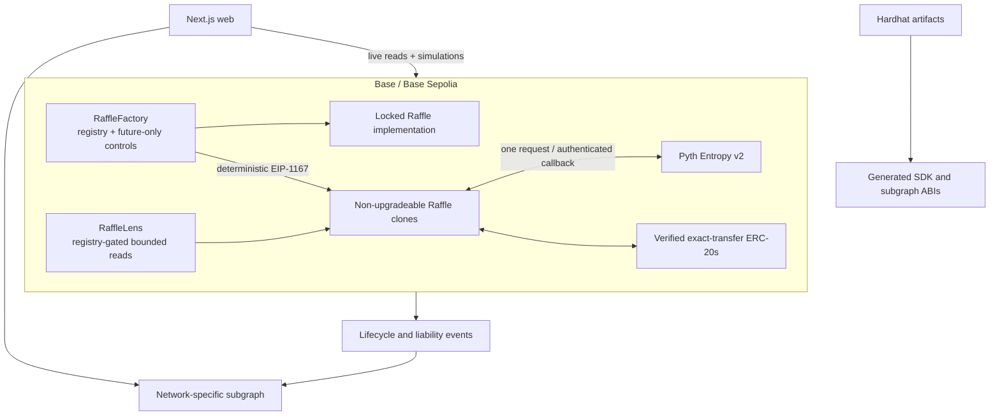

# Architecture

## System boundary

raffle.fun isolates every prize and accounting domain in a non-upgradeable EIP-1167
clone. The factory creates and registers clones but never custodies raffle assets.
The lens is read-only, and the subgraph is discovery infrastructure rather than a
source of transaction authority.



## Factory and atomic escrow

`RaffleFactory` deploys one implementation whose constructor disables initializers.
Creation validates code, ERC-165/ERC-721 support, a currently verified quote token,
economics, metadata bounds, and timing. New sales may start at most 7 days ahead and
last at most 30 days. A zero recovery recipient defaults to the sponsor.

The factory clones and initializes, registers and emits, then transfers the exact NFT
with `safeTransferFrom`. The clone receiver requires the configured NFT contract,
token ID, sponsor as `from`, factory as `operator`, and `AwaitingPrize` state. The
factory finally checks `Active` and `ownerOf(tokenId) == clone`. Any failure reverts
the entire transaction, including clone creation, registration, and events.

`Ownable2Step` controls only future creation pause, treasury, and the bounded verified
token registry. Delisting does not change an existing clone. No clone has an admin,
proxy, upgrade, settlement override, rescue function, or arbitrary call path.

## Clone initialization and storage

The clone uses `ERC721Upgradeable` because ticket name/symbol require an initializer.
The implementation address is embedded immutably; `initialize` accepts only a factory
whose `raffleImplementation()` equals that address. Initializable prevents a second
call.

OpenZeppelin Contracts 5.6.1 `ReentrancyGuard` is safe with fresh zeroed clone storage:
only status `2` means entered, and the first successful guarded call normalizes zero to
the standard status `1`. This is an exact-version storage assumption. Clones are not
upgradeable, so no later layout is installed over this storage.

## Accounting

For supported exact-transfer, non-rebasing quote tokens:

```text
accountedQuoteBalance =
    unsettledPot
  + uncreditedRefundLiability
  + totalClaimableQuote

quoteToken.balanceOf(raffle) >= accountedQuoteBalance
```

Purchases verify the exact inbound balance increase. Claims clear liability before
interaction and verify both the raffle debit and recipient credit; failure reverts and
restores the claim. Settlement moves the complete pot into normal claims or the
complete gross pot into refund liability. Direct token/native donations are reported
as surplus and never alter a claimant's amount.

Refund entitlement is bound to `ownerOf(ticketId)` while the ticket is frozen in
`Refunding`. Permissionless batches of at most 100 tickets move value from uncredited
liability to that owner's pull claim without an external call. A credited ticket may
then move as a souvenir.

## Read and index boundaries

`RaffleLens` checks factory registration before raffle calls, caps batches at 100, and
reports deadlines, available transitions, all aggregate liabilities, claimant state,
and entropy-fee availability. An oracle fee read failure does not hide timeout/refund
recovery data.

The subgraph indexes factory admission, requests, both success branches, both failure
branches, per-ticket refund ownership, claims, and token-partitioned aggregates. The
web rereads live chain state and simulates immediately before writes; indexed state is
never a security-critical transaction argument.

## Versioning

Protocol changes require a new implementation and factory. Existing clones continue
with their fixed code and configuration. A deployment record binds the app/indexer to
specific implementation, factory, lens, oracle, treasury, token allowlist, source
commit, and compiler output.
