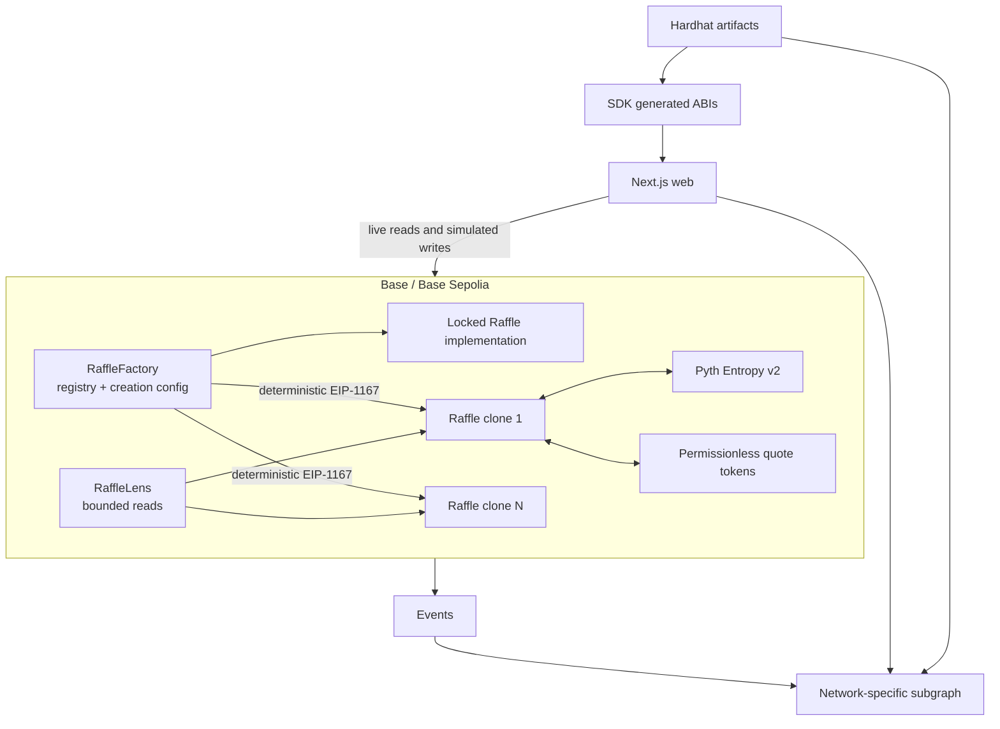

# Architecture

## Design goals

Raffle Fun isolates each prize and accounting domain in a non-upgradeable clone. The
factory is a registry/configuration boundary, not a custodian. Oracle callbacks only
create storage claims. Discovery infrastructure can fail without changing settlement.



## Factory

`RaffleFactory` deploys one locked implementation and deterministic EIP-1167 clones.
Creation validates prize and quote-token code, ERC165 support, economics, timing,
treasury, and Entropy. It does not gate the selected quote token on verification. It
registers the clone and emits `RaffleCreated` before transferring the prize, enabling
same-transaction dynamic indexing. If escrow fails, the complete transaction—including
registration and event—reverts.

The owner uses `Ownable2Step`. Creation pause, provider allowlist, quote-token
verification, and future treasury changes cannot mutate existing clones. The
verification registry is bounded to 32 unique tokens and retains stable enumeration
indices. Verification is a discovery/reputation signal only: removing it hides a
token from official public listings but never blocks creation or interaction.

## Raffle clone

The clone uses `ERC721Upgradeable` for initializer-compatible ticket metadata and the
OpenZeppelin namespaced-storage `ReentrancyGuard`. OpenZeppelin Contracts Upgradeable
5.6.1 does not ship a separate `ReentrancyGuardUpgradeable`; the base guard is
clone-safe because zero is accepted as the initial non-entered state and the first
guarded call writes the standard entered/not-entered values. The clone has no UUPS,
beacon, admin, upgrade, or rescue interface.

Every clone captures sponsor, treasury, tokens, oracle, fee constants, threshold, and
times at initialization. The expected NFT receiver condition binds token contract,
token ID, sponsor, factory operator, and `AwaitingPrize` state.

## Accounting

The quote-token invariant is:

```text
contract balance >= netPot + totalClaimableQuote
```

Purchases verify exact balance delta, rejecting transfer-tax/rebasing behavior during
the pull. Direct donations are observable surplus and never implicit settlement.
Allocation sets `netPot` to zero while increasing claims by exactly the same amount.
Claims clear storage and reduce `totalClaimableQuote` before external transfer.

## Read and indexing boundaries

`RaffleLens` checks factory registration before any candidate call and caps batches at 100. It holds and forwards no assets.

The subgraph handles ownership discovery, verification state, lists, history, and
per-token financial aggregates. It never adds amounts denominated in different
ERC20s. It uses factory-created dynamic data sources and idempotent event IDs. Public
discovery and activity show verified-token raffles by default; profiles and direct
links preserve canonical unverified raffles with warnings. The web reads the lens and
factory immediately before each write; indexed state never supplies a security-critical
transaction argument.

## Versioning

A protocol change deploys a new implementation and factory. Existing clones continue
unchanged. Deployment JSON connects a versioned application/index to a concrete
factory, lens, initial verified-token registry, oracle, source commit, and owner.
