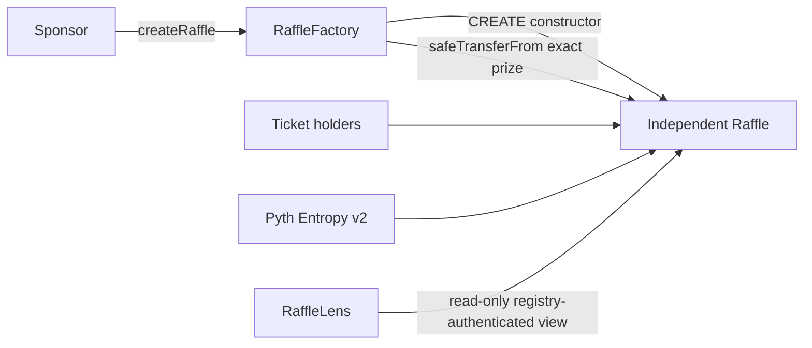

# Architecture

The protocol has three production contracts:



## Constructor-deployed raffles

`RaffleFactory` uses ordinary `CREATE`; it does not use clones, initializers, proxies,
or deterministic addresses. Each raffle receives all dependencies and configuration in
its constructor. The constructor authenticates `msg.sender == factory` and begins in
`AwaitingPrize`.

The factory registers the new address, emits `RaffleCreated`, and transfers the exact
ERC-721 prize in the same transaction. The raffle receiver checks token contract,
token ID, sponsor, operator, and status. The factory then verifies `ownerOf` and
`Active`. Any failure reverts deployment, registry updates, events, and escrow.

## Factory authority

Every factory has one immutable USDC token, Pyth Entropy v2 address, and callback gas
limit. `Ownable2Step` administration can only pause future creation and select the
treasury captured by future raffles. It cannot alter existing raffles, replace their
dependencies, change a recipient, choose a winner, or rescue their assets.

`createRaffle` bounds start delay to seven days, sale duration to 30 days, ticket price
and threshold to positive values, and metadata to 2,048 bytes. A zero recovery
recipient defaults to the sponsor.

## Settlement

Tickets are ordinary ERC-721 bearer claims. They never freeze. A successful draw stores
only the winning ticket ID and liabilities. The current ticket owner burns that ticket
for its NFT or cash. In `Refunding`, current owners burn bounded batches for exact
refunds. Sponsor and treasury cash remain pull claims so one recipient cannot block
another.

Known protocol contracts cannot receive tickets or be selected as new fixed claimants.
A permissionless bounded helper handles the narrower future-address case where a
ticket, quote claim, or prize right reached a code-less address before it became a
registered raffle. The helper exposes only four fixed claim kinds, targets only a
registered raffle, and pays only the holding raffle's immutable recovery recipient, so
it cannot be used as an arbitrary call or asset sweep.

The only quote accounting identity is:

```text
accountedQuoteBalance
  = unsettledPot
  + remainingRefundLiability
  + winnerCashLiability
  + totalClaimableQuote
```

## Read and indexing layers

`RaffleLens` is stateless and authenticates every raffle through the factory registry.
It returns the one status, four liabilities, current bearer ownership, deadlines,
dynamic Entropy fee, and account-specific actions. Its batch is capped at 64.

SDK and subgraph ABIs are generated from Hardhat artifacts. The subgraph mirrors status
and liabilities but is never authoritative for transactions; the web re-reads the lens
before every action.
