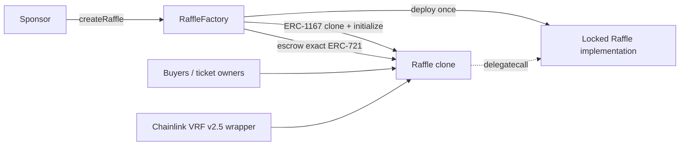

# Architecture

The v1 protocol has two production contracts:



## Fixed-target clones

Each factory constructor deploys one full `Raffle` implementation. Its initializer
is locked in constructor storage. Every canonical raffle is a standard ERC-1167
minimal proxy whose 45-byte runtime permanently names that implementation. There is
no proxy administrator, implementation setter, beacon, CREATE2 salt, or upgrade path.

The implementation holds immutable references to the factory's quote token, Chainlink
wrapper, and factory address. Each clone holds isolated raffle configuration,
ERC-721 ownership and liabilities.

`createRaffle` is one atomic transaction:

1. validate the prize, positive reserve, and sale deadline;
2. create the clone;
3. call its factory-only, one-time initializer;
4. register its address and ID;
5. move the exact prize from sponsor to clone;
6. verify `ownerOf(prizeTokenId) == raffle` and `status == Active`.

Any failure rolls back the clone, registry, event logs, and prize movement.

## Range tickets

One purchase mints one ERC-721 ticket with a simple sequential ID. Its inclusive entry
range is stored separately:

```text
ticket #3 -> { firstEntry: 34, lastEntry: 36 }
```

Ranges are contiguous and non-overlapping because each new range starts at
`totalEntries + 1`. One compact range mapping exists, but no per-entry owner mapping.
The ERC-721 owner of the one ticket containing `winningEntry` owns the outcome.

| Operation                    | Complexity                       |
| ---------------------------- | -------------------------------- |
| buy any positive entry count | O(1)                             |
| Chainlink callback           | O(1)                             |
| prove and settle winner      | O(1)                             |
| refund                       | O(tickets supplied), maximum 100 |

## Authority

The factory has an OpenZeppelin two-step owner. That owner may set only
`creationPaused`, affecting future clones. The factory's quote token, Chainlink
wrapper, treasury, callback gas, confirmation count, and implementation are immutable.
`renounceOwnership` is disabled so a paused factory cannot be permanently stranded.

A raffle has no owner, role, pause, rescue, reroll, or configuration setter. Its
sponsor is only a fixed prize/proceeds claimant. Neither sponsor nor factory owner can
choose a winner, cancel a sold raffle, or redirect another account's assets.

## Custody and accounting

Each clone escrows exactly one configured ERC-721 and only its own USDC pot. It does
not share balances or mutable state with another raffle. Quote liabilities obey:

```text
accountedQuoteBalance
  = unsettledPot
  + remainingRefundLiability
  + winnerProceeds
  + sponsorProceeds
  + protocolFees
```

Incoming and outgoing USDC balance deltas must match exactly. Known protocol
destinations are rejected for tickets and payouts. Arbitrary future addresses and
unrelated contracts cannot be proven safe onchain and remain user/deployment risks.

The Chainlink callback authenticates the immutable wrapper and performs storage work
only. Winning-ticket settlement also performs storage work only: it snapshots the
bearer, burns the ticket, and records isolated winner, sponsor, and protocol claims.
ERC-20 transfers, ERC-721 delivery, and refunds occur later in independent
non-reentrant calls, so one failed recipient cannot roll back another recipient's claim.

Liveness is bounded by two hard, non-overlapping time windows. A sold raffle accepts a
draw request in `[endTime, drawRequestDeadline())`, with refunds available at the
request deadline if no request succeeded. An accepted request resolves only through an
authenticated, ABI-decodable callback included before `callbackDeadline()`; at and
after that deadline the callback is ignored and refunds are available. A request at the
last valid second therefore places the last nominal boundary almost four days after
sale end. Censorship or a reorganization across either cutoff can force refunds.

## Offchain layers

Hardhat artifacts generate the SDK and subgraph ABIs. The subgraph stores one
`Ticket` entity per purchase, never one entity per entry. The web uses indexed data
for discovery but re-reads each raffle directly for transaction decisions; there is
no production Lens contract.
