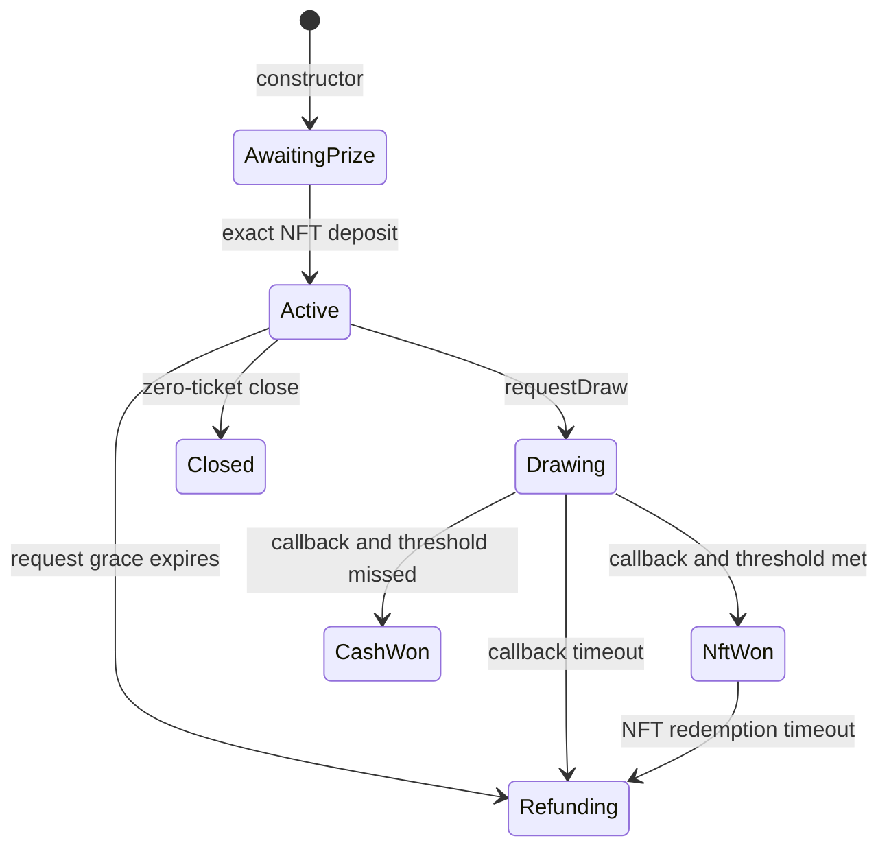

# Lifecycle

`IRaffle.Status` is the only lifecycle and outcome representation.

| Status          | Meaning                                                           | Available terminal asset paths                                                    |
| --------------- | ----------------------------------------------------------------- | --------------------------------------------------------------------------------- |
| `AwaitingPrize` | Constructor deployment exists only inside the factory transaction | exact factory-operated deposit or whole transaction reverts                       |
| `Active`        | Tickets may be purchased during the configured window             | draw, refund enablement after grace, or empty close                               |
| `Drawing`       | One Pyth Entropy v2 sequence is pending                           | matching callback or permissionless timeout refund                                |
| `NftWon`        | A request-time ticket was selected above the threshold            | its fixed owner burns it for the NFT, or all tickets refund after 30 days         |
| `CashWon`       | A winning ticket was selected below the threshold                 | its current owner burns it for cash; recovery recipient claims NFT                |
| `Refunding`     | Oracle liveness deadline expired                                  | each current owner burns tickets for exact refunds; recovery recipient claims NFT |
| `Closed`        | Zero tickets sold and no draw exists                              | recovery recipient claims NFT                                                     |

All transfers freeze in `Drawing`, fixing ownership before the provider can know the
winner. The selected ticket stays locked in `NftWon` or `CashWon`; nonwinning tickets
may move. Refund tickets are transferable again in `Refunding`. Approval is not enough
to redeem: the caller must be the actual owner.

Ticket and payout destinations reject the ticket's own raffle, its factory, quote
token, Entropy contract, configured prize contract, and every registered sibling
raffle. Future code-less addresses remain an explicit unsupported destination risk;
there is no cross-raffle claim dispatcher whose address can be captured through
permissionless factory creation.

`Closed` is reached by `closeEmptyRaffle`. Before `endTime`, only the sponsor may call
it. At or after `endTime`, anyone may call it. The immutable
`sponsorPrizeRecoveryRecipient` performs the later NFT withdrawal.

`enableRefunds` covers both oracle failures. From `Active`, it becomes callable at
`endTime + 3 days` when no request succeeded. From `Drawing`, it becomes callable two
days after the accepted request. From an unredeemed `NftWon`, it becomes callable 30
days after resolution while the full gross pot is still escrowed. A callback and its
two-day timeout transaction can both be valid at the boundary; the first included
transition wins and the other becomes harmless.
