# State machine

```mermaid
stateDiagram-v2
  [*] --> Uninitialized
  Uninitialized --> AwaitingPrize: factory initialize
  AwaitingPrize --> Active: exact ERC721 callback
  Active --> Cancelled: sponsor cancel; totalTickets == 0
  Active --> Resolved: closeNoSales; now >= end; totalTickets == 0
  Active --> DrawRequested: requestDraw; now >= end; totalTickets > 0
  DrawRequested --> Resolved: matching Entropy sequence
```

| State               | Purchases | Ticket transfers  | Draw                          | Claims                      |
| ------------------- | --------- | ----------------- | ----------------------------- | --------------------------- |
| AwaitingPrize       | no        | no minted supply  | no                            | no                          |
| Active before start | no        | yes               | no                            | accrued fees can be claimed |
| Active sale window  | yes       | yes               | no                            | accrued fees can be claimed |
| Active after end    | no        | yes until request | one request or no-sales close | accrued fees                |
| DrawRequested       | no        | frozen            | no second request             | accrued fees/native refund  |
| Resolved            | no        | yes as souvenirs  | no                            | assigned quote/prize/native |
| Cancelled           | no        | no sold tickets   | no                            | sponsor prize/native        |

## Time boundaries

- `startTime` is inclusive.
- `endTime` is exclusive for purchases.
- draw/no-sales closure begins at `block.timestamp >= endTime`.
- a requested draw cannot be displaced by cancellation or no-sales closure.

## Monotonicity

No path returns to `Active`, resets the sequence, clears a winner, or changes the
outcome. Stale/wrong/duplicate callbacks emit `CallbackIgnored` and return. Claims
only decrease the caller's accrual or mark the one prize transfer; they cannot mutate
winner, ticket, state, outcome, or branch amounts.

## Prize paths

Before resolution the exact configured prize must remain owned by the clone. A
terminal transition sets `prizeClaimant` in storage:

- NFT outcome → snapshotted winner;
- cash fallback → sponsor;
- no sales → sponsor;
- cancelled before sale → sponsor.

Only that claimant calls `claimPrize(to)`. Marking occurs before `safeTransferFrom`;
a receiver revert rolls back the mark and permits a different destination retry.
