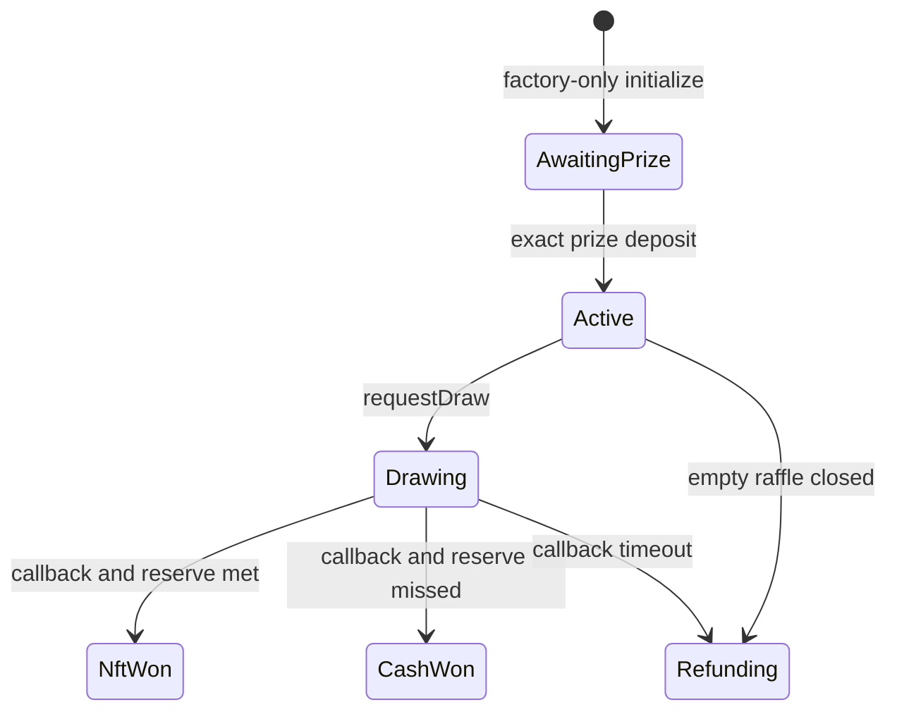

# Lifecycle

`IRaffle.Status` is the only lifecycle and economic-result representation.

| Status          | Meaning                                            | Available progress                                               |
| --------------- | -------------------------------------------------- | ---------------------------------------------------------------- |
| `AwaitingPrize` | clone initialized inside creation                  | exact factory-operated prize deposit; otherwise creation reverts |
| `Active`        | prize escrowed; purchases allowed before `endTime` | purchase, draw after end, or close an empty raffle               |
| `Drawing`       | one Chainlink request accepted                     | matching callback or callback-timeout refunds                    |
| `NftWon`        | reserve met; winning entry recorded                | settle ticket, then release sponsor/protocol balances            |
| `CashWon`       | reserve missed; winning entry recorded             | settle ticket; independently return sponsor prize                |
| `Refunding`     | full-refund or empty-raffle result                 | ticket refunds and sponsor prize return                          |

There is no separate `Closed` or `Completed` state. One-time burns,
`prizeClaimed`, and zeroed liabilities record consumption while preserving the
economic result.

## Sale and bearer ownership

Purchases require `status == Active` and `block.timestamp < endTime`. The end is
exclusive. An unburned ticket remains transferable in every status. Approvals do not
authorize settlement: ownership is read from `ownerOf(ticketId)` at execution time.
If a transfer and claim compete, normal Ethereum transaction ordering decides which
valid action executes first.

## Draw request

`requestDraw` requires:

- `status == Active`;
- at least one entry;
- `block.timestamp >= endTime`;
- enough ETH for the current native Chainlink fee.

The call records `Drawing` before contacting the wrapper and stores exactly one
request ID. It cannot be rerun. There is no post-sale request deadline: a nonempty
raffle remains `Active` until someone successfully pays Chainlink and moves it forward.

## Refund transitions

`enableRefunds` has one oracle-liveness branch plus the empty case:

- accepted request, no result: at `drawRequestedAt + 2 days`;
- zero sales: sponsor before end, anyone at or after end.

Every nonempty transition moves the entire `unsettledPot` to
`remainingRefundLiability`; it never creates a fee. The empty transition has zero
liability.

Callbacks do not reject only because the callback deadline has passed. At the boundary,
fulfillment and `enableRefunds` race; the first included valid transition wins and makes
the other invalid. Once a valid callback records `NftWon` or `CashWon`, refunds can never
be enabled.

Both resolved statuses are final. Settlement pays an 80% cash winner in `CashWon` or
delivers the NFT in `NftWon`, while recording the fixed sponsor and protocol balances.

## Consumption

The winning ticket is burned after its range proves `winningEntry`. NFT and cash
settlement are permissionless and always pay the current owner. Refund calls burn one
to 100 caller-owned tickets and pay their aggregate entry value to that owner. Sponsor
proceeds, protocol fees, and sponsor prize return are independent fixed-recipient
releases that anyone may execute.
