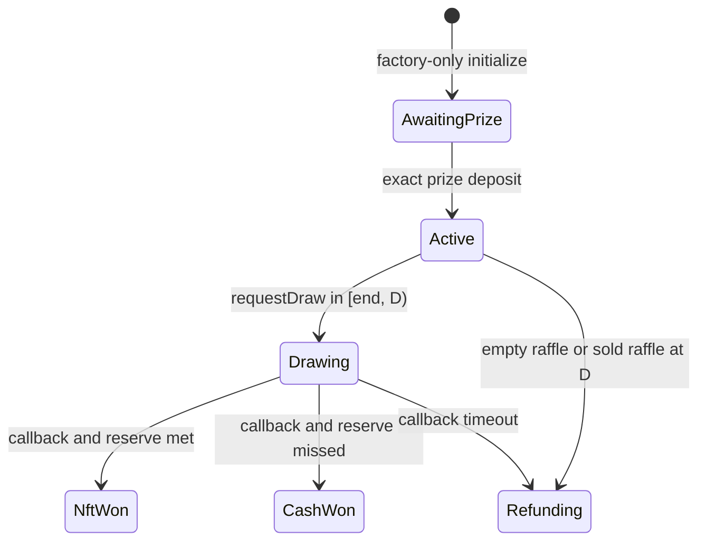

# Lifecycle

`IRaffle.Status` is the only lifecycle and economic-result representation.

| Status          | Meaning                                            | Available progress                                               |
| --------------- | -------------------------------------------------- | ---------------------------------------------------------------- |
| `AwaitingPrize` | clone initialized inside creation                  | exact factory-operated prize deposit; otherwise creation reverts |
| `Active`        | prize escrowed; purchases allowed before `endTime` | purchase; bounded draw request; or deadline-based refunds        |
| `Drawing`       | one Chainlink request accepted                     | matching callback or callback-timeout refunds                    |
| `NftWon`        | reserve met; winning entry recorded                | settle ticket; independently release winner NFT and quote claims |
| `CashWon`       | reserve missed; winning entry recorded             | settle ticket; independently release all claims and sponsor NFT  |
| `Refunding`     | full-refund or empty-raffle result                 | ticket refunds and sponsor prize return                          |

There is no separate `Closed` or `Completed` state. One-time burns,
`prizeClaimed`, and zeroed liabilities record consumption while preserving the
economic result.

## Sale and bearer ownership

Purchases require `status == Active` and `block.timestamp < endTime`. The end is
exclusive. An unburned ticket remains transferable in every status. Approvals do not
authorize settlement: ownership is read from `ownerOf(ticketId)` at execution time.
If a transfer and claim compete, normal Ethereum transaction ordering decides which
valid action executes first.

## Draw request

`requestDraw` requires:

- `status == Active`;
- at least one entry;
- `block.timestamp >= endTime`;
- `block.timestamp < drawRequestDeadline()`;
- enough ETH for the current native Chainlink fee.

The call records `Drawing` before contacting the wrapper and stores exactly one
request ID. It cannot be rerun. The request deadline is
`D = drawRequestDeadline() = endTime + 2 days`: the request window is exactly
`[endTime, D)`. At `D`, `requestDraw` is no longer valid and a sold raffle that remains
`Active` can be moved to `Refunding` by anyone.

## Refund transitions

`enableRefunds` has two oracle-liveness branches plus the empty case:

- sold `Active` raffle, no accepted request: at `drawRequestDeadline()`;
- accepted request, no result: at `C = callbackDeadline() = drawRequestedAt + 2 days`;
- zero sales: sponsor before end, anyone at or after end.

Every nonempty transition moves the entire `unsettledPot` to
`remainingRefundLiability`; it never creates a fee. The empty transition has zero
liability.

The callback window is half-open: a wrapper-authenticated, ABI-decodable callback may
resolve only while `block.timestamp < C`. At `C` and afterward, the callback is ignored
even if the raffle is still `Drawing`, while `enableRefunds` is valid. There is no
callback/refund equality race. Once an earlier valid callback records `NftWon` or
`CashWon`, refunds can never be enabled.

A request at `D - 1` creates a callback deadline at `D - 1 + 2 days`, so the maximum
nominal path from sale end to a successful result or permissionless refund eligibility
is just under four days. A deadline makes the transition eligible; it does not execute
the transition automatically.

Both resolved statuses are final. Settlement snapshots the current winner, burns the
winning ticket, and records the 80% cash claim in `CashWon` or fixed NFT claim in
`NftWon`, plus sponsor and protocol balances. Settlement transfers no external asset.

## Consumption

The winning ticket is burned after its range proves `winningEntry`. Settlement and all
winner, sponsor, and protocol releases are permissionless, but always target their fixed
recorded recipient. Refund calls burn one to 100 caller-owned tickets and pay their
aggregate entry value to that owner. A failed release affects only its own claim.
