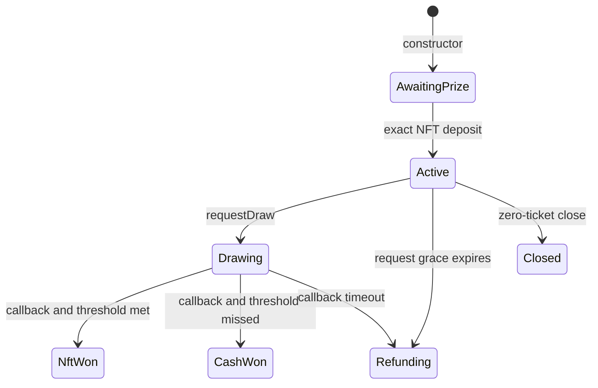

# Lifecycle

`IRaffle.Status` is the only lifecycle and outcome representation.

| Status          | Meaning                                                           | Available terminal asset paths                                                    |
| --------------- | ----------------------------------------------------------------- | --------------------------------------------------------------------------------- |
| `AwaitingPrize` | Constructor deployment exists only inside the factory transaction | exact factory-operated deposit or whole transaction reverts                       |
| `Active`        | Tickets may be purchased during the configured window             | draw, refund enablement after grace, or empty close                               |
| `Drawing`       | One Pyth Entropy v2 sequence is pending                           | matching callback or permissionless timeout refund                                |
| `NftWon`        | A winning ticket was selected above the threshold                 | its current owner burns it for the NFT                                            |
| `CashWon`       | A winning ticket was selected below the threshold                 | its current owner burns it for cash; recovery recipient claims NFT                |
| `Refunding`     | Oracle liveness deadline expired                                  | each current owner burns tickets for exact refunds; recovery recipient claims NFT |
| `Closed`        | Zero tickets sold and no draw exists                              | recovery recipient claims NFT                                                     |

There is no transfer freeze and no ownership snapshot. A ticket is the bearer claim:
ownership immediately before its burn determines who may redeem it. Approval is not
enough; the caller must be the actual owner. A successful external transfer and its
burn are atomic, so a rejected destination restores both ticket ownership and the
liability.

Ticket transfers reject the ticket's own raffle, its factory, quote token, Entropy
contract, configured prize contract, and every registered sibling raffle. If a ticket
was sent to a code-less address before that address later became a registered raffle,
anyone may call the holding raffle's `recoverProtocolOwnedClaim` helper. It can target
only a registered raffle, selects only a winning ticket, bounded refund tickets, an
ordinary quote claim, or a sponsor prize, and sends the recovered asset only to the
holding raffle's immutable recovery recipient. It is not a generic rescue or redirect.

`Closed` is reached by `closeEmptyRaffle`. Before `endTime`, only the sponsor may call
it. At or after `endTime`, anyone may call it. The immutable
`sponsorPrizeRecoveryRecipient` performs the later NFT withdrawal.

`enableRefunds` covers both oracle failures. From `Active`, it becomes callable at
`endTime + 3 days` when no request succeeded. From `Drawing`, it becomes callable two
days after the accepted request. A callback and timeout transaction can both be valid
at the boundary; the first included transition wins and the other becomes harmless.
