# State machine

```mermaid
stateDiagram-v2
  [*] --> AwaitingPrize: factory initialize
  AwaitingPrize --> Active: exact prize escrow verified
  Active --> Cancelled: sponsor cancel; zero sales
  Active --> Resolved: closeNoSales; zero sales after end
  Active --> DrawRequested: request before grace deadline
  Active --> Refunding: grace deadline; request never completed
  DrawRequested --> Resolved: matching Entropy callback wins
  DrawRequested --> Refunding: callback timeout transaction wins
```

| State                 | Purchases | Ticket transfers                                         | Available terminal action                             | Claims                          |
| --------------------- | --------- | -------------------------------------------------------- | ----------------------------------------------------- | ------------------------------- |
| `AwaitingPrize`       | no        | no supply                                                | exact factory-operated deposit                        | none                            |
| `Active`, before sale | no        | yes                                                      | sponsor cancel if zero sold                           | none                            |
| `Active`, sale window | yes       | yes                                                      | sponsor cancel only while zero sold                   | none                            |
| `Active`, after end   | no        | yes                                                      | no-sales close, draw request, or grace-expiry failure | none                            |
| `DrawRequested`       | no        | frozen                                                   | callback or timeout finalization                      | native excess only              |
| `Resolved`            | no        | souvenir transfers                                       | terminal                                              | assigned quote/prize/native     |
| `Cancelled`           | no        | no sold tickets                                          | terminal                                              | recovery-recipient prize/native |
| `Refunding`           | no        | uncredited ticket frozen; credited souvenir transferable | bounded refund crediting                              | ticket refunds/prize/native     |

## Exact boundaries

- `startTime` is inclusive; `endTime` is exclusive for purchases.
- Draw/no-sales actions begin at `block.timestamp >= endTime`.
- A draw request is allowed only while `block.timestamp < endTime + 3 days`.
- Missing-request finalization begins at the exact grace deadline (`>=`).
- Callback timeout finalization begins at `drawRequestedAt + 2 days` (`>=`).
- A callback stays valid after its deadline until a timeout transaction executes.
  At the exact boundary, callback and timeout transactions race; the first included
  valid terminal transition wins. The loser becomes a harmless ignored callback or
  invalid-state transaction. This preserves one result without privileged ordering.

## Terminal outcomes

| Outcome               | Winner                   | Quote allocation                                  | Prize claimant           |
| --------------------- | ------------------------ | ------------------------------------------------- | ------------------------ |
| `NftAwarded`          | snapshotted ticket owner | fee + sponsor distributable pot                   | winner                   |
| `CashFallback`        | snapshotted ticket owner | fee + 80% winner cash + sponsor remainder         | fixed recovery recipient |
| `NoSales`             | none                     | none                                              | fixed recovery recipient |
| `CancelledBeforeSale` | none                     | none                                              | fixed recovery recipient |
| `DrawNotRequested`    | none                     | one ticket-price refund per sold ticket; fee zero | fixed recovery recipient |
| `DrawTimedOut`        | none                     | one ticket-price refund per sold ticket; fee zero | fixed recovery recipient |

## Monotonicity and refund ownership

No path returns to `Active`, changes an accepted sequence, or changes a terminal
outcome. Ticket ownership may change until the draw request. It then freezes. If the
draw fails, each ticket remains frozen until `creditTicketRefunds` snapshots its
current owner and credits exactly `ticketPrice`. A ticket ID is marked before any
later claim and cannot be credited twice. Crediting makes no external call.

Prize and quote claims are independent. A failed destination reverts atomically and
does not consume the claim. `claimPrizeFor` and `claimQuoteFor` are permissionless but
can send only to the fixed rightful account; claimant-directed methods may choose a
different safe destination.
