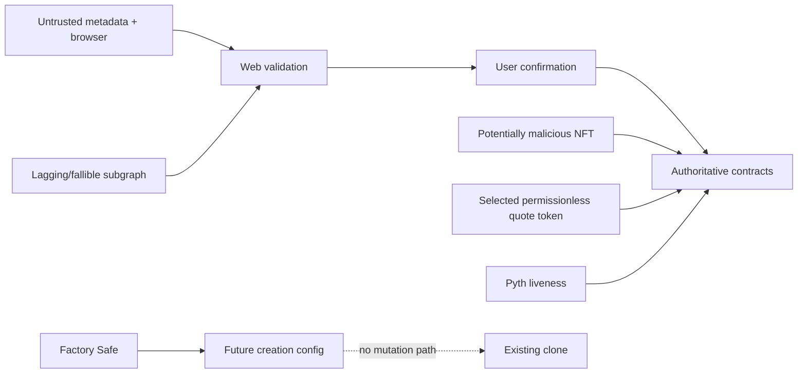

# Threat model

## Assets and safety properties

- one escrowed prize NFT per raffle;
- gross quote-token inflow, unsettled pot, and resolution claims;
- uniqueness/unbiasability of the requested random result;
- winner identity at callback time;
- availability of terminal and claim paths;
- integrity of indexed/UI representations.

Required properties:

1. accounted quote is solvent and reconciles;
2. the prize leaves at most once through a terminal claimant;
3. no second random sequence is accepted;
4. winner selection covers every sold ticket exactly once in the modulo domain;
5. admin and UI/index infrastructure cannot alter clone economics.

## Actors

- honest or malicious sponsor, buyer, recipient, treasury, and claimant;
- malicious ERC20/ERC721 contracts in local tests;
- factory Safe signers;
- oracle/provider infrastructure;
- RPC, subgraph, wallet, browser, and metadata hosts;
- searchers ordering transactions at the sale boundary.

## Trust boundaries

## Attacks and mitigations

| Attack                                                       | Mitigation                                                                    |
| ------------------------------------------------------------ | ----------------------------------------------------------------------------- |
| Buy before/after window or after request                     | exact state/timestamp checks                                                  |
| Fee-on-transfer/false ERC20                                  | `SafeERC20` plus exact balance delta                                          |
| Malicious/rebasing/blocked quote token                       | clone isolation, verification labels, UI warning; residual claim risk remains |
| Reentrancy on mint, token, prize receiver, or factory escrow | checks-effects-interactions and guards                                        |
| Arbitrary NFT sent to clone                                  | receiver binds state/token/id/from/operator                                   |
| Last/one ticket excluded                                     | `(random % totalTickets) + 1`                                                 |
| Winner changes after reveal                                  | transfer freeze pending; owner snapshot in callback                           |
| Duplicate/wrong callback                                     | sequence/state validation and safe ignore                                     |
| Callback gas grief via transfers                             | bounded storage-only callback                                                 |
| Repeated settlement/request                                  | monotonic state and stored sequence                                           |
| Admin seizure or upgrade                                     | no clone admin/rescue/proxy hooks                                             |
| Direct token/native donation changes state                   | explicit accounting; donation only surplus                                    |
| Fake address passed to lens                                  | factory registry gate before candidate calls                                  |
| Index lag manipulates transaction                            | live onchain reread and simulation                                            |
| Malicious NFT metadata                                       | no HTML, Zod bounds, constrained HTTP/IPFS URLs, SVG blocked                  |
| Batch wallet unsupported                                     | ordered approve receipt then simulated buy fallback                           |

## Admin compromise

A compromised factory owner can redirect the treasury for future raffles, change
quote-token verification, pause future creation, or transfer ownership. Token
verification affects official discovery but cannot block creation or
interaction. The owner cannot change a selected token or economics, upgrade, cancel,
settle, seize, or pause an existing clone. Frontends should surface factory versions
and owner changes.

## Oracle liveness

The protocol favors result uniqueness over an insecure emergency result. If the
callback fails, the same Entropy sequence must be retried/replayed; users may wait.
There is no timeout refund or admin randomness. See `RANDOMNESS.md`.

## Residual risks

- unaudited first-party code and dependencies;
- compiler/EVM/tooling defects;
- selected quote-token freezes, blacklists, or unexpected behavior after deployment;
- malicious, mutable, counterfeit, or legally encumbered prizes;
- oracle/provider outage or censorship;
- compromised RPC/wallet/frontend presenting misleading data before user review;
- high threshold, low participation, or adverse market value;
- applicable gambling, sweepstakes, consumer, sanctions, tax, or licensing law.

Independent audit, multisig operational review, oracle runbooks, frontend supply-chain
hardening, and jurisdiction-specific legal advice are required before production use.
