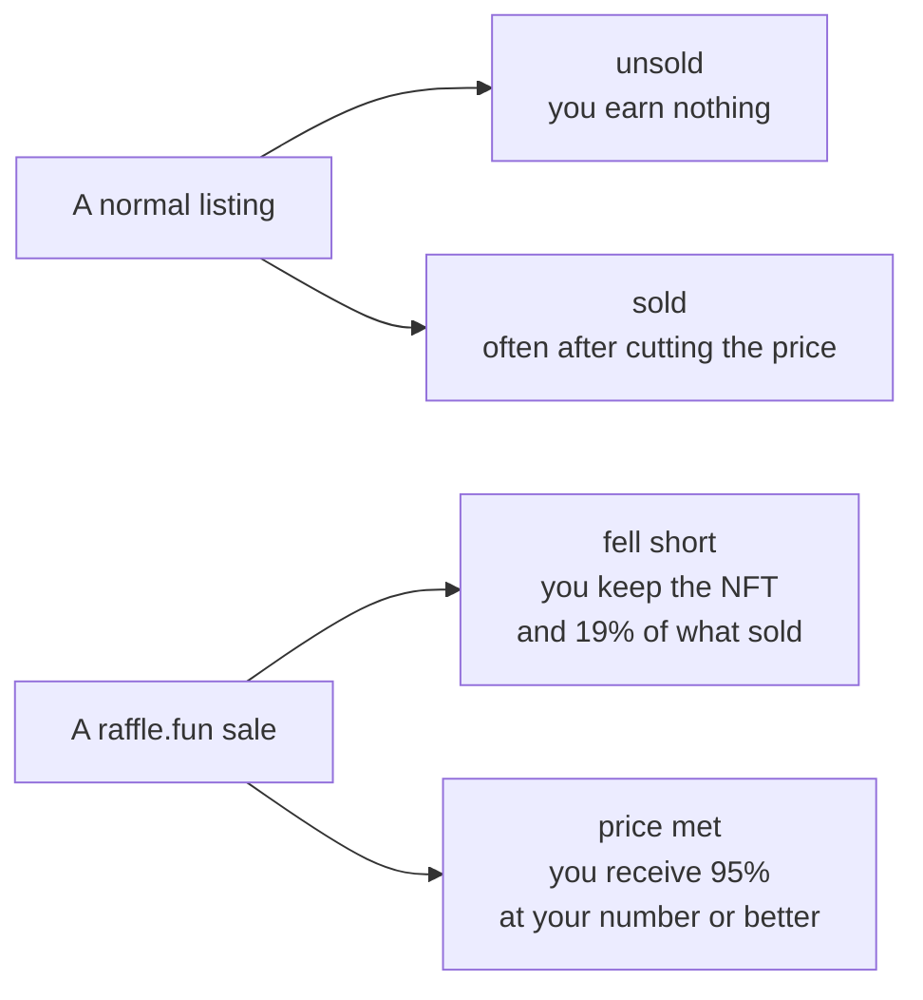

# How raffle.fun Makes NFT Raffles Work Entirely Onchain

_A plain-language explanation of the complete sponsor and buyer experience. No Solidity
required. Every factual claim here traces to
[`docs/facts/raffle-fun-facts.md`](../facts/raffle-fun-facts.md), which cites the exact
contract, function, and test behind it. Described commit:
`5772e54ba89c06646815ed52a881cd8940f094ca`._

---

## 1. The basic idea

The mechanism is a raffle. The problem it solves is that NFTs are hard to sell.

If you hold one, you know the pattern. You list at the price you want. The listing sits there
earning nothing. Weeks pass. Eventually you get lucky or you capitulate and cut, because a
listing has only two states: _unsold_ and _sold cheaper_.

raffle.fun adds a third state: **earning while unsold**. You name your price and open the NFT
up for a fixed period. People buy tickets. When the period ends:

- **Ticket sales reached your price** — one ticket wins the NFT and you receive 95% of
  everything sold. You sold, at your number.
- **They fell short** — the NFT comes straight back to you and **you keep 19% of everything
  sold**. One ticket wins the remaining cash instead. Then you can run it again.

So the two things the protocol actually does for an NFT holder are: **sell your NFT at your
price, or earn yield on it while it fails to sell.**



Section 17 works a full example end to end.

Everything else here is the machinery that makes those outcomes trustworthy without trusting
the organiser: who holds the NFT while tickets sell, how the winner is drawn, and what
happens when something breaks. In one sentence: **raffle.fun locks one NFT into a contract,
sells numbered tickets for a stablecoin, draws one ticket using an external randomness
service, and lets whoever holds that ticket claim the prize.**

## 2. How the sponsor creates a raffle

The person offering the prize is the **sponsor**. They choose:

- **The prize** — one specific NFT they already own.
- **The ticket price** — a flat amount in the raffle's stablecoin, USDC in the intended
  deployment. (The contracts accept whichever single token is chosen when the factory is
  deployed; USDC is a deployment-time decision, not hard-coded into the raffle logic.)
- **A minimum ticket threshold** — how many tickets must sell for the NFT itself to be the
  prize. Below it, the raffle pays out in cash instead. Section 11 explains why.
- **A sale window** — the start can be up to seven days out, and the sale can run up to 30
  days.
- **A recovery address** — where the NFT goes if the raffle does not award it. Defaults to
  the sponsor.

They approve the NFT and send one transaction. That is the entire setup: no application,
no approval queue, no listing fee, no counterparty.

Note what the sponsor _cannot_ do: cancel once a single ticket has sold; change the price,
threshold, deadline, or prize; choose the winner; pause the draw; or withdraw early. Those
are not policies someone enforces — they are functions that do not exist.

## 3. Why the NFT must be escrowed first

This is the most important structural decision in the protocol.

When the sponsor sends that creation transaction, five things happen inside it: a new
contract is deployed for this specific raffle; it is recorded in an official registry; the
NFT is transferred into it; the contract confirms it received the right NFT from the right
person; and the registry confirms the NFT really arrived.

All five are one transaction, which in blockchain terms means **all of them succeed or none
of them do**. If the NFT transfer fails, the deployment itself is undone along with the
registry entry. There is no half-created raffle. So a raffle you can see is a raffle whose
prize is already locked — you are never buying a ticket on a promise, unlike most offchain
raffles where the prize stays with the organizer until the end.

The escrow is one-way. The raffle accepts an incoming NFT only if it is the exact configured
token, sent by the sponsor, through the official factory, while still awaiting its prize.
Anything else is rejected. Once the prize is in, no function exists — for anyone — that
pulls it out except through the settlement paths below.

## 4. What buyers receive

A buyer approves the stablecoin and buys 1 to 100 tickets per transaction. The price shown
is the price paid; there is no checkout fee. The buyer names the recipient, so you can buy
tickets for someone else.

Tickets are numbered sequentially from 1 across all buyers: buy the first ten and you own 1
through 10, the next person starts at 11, and numbering never restarts or reuses a number.
There is no cap on total tickets and none per buyer.

One detail matters more than it sounds: the contract checks its own balance before and
after your payment and requires it to rise by _exactly_ the amount owed. If the token
delivered even one unit less — as some do by design — the purchase fails rather than issuing
tickets the pot cannot back. This is why tokens with transfer taxes or rebasing supplies
cannot be used at all.

## 5. Why tickets are ERC-721 tokens

Your tickets are not database rows on a website. They are NFTs, minted by the raffle
contract itself, sitting in your own wallet, visible and movable like any other NFT. This
has one enormous consequence:

> **The ticket is the claim. Whoever holds it at the moment of redemption is the person who
> can claim.**

The contract never looks at who originally bought a ticket. It asks one question: are you,
right now, the owner? If yes, you may burn it and take what it is owed. If no, you may not —
and that includes anyone you have "approved" on a marketplace. An approval lets someone
_move_ your ticket; it does not let them _redeem_ it. This is also why tickets can be traded
at all: the claim travels with the token.

It is the main way a user can hurt themselves. Send a ticket to an address whose keys are
lost, or to a contract that cannot call the redemption function, and the claim is gone
forever. The protocol blocks the destinations it can recognize as dead ends — the raffle
itself, the factory, the payment token, the randomness contract, the prize collection, and
any other registered raffle — but it cannot screen every arbitrary contract without breaking
ordinary NFT transferability, and deliberately does not try. No administrator can reverse
the mistake, because there is no administrator.

## 6. When tickets may be transferred

Transferability changes with the raffle's state:

- **During the sale** — freely transferable. Trade, gift, list on a marketplace.
- **While randomness is pending** — **completely frozen**. Not one ticket can move.
- **After a result** — every ticket is transferable again _except the winning one_, which
  stays locked.
- **In refund mode** — everything is transferable again.

Section 9 explains why the freeze exists.

## 7. What happens when the sale ends

At the closing time, sales stop. Nothing else happens automatically — blockchains have no
alarm clocks, and something only happens when someone sends a transaction.

So the next step is that **anyone** — sponsor, buyer, bot, bystander — pays the randomness
service's current fee out of their own pocket and asks the raffle to draw. This is
deliberately permissionless: a sponsor cannot stall a raffle they dislike by refusing to run
the draw.

The catch is that the fee is real money in ETH and the protocol does not reimburse it. In
practice a buyer with many tickets, or a sponsor expecting a payout, has every reason to pay
it. But if nobody does within **three days** of the sale closing, the raffle gives up and
refunds everyone. That is refund origin one.

If the raffle sold zero tickets, there is nothing to draw — see section 15.

## 8. How Pyth Entropy randomness works, at a high level

Picking a random number on a blockchain is famously hard, because everything on a
blockchain is public and reproducible. If the raffle used something like a block hash,
whoever produces blocks could quietly reroll until they liked the result.

raffle.fun uses **Pyth Entropy**, an external randomness service. The shape is a
commit-and-reveal between the contract and an external provider: the request goes in, and
later the provider's service calls back with a random value. The raffle computes the
winning number as `random mod (tickets sold) + 1`.

Three honest caveats.

**First**, that mapping has a mathematically nonzero bias. When the ticket count does not
divide evenly into the enormous range of random values, some numbers are very slightly more
likely than others. For realistic ticket counts the difference is cryptographically
negligible, but the protocol documents it rather than claiming perfect uniformity.

**Second**, and far more importantly, **the provider can see the result before publishing
it.** Pyth documents this. A provider holding tickets could publish the answer if they won
and stay silent if they did not — at which point the raffle times out and everyone,
including them, is refunded. Heads they win, tails they get their money back. This is a
documented, **unresolved** trust assumption, rated High severity by the project's own
review; the release checklist requires pinning a reviewed provider or replacing the
randomness design before any launch. Nobody should call this mechanism provably fair.

**Third**, the randomness step can simply fail to complete for boring reasons. Section 13
covers that.

## 9. Why transfers lock during the randomness period

Now the freeze makes sense.

Imagine transfers stayed open. The provider knows the winning number before anyone else. In
the window between "the result exists" and "the result is public", someone with advance
knowledge could buy the winning ticket from a seller who has no idea what they hold.

So the instant the draw is requested, **every ticket transfer is blocked**. Ownership is
photographed at that moment. Whoever holds ticket 137 when the request goes in is the owner
of ticket 137 if 137 is drawn — no marketplaces, no approvals, no exceptions.

Once the result publishes, ordinary tickets unfreeze. The _winning_ ticket stays locked
permanently, closing the mirror-image problem: a stale marketplace listing or forgotten
approval could otherwise yank it out of the winner's wallet the instant the result became
public. The winner cannot resell the winning ticket, but they can direct the prize to any
safe address when they redeem it, which covers the legitimate version of that need.

Be clear about the limit: this stops someone _acquiring_ the winning ticket after the draw.
It does nothing about a provider who already owned tickets before it. That is the
unresolved issue from section 8.

## 10. The NFT-success outcome

If the raffle sold at least its minimum threshold, the drawn ticket wins the NFT.

The winner calls one function, naming where the NFT should go. The contract burns their
ticket, transfers the NFT, and then **verifies onchain that it actually arrived**. Only then
does it calculate the protocol fee, credit the treasury, and credit the sponsor with the
rest.

The sequencing is the point: the sponsor is paid not when the winner is _chosen_ but when
the winner is _delivered to_. Between resolution and redemption the entire pot sits in the
raffle belonging to nobody in particular. If the transfer fails — collection paused, token
burned, destination rejects it — the whole call reverts, the ticket is un-burned, nothing is
paid, and the winner can retry elsewhere or later.

### Worked example 1: the NFT branch

Sofia raffles a 1-of-1 NFT.

| Parameter         | Value             |
| ----------------- | ----------------- |
| Ticket price      | 10.00 USDC        |
| Minimum threshold | 100 tickets       |
| Tickets sold      | 250               |
| **Gross sales**   | **2,500.00 USDC** |

The sale closes. A buyer named Maya pays the Entropy fee and requests the draw. Transfers
freeze. The callback selects ticket **#137**, which Maya happens to hold.

Because 250 ≥ 100, this is the NFT branch. Maya redeems, naming her hardware wallet. Her
ticket burns, the NFT arrives, and the contract verifies it. In that same instant:

| Recipient                          |        Amount |
| ---------------------------------- | ------------: |
| Protocol treasury (5% of 2,500.00) |   125.00 USDC |
| Sponsor (Sofia)                    | 2,375.00 USDC |
| Winner (Maya)                      |       the NFT |

Sofia and the treasury each now hold a claim they withdraw whenever they like. The other
249 tickets are worth nothing — souvenirs.

## 11. The cash-fallback outcome

This branch turns a failed sale into income, so it is worth being precise.

The threshold **is the ask**: ticket price times minimum tickets is the number the sponsor
wants for the NFT. Above it they have sold, below it they have not. It also protects them
from a valuable NFT going to someone who paid almost nothing because few tickets sold.

So if the sale finished **below** the threshold, the draw still happens and a ticket still
wins — but it wins **money** instead, and the sponsor keeps the NFT plus the rest of the
cash. Unlike the NFT branch, these amounts are recorded immediately when the result arrives,
because no external NFT transfer has to succeed first.

### Worked example 2: the cash branch

```text
80 tickets sold
1.00 USDC each
minimum: 100 tickets  ← missed
```

| Step                           | Calculation                  |         Amount |
| ------------------------------ | ---------------------------- | -------------: |
| Gross sales                    | 80 × 1.00                    |     80.00 USDC |
| Protocol fee                   | 5% of gross, rounded down    |      4.00 USDC |
| Distributable pot              | 80.00 − 4.00                 |     76.00 USDC |
| **Winning ticket**             | 80% of the pot, rounded down | **60.80 USDC** |
| **Sponsor**                    | the remainder                | **15.20 USDC** |
| **Sponsor's recovery address** |                              |    **the NFT** |

The holder of the drawn ticket burns it and receives 60.80 USDC — a 60× return on a 1 USDC
ticket, which is the point of the mechanism. Sofia gets her NFT back plus 15.20 USDC. The
other 79 tickets get nothing.

**On rounding.** Both percentages round down and the remainder always goes to the sponsor,
so nothing is lost or created. On an awkward gross of 999,999 raw token units, the fee is
49,999, the winner gets 760,000, and the sponsor 190,000 — exactly 999,999.

## 12. Refund origin one: nobody requested the draw

If the sale ends with tickets sold but no draw requested within **three days**, anyone can
switch the raffle into refund mode, and the entire pot becomes refundable. Ticket holders
burn their tickets — up to 100 per transaction — and receive **exactly the ticket price**
for each. No protocol fee, no sponsor proceeds; the NFT returns to the sponsor's recovery
address.

Refunds pay face value, not what you paid on a secondary market.

## 13. Refund origin two: the randomness never came back

If a draw request _was_ accepted but no valid result arrives within **two days**, the same
function opens the same full refund. Again: no fee, no sponsor proceeds, NFT returned.

One subtlety matters if you are watching closely: **a deadline does not change anything by
itself.** At the two-day mark both a late-but-valid result and a refund finalization are
legitimate; whichever lands first wins and the other becomes a harmless no-op. If nobody
finalizes refunds, a valid result arriving a year later still settles the raffle normally.
The project tests this deliberately so it cannot change by accident.

## 14. Refund origin three: the NFT could not be delivered

This one is the least obvious and, in some ways, the most important.

Suppose the raffle succeeded, the threshold was met, and a winner was drawn — but the NFT
cannot be delivered. The collection got paused, the token was burned by its issuer, or the
contract was upgraded into something broken.

An earlier design would have paid the sponsor at resolution and left buyers with a broken
claim. raffle.fun instead keeps the whole pot escrowed until delivery is verified, and adds
a deadline: if the NFT has not been claimed within **30 days** of the result, anyone can
convert the raffle to full refunds. Every buyer gets the whole ticket price back; the
sponsor and the protocol get nothing. A raffle where the prize cannot be delivered is a
raffle that did not happen, so nobody should profit from it.

This also fires when a winner never shows up — thirty days of inaction turns an NFT win into
a full refund for everyone, including the absent winner. As with the other deadline, a
winner who resolves their problem on day 31 can still redeem, provided nobody finalized
refunds first.

### Worked example 3: the refund branch

Take exactly the setup from example 1 — 250 tickets at 10.00 USDC, 2,500.00 USDC in the pot
— but this time nobody pays the Entropy fee in the three days after the sale closes.

| Recipient                  |                        Amount |
| -------------------------- | ----------------------------: |
| Protocol treasury          |                     0.00 USDC |
| Sponsor                    |                     0.00 USDC |
| Sponsor's recovery address |                       the NFT |
| Every ticket holder        | exactly 10.00 USDC per ticket |
| **Total refunded**         |             **2,500.00 USDC** |

Maya, holding 40 tickets, redeems once with all 40 IDs and receives 400.00 USDC. If she
held 250 she would need three transactions, because the batch limit is 100. Two practical
notes: the batch is all-or-nothing, so a single duplicate or wrong ticket ID fails the whole
transaction and consumes nothing; and nobody's refund depends on anyone else claiming
theirs.

## 15. When nobody buys anything

If a raffle sells zero tickets, it never needs a draw. The sponsor can close it early at any
time; once the sale window has ended, anyone can close it. The NFT goes back to the recovery
address. That early-close privilege disappears the moment a single ticket sells.

## 16. Sponsor and treasury claims

The protocol never pushes money at anyone. It records what it owes and each party withdraws
their own — the standard "pull payments" pattern, which stops one recipient's broken wallet
from blocking everyone else's payout. A helper lets a third party pay the gas to settle
someone else's claim, but it can only send those funds to the account owed them.

The NFT recovery path is separate and tighter. Only the recovery address named at creation
can pull the NFT out, and only in the three states where the raffle did not award it: cash
outcome, refund, or empty closure. It is deliberately unavailable in the NFT-win state,
because there the prize belongs to the winner. That address is fixed forever at creation — a
sponsor who names the wrong one has no remedy.

## 17. A complete numeric example, end to end

One raffle, every stage, with the money tracked the whole way.

**Setup.** Sofia raffles _Vault Key #7_: 25.00 USDC per ticket, minimum 200, seven-day
sale, recovery address her cold wallet. One transaction deploys the raffle, registers it,
and moves the NFT into escrow. Sofia can now touch neither the NFT nor any parameter.

**Sale.** Over seven days, 640 tickets sell to 47 addresses. Gross sales are
640 × 25.00 = **16,000.00 USDC**, all held by the raffle. During the sale its books read:

| Ledger line               |        Amount |
| ------------------------- | ------------: |
| Unsettled pot             |     16,000.00 |
| Refunds owed              |          0.00 |
| Winner cash owed          |          0.00 |
| Sponsor + treasury claims |          0.00 |
| **Total accounted**       | **16,000.00** |

The contract's balance always equals or exceeds that total; anything extra, such as a direct
donation, is surplus and never becomes anyone's claim.

**Draw.** The sale closes. Eleven hours later a ticket holder named Leo pays the Entropy fee
in ETH and requests the draw; he overpays slightly and the excess returns in the same
transaction. All 640 tickets freeze.

**Result.** The callback selects ticket **#411**, held by Noor. Because 640 ≥ 200, this is
the NFT branch. Nothing is paid out yet — every ledger line above is unchanged, with the
full 16,000.00 still in the unsettled pot.

**Redemption.** Noor redeems, naming her cold wallet. Her ticket burns, _Vault Key #7_
arrives, the contract verifies ownership, and only then does settlement happen:

| Recipient         | Calculation           |         Amount |
| ----------------- | --------------------- | -------------: |
| Protocol treasury | floor(16,000.00 × 5%) |    800.00 USDC |
| Sponsor (Sofia)   | 16,000.00 − 800.00    | 15,200.00 USDC |
| Winner (Noor)     |                       | _Vault Key #7_ |

The books now read:

| Ledger line               |        Amount |
| ------------------------- | ------------: |
| Unsettled pot             |          0.00 |
| Refunds owed              |          0.00 |
| Winner cash owed          |          0.00 |
| Sponsor + treasury claims |     16,000.00 |
| **Total accounted**       | **16,000.00** |

**Withdrawal.** Sofia withdraws her 15,200.00 and the treasury its 800.00, independently and
in either order. Every line goes to zero and the raffle is finished. The 639 losing tickets
stay in their owners' wallets as souvenirs.

## 18. What "immutable" means for an individual raffle

This word gets used loosely, so here is exactly what it means.

Each raffle is its own freshly deployed contract — not a proxy, not a clone pointing at
shared logic, but a standalone contract with its entire configuration frozen at deployment.
There is no upgrade function and no shared implementation that could be swapped underneath
it.

Concretely, once a raffle exists, **nobody** — sponsor, protocol team, factory owner,
treasury — can change its prize, price, threshold, deadlines, fee rate, recovery address,
payment token, or randomness source; pause, cancel, or reverse it; choose or override a
winner; or withdraw assets outside the settlement paths in this article.

That guarantee cuts both ways. The rules you read when you bought are the rules that apply.
But if something goes wrong in a way the contract does not anticipate, **there is no help
available** — no emergency pause, no admin refund, no support team who can move your ticket
back. The absence of a rescue function is what makes the guarantee credible, and it is also
what makes user error final.

## 19. What the factory owner can and cannot do

There is one administrative role in the protocol: the owner of the **factory**, the contract
that creates raffles. That owner can do exactly two things, both applying only to raffles
created _in the future_:

1. **Change which treasury receives the protocol fee.** Every existing raffle captured its
   treasury address permanently at creation, so this affects only new ones.
2. **Pause creation of new raffles.** This touches no existing raffle's sale, draw, refund,
   or claim.

Ownership transfer is two-step — a proposed owner must actively accept — so a typo cannot
strand the role. Ownership also **cannot be renounced**: an earlier version allowed it, and
the project's own review found that renouncing while creation was paused would have
permanently bricked raffle creation. It now always reverts.

What the owner cannot do is more interesting: nothing at all to an existing raffle. Not
pause it, seize its assets, change its fee, pick its winner, or redirect its payouts. If a
serious bug were found, the realistic response would be to pause new creation, warn users,
take down the website, and deploy a new factory. Raffles already running would run to their
own conclusions, bug and all.

## 20. Risks and limitations

Read this before putting money at risk.

**The randomness provider is trusted.** Per section 8: the provider can know the result
before publishing it, and if it holds tickets it could publish only when it wins. The
project's own model puts the gain at up to a quarter of the pot, when the provider holds
half the tickets. Unresolved, and rated High severity.

**The stablecoin issuer is trusted.** Circle can freeze, blacklist, pause, or upgrade USDC.
If your address were blacklisted, no contract could force a payment to you. The contracts
preserve your claim across a failed transfer so a later retry works — but they cannot make a
frozen token move.

**The chain is trusted.** Base's sequencer orders transactions. It could delay a draw
request past its three-day window or a callback past its two-day window, converting a raffle
into refunds, and could in principle censor a user. A halted or reorganized chain has no
application-level escape hatch.

**The prize NFT is trusted.** The protocol checks that a prize contract claims to be an
ERC-721 and verifies delivery — but performs those checks _through the same contract that
could be lying_. A malicious or upgradeable collection can misreport ownership, and can
simply be worthless. **No smart contract can tell you whether an NFT is worth buying tickets
for.** That judgment is yours.

**Ticket destinations are your responsibility.** A ticket sent to a lost key or an incapable
contract is gone, with no recovery.

**Nothing is private.** Sponsor identity, every purchase and transfer, the winner and every
amount are permanently public. Websites and RPC providers may also see your IP and wallet
metadata.

**The legal position is unresolved.** Raffles, lotteries, sweepstakes, and prize promotions
are regulated very differently across jurisdictions, and no jurisdiction-specific legal
review has been performed. Whether participating in or sponsoring one is lawful where you
live is a question this article cannot answer.

**Losing tickets keep existing.** Only the winning ticket is burned. The rest stay in their
wallets, tradable, worth nothing. If you buy on a secondary market, check the raffle is still
running — a settled loser looks exactly like a live ticket.

**Some things are unsupported outright.** Tokens with transfer taxes or rebasing supplies
are rejected; stablecoins donated directly to a raffle are unrecoverable; an unrelated NFT
force-sent into a raffle has no rescue path. Using another raffle's ticket as a prize is a
known bad idea: if that inner raffle locks the ticket, the prize can be stranded for good,
though buyers still get refunded.

## 21. Current status

This is the part most likely to be misread, so it is stated plainly.

**raffle.fun is not deployed.** There is no live raffle.fun on Base or any other public
network. The repository contains no deployed address, and the web application disables all
write actions when no deployment record is present. Every test against real chain state has
run on local forks; no transaction has been broadcast.

**The contracts have not been independently audited.** The project's own security policy
says so in as many words: it "remains independently unaudited". The most recent review was
self-administered, and its own scope note calls it "not an independent audit or a production
authorization".

**The project's own release checklist says, verbatim, "Current status: not release-ready."**
Outstanding blockers include an external audit, a monitored testnet period, selection of the
multisig wallets that would own the factory and receive fees, production monitoring and
incident-response runbooks, a staffed disclosure process, and jurisdiction-specific legal
review.

**What _has_ happened is a substantial internal testing campaign** — fuzzing, stateful and
strict invariants, an independent differential model, two separate independent fuzzing
tools, symbolic execution, mutation testing, static analysis, compiler differentials, and
pinned fork validation against live Base state, measured in millions of generated call
sequences, with roughly 99.7% line and 100% function coverage. The maintainers are explicit
that this is "evidence, not a mathematical proof", and not a substitute for an independent
audit — an unusual amount of self-imposed rigor for this stage, but still not an audit, and
this article will not pretend otherwise.
