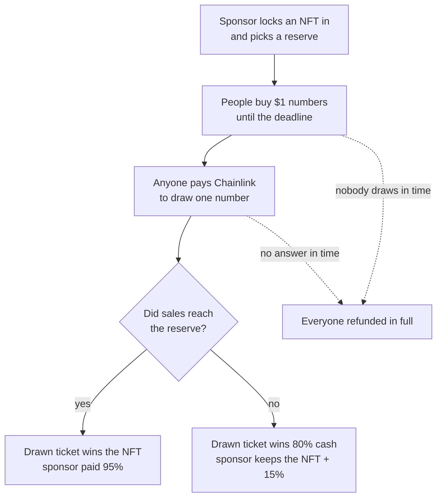
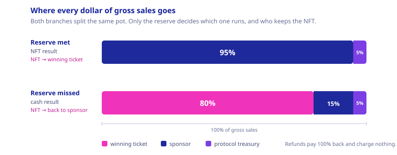
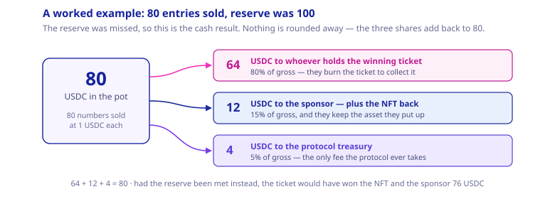
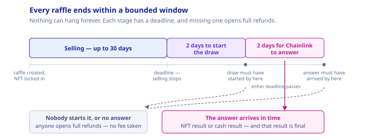

# How raffle.fun works

raffle.fun is a simple Ethereum mechanism for raffling one ERC-721 NFT with one-dollar
USDC entries and a reserve price chosen in advance.

This article explains the candidate v1 design. The Solidity and canonical technical
documents remain authoritative, and the protocol is not deployed or independently
audited.



## The sponsor's choice

The sponsor chooses:

- the NFT;
- the number of one-dollar entries required to meet the reserve;
- a sale end time, no more than 30 days away.

Those values become permanent when the raffle is created. The factory makes a cheap
ERC-1167 clone, registers it, and escrows the NFT in one transaction. If the transfer
or verification fails, the entire creation reverts.

The reserve is not a sell-out cap. A raffle with a 100,000-entry reserve keeps
accepting entries until its deadline. Selling exactly 100,000 meets the reserve;
selling more is also an NFT result.

## A ticket can contain many numbers

Every number costs exactly 1 USDC. A buyer can buy one number or many:

- buy 1 and receive one ERC-721 ticket for number 1;
- buy 20 and receive one ERC-721 ticket for a 20-number range;
- buy again later and receive another ticket for the next range.

Ticket IDs are simple counters: `1`, `2`, `3`, and so on. The contract stores each
ticket's first and last entry separately. It does not create one NFT or storage record
for every number, so buying a million entries is still one ticket mint and constant
onchain work. The buyer must of course have and approve a million USDC.

A whole ticket can be transferred in any raffle state until it is claimed and burned;
its range cannot be split. The current owner holds the bearer claim.


## The draw

After the sale, anyone can pay the current Chainlink VRF v2.5 native fee in ETH to
request the draw. The protocol does not take that fee from the USDC pot.

The raffle uses Chainlink's official native direct-funding wrapper through the
exact-pinned `@chainlink/contracts@1.5.0` consumer base, interface, and client library.
It does not deploy its own oracle or wrapper, and it does not require a raffle-managed
VRF subscription.

Chainlink later supplies one authenticated 256-bit word. The raffle maps it to:

```text
winningEntry = (randomWord mod totalEntries) + 1
```

The callback records only that number and the economic result. It never searches all
tickets or transfers assets. To claim, someone supplies a ticket ID; the contract
loads its first and last number and checks whether the winner lies inside.

This is why entry count does not create a gas-limit problem:

| Operation           | Work                                          |
| ------------------- | --------------------------------------------- |
| buy any entry count | one payment and one ticket mint               |
| draw callback       | one modulo and bounded state writes           |
| prove winner        | load one ticket range                         |
| refund              | loop only over submitted tickets, at most 100 |



## If the reserve is met

The selected ticket wins the NFT. The USDC pot does not leave merely because the
callback picked a winner. A later permissionless settlement proves the ticket and
allocates the sponsor and protocol balances without reading its owner, burning it, or
transferring an asset.

Settlement records:

- the protocol records a 5% balance for its immutable treasury;
- the protocol records a 95% balance for the sponsor's immutable recipient;
- the winning ticket ID is recorded while the ticket remains transferable.

Only the current ticket owner may redeem the NFT. `redeemWinningTicket` can perform
settlement first when necessary, then burns the ticket and transfers the NFT in the
same transaction. A failed transfer or ownership check reverts the burn. Sponsor
proceeds and the protocol fee are separately releasable after settlement, so winner
inactivity or a broken prize cannot block those quote claims.

This result is final. There is no deadline after which an unredeemed NFT turns back
into refunds, so the winner's claim on the NFT stays open indefinitely — and so does
the risk that the collection itself stops cooperating. If that collection is later
paused, upgraded, restricted, or burned, delivery can fail forever while every USDC
claim still settles normally. That is the single biggest thing to check before buying
into a raffle: the NFT is only as reliable as the contract that issued it.

## If the reserve is missed

Gross sales are split into fixed claims: the selected ticket carries the right to 80%,
the protocol treasury receives 5%, and the sponsor receives the exact 15% remainder
plus the NFT.

Cash settlement follows the same accounting rule: anyone may prove and record the
winning ticket and allocate the 80/5/15 split without reading ownership. The ticket
remains transferable until its current owner atomically burns it and receives the 80%
cash amount. The sponsor and protocol claims remain independently releasable. The cash
result is final; it does not later turn into refunds because winner inactivity affects
no other participant.



## If the process stalls

The draw request is available for two days after sale end. If nobody gets a request
accepted by that hard deadline, anyone can open full, fee-free refunds. If a request
is accepted, Chainlink gets a fresh two-day callback window; a callback received at or
after that second deadline is ignored and refunds are available instead. A request in
the final second can therefore make the maximum nominal path just under four days.



Each ticket refunds `number of entries × 1 USDC`. A 20-number ticket therefore
refunds 20 USDC in one burn. The sponsor can reclaim the NFT independently.

A zero-sale raffle uses the same `Refunding` state with zero liability. Its sponsor
may finalize it early, or anyone may finalize it after the deadline.

The callback boundary is deterministic: only a wrapper-authenticated callback before
the deadline can resolve the raffle. At the deadline and afterward, an ABI-decodable
callback is ignored even if `enableRefunds` has not yet been called.

## What is and is not guaranteed

Every raffle clone is fixed and has no administrator. The factory is also ownerless,
cannot be paused or reconfigured, and cannot alter existing prizes, reserves, owners,
results, or claims. USDC movements verify exact balance changes, and known protocol
addresses cannot receive tickets or payouts.

There is no administrator to abuse the system — and none to repair it. A bug found
after launch cannot be patched into a running raffle, and new raffles cannot be halted
onchain. The response available is to warn people, take the interface down, and ship a
new factory; the raffles already running finish on their own terms.

The design still relies on external systems:

- the NFT contract can be upgradeable, frozen, dishonest, or broken, and after a result
  there is no refund to fall back on;
- Chainlink must provide correct, available VRF service, and somebody must be willing
  to pay the ETH fee that starts the draw — nobody is obliged to;
- Ethereum must continue including transactions; a request or callback that misses its
  cutoff cannot be replayed, and the raffle refunds instead;
- Circle can pause or blacklist USDC;
- users can lose keys, or send a ticket to a contract that can never act on it;
- no finite confirmation count guarantees unlimited economic value, and the contracts
  impose no cap on how large a raffle can get;
- chance-based promotions and gambling are legally regulated.

Those limits are why Sepolia testing, independent audit, operational monitoring, and
jurisdiction-specific legal review remain release blockers.
