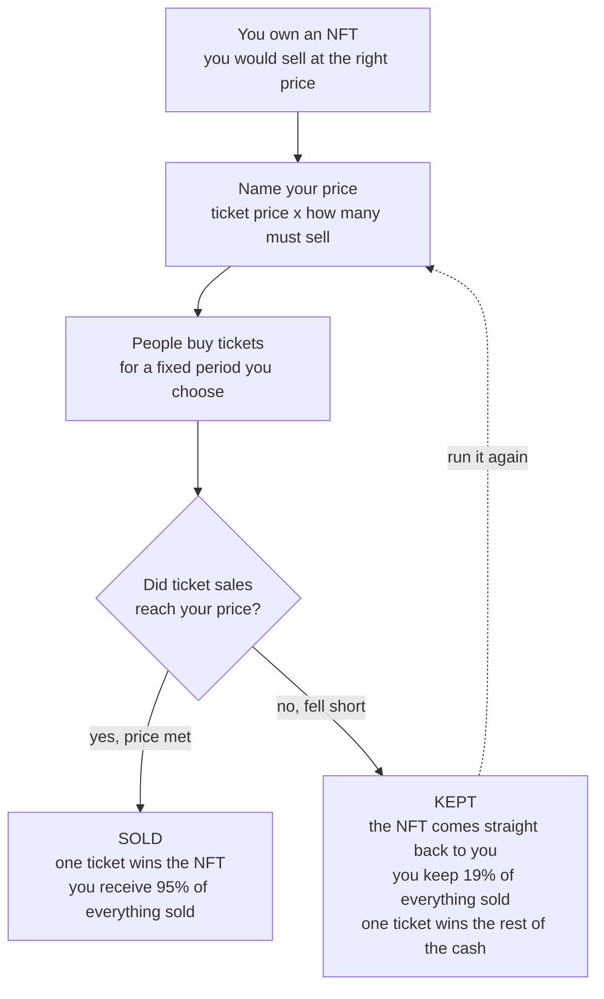

# raffle.fun at a Glance

**Your NFT either sells at your price, or it earns while it waits.**

NFTs are hard to sell. You list at the price you actually want, and the listing sits there —
earning nothing, doing nothing — until someone finally meets it or you give up and cut.

raffle.fun changes what happens during the waiting. You name your price and open it up for a
fixed period. People buy tickets. When the period ends there are exactly two outcomes, and
**you are paid in both of them**.

## The two outcomes

Say you want **10,000 USDC** for an NFT, so you offer 1,000 tickets at 10 USDC each.

| Tickets sold | What happens        |     You receive | Who gets the NFT  |
| ------------ | ------------------- | --------------: | ----------------- |
| 400          | fell short          |    **760 USDC** | you keep it       |
| 999          | fell short          |  **1,898 USDC** | you keep it       |
| 1,000        | price met           |  **9,500 USDC** | one ticket holder |
| 1,500        | price met, oversold | **14,250 USDC** | one ticket holder |
| 0            | nobody showed up    |         nothing | you keep it       |

**Fall short and you keep the NFT and 19% of whatever sold.** Then run it again. That is the
yield: you are paid for waiting, which a normal listing pays you nothing for.

**Hit your price and you have sold** — at your number, to a buyer who never had to write a
five-figure cheque. Nothing caps the upside above your price, so a sale that runs hot pays
you more.

If you think in options: you are writing a covered call on your own NFT and keeping the
premium.

## What ticket buyers get

A real shot at an NFT for a small fixed amount instead of its full price. Tickets are
themselves NFTs, so they sit in your wallet and can be traded while the sale is open.
Whoever holds the winning ticket claims the prize — the protocol never looks at who bought
it. If the sale falls short, the drawn ticket still wins **80% of the pot** in cash.

The winner is drawn using Pyth Entropy, an external randomness service. The instant the draw
is requested every ticket freezes, so nobody who learns the result early can go and buy the
winning ticket.

## If something goes wrong

Nobody can walk off with the money. The NFT is locked in the contract before a single ticket
sells, and if the draw never completes or the prize cannot be delivered, **every ticket
refunds exactly what it cost** and no fee is taken. Three separate deadlines trigger this,
and **anyone** can trigger them — nobody is waiting on us to show up.

## Fee and control

The protocol takes **5%**, and only when a sale actually resolves. Failed draws and refunds
cost nothing. Once your sale exists, nobody — including us — can change its price, deadline
or prize, cancel it, pick the winner, or touch the money. There is no admin key on it.

## Key risks

- **The randomness provider is trusted.** It can see the result before publishing it. If it
  held tickets, its edge peaks at a quarter of the pot. Documented, **unresolved**, rated
  High severity by the project itself.
- **Your NFT is locked** for the whole sale period. You cannot pull it out early.
- **Tickets are bearer assets.** Send one to a wallet you cannot use and the claim is gone.
  No admin can reverse it.
- **USDC and Base are trusted.** Circle can freeze funds; Base can delay or censor.
- **Smart-contract risk.** Never independently audited, never run in production.
- **Losing tickets stay tradable** after a sale ends, though they are worth nothing.
- **Legal and gaming rules vary** by jurisdiction. No legal review has been done.
- **Nothing is private.** Every purchase, transfer and payout is public.

## Status

| Item                  | Status                                                                                                                                                                                                                             |
| --------------------- | ---------------------------------------------------------------------------------------------------------------------------------------------------------------------------------------------------------------------------------- |
| **Protocol**          | Pre-release. The release checklist states verbatim "not release-ready".                                                                                                                                                            |
| **Deployment**        | **Not deployed.** No deployment record exists for any public network.                                                                                                                                                              |
| **Internal review**   | An internal adversarial campaign has been completed — fuzzing, invariants, differential models, Echidna, Medusa, Halmos, mutation testing, pinned Base forks. The maintainers state this is evidence, not proof, and not an audit. |
| **Independent audit** | **None.** The most recent review is self-administered and describes itself as "not an independent audit".                                                                                                                          |
| **Source commit**     | `5772e54ba89c06646815ed52a881cd8940f094ca`                                                                                                                                                                                         |

_raffle.fun must not be described as audited, trustless, provably fair, guaranteed, live or
production-ready. Nothing here is financial advice. Every claim traces to
[`docs/facts/raffle-fun-facts.md`](../facts/raffle-fun-facts.md), which cites the exact
contract, function and test behind it._
