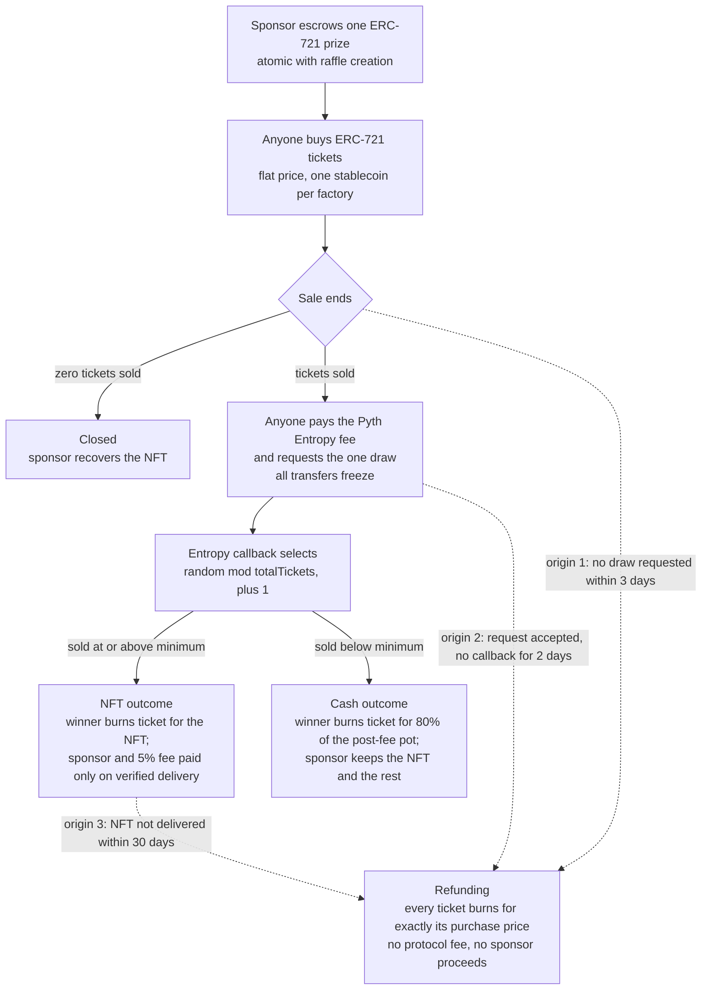

# raffle.fun at a Glance

**raffle.fun is an NFT raffle protocol written as immutable smart contracts.** A sponsor
locks one NFT into a purpose-built contract; anyone can buy numbered tickets in a
stablecoin; one ticket is drawn using Pyth Entropy; and the holder of that ticket claims
the prize. Every rule is fixed in code when the raffle is created, and nobody — including
the people who wrote it — can change that raffle afterwards.

## What a sponsor does

The sponsor calls `createRaffle`, setting the prize, the ticket price, a minimum ticket
threshold, and the sale window. In that single transaction the protocol deploys a new
`Raffle` contract, registers it, and pulls the NFT into escrow, verifying that it actually
arrived. If any step fails, the whole transaction reverts — so a raffle can never exist
without its prize already locked inside it.

## What a buyer receives

Tickets are ERC-721 NFTs minted by the raffle contract itself, numbered sequentially from
1, priced at a flat rate with no checkout fee. **Ticket ownership is the bearer claim
credential.** Whoever holds the ticket at redemption time is the person who can claim —
the protocol never consults purchase history, and an approved operator is not enough. You
can freely trade a ticket during the sale, which means you can also lose the claim
permanently by sending it somewhere that cannot call back into the contract.

## How a winner is selected

After the sale closes, anyone may pay Pyth Entropy's current fee and request the one draw,
within a three-day window. The moment that request is submitted, **all ticket transfers
freeze**, fixing ownership before the randomness provider can know the outcome. The
Entropy callback then selects ticket `(random mod totalTickets) + 1`.

## The two success outcomes

If at least `minimumTickets` sold, the drawn ticket wins **the NFT**. The pot stays
escrowed until the winner burns their ticket and delivery is verified onchain; only then
are the sponsor and the protocol fee paid. If the threshold was missed, the drawn ticket
wins **cash instead** — 80% of the post-fee pot — while the sponsor keeps the NFT plus the
remaining 20%.

## The three refund fallbacks

All three origins are finalized by the same permissionless function, `enableRefunds()`,
which anyone may call once the relevant deadline passes. Each outstanding ticket then
burns for exactly one ticket price, in batches of up to 100. A raffle that sold zero
tickets is closed instead, returning the NFT to the sponsor's recovery address.

A deadline does not change state by itself. At each boundary, a valid callback and a
refund finalization are both executable, and whichever transaction lands first wins.

## Fee and control

The protocol charges **5% of gross sales**, floored, and only when a raffle actually
resolves. Every refund path charges nothing. The rate is a compile-time constant baked
into every deployed raffle and cannot be changed for an existing raffle by anyone.

An existing `Raffle` has **no administrator** — no owner, no pause, no upgrade, no rescue,
no settlement override. The factory owner controls exactly two things, both future-facing:
which treasury _new_ raffles pay, and whether _new_ raffles can be created. Neither
touches a raffle that already exists. Factory ownership cannot be renounced.

## Key risks

- **Pyth Entropy provider trust.** The provider can know the result before revealing it.
  Transfer locking prevents buying the winning ticket after the draw, but a provider that
  already holds tickets could publish only favorable results and take a refund otherwise.
  This is a documented, **unresolved** High-severity trust assumption.
- **USDC issuer controls.** Circle can pause, freeze, blacklist, or upgrade the token. No
  contract can force a frozen transfer.
- **Base liveness and censorship.** The sequencer can delay or censor a draw request or
  callback into a refund. A halted or reorganized chain has no application-level escape.
- **Malicious or upgradeable NFTs.** A prize collection can lie about its own standard and
  ownership, or be paused or burned after escrow. Buyers bear all prize due diligence.
- **Smart-contract risk.** These contracts have never been independently audited and have
  never run in production.
- **Unsafe ticket destinations.** Sending a ticket to a lost key or to a contract that
  cannot redeem forfeits the claim permanently. There is no admin recovery.
- **Legal and gaming regulation.** Raffles and prize promotions are regulated differently
  in every jurisdiction. No legal review has been performed.
- **No privacy.** Sponsors, purchases, ticket ownership, the winner, and all amounts are
  public.

## Status

| Item                         | Status                                                                                                                                                                                                                                                                                                                 |
| ---------------------------- | ---------------------------------------------------------------------------------------------------------------------------------------------------------------------------------------------------------------------------------------------------------------------------------------------------------------------- |
| **Protocol status**          | Pre-release. Feature-complete contracts; the release checklist states verbatim "not release-ready".                                                                                                                                                                                                                    |
| **Deployment status**        | **Not deployed.** No deployment record exists for any public network; the repository contains no live address, and the web app disables writes without one.                                                                                                                                                            |
| **Internal review status**   | An internal adversarial hardening campaign has been completed, including fuzzing, stateful and strict invariants, differential modelling, Echidna and Medusa, Halmos symbolic checks, mutation testing, Slither, and pinned Base fork validation. The maintainers state this is evidence, not proof, and not an audit. |
| **Independent audit status** | **None.** No external audit has been performed. The most recent review is self-administered and describes itself as "not an independent audit or a production authorization".                                                                                                                                          |
| **Source commit**            | `5772e54ba89c06646815ed52a881cd8940f094ca`                                                                                                                                                                                                                                                                             |

_raffle.fun must not be described as audited, trustless, provably fair, guaranteed, live,
or production-ready. Every claim on this page traces to
[`docs/facts/raffle-fun-facts.md`](../facts/raffle-fun-facts.md), which cites the exact
contract, function, and test behind it._
