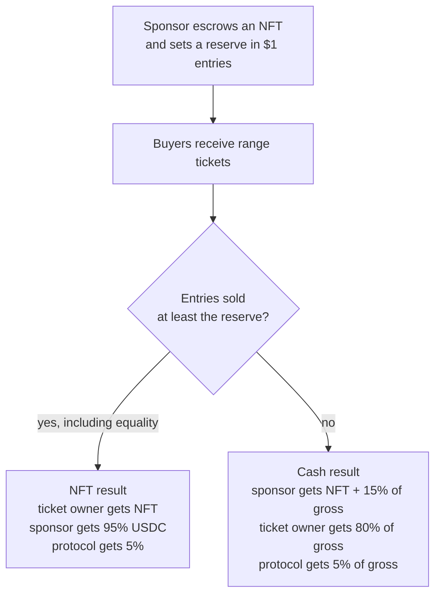

# raffle.fun at a glance

raffle.fun is an Ethereum raffle for one NFT. The sponsor chooses a deadline and a
reserve price. Every raffle number costs exactly 1 USDC.

## One purchase, one NFT ticket

A buyer chooses how many numbers to buy:

- 1 USDC mints one ticket containing one number;
- 20 USDC mints one ticket containing 20 consecutive numbers;
- any positive amount still mints only one ticket.

The ticket is an ERC-721 bearer claim and can move in any raffle state until a
successful winner settlement or refund burns it.

## Two successful outcomes

If a sponsor sets a 2,000,000-entry reserve, there is no separate protocol cap. The
raffle does not sell out: it accepts entries until the deadline, and equality meets
the reserve.

If the reserve is missed, the sponsor receives the NFT back plus 15% of gross sales.
The randomly selected ticket receives 80% of gross sales, and the protocol receives
the remaining 5%.

## Verifiable and bounded

After the deadline, anyone may pay Chainlink VRF v2.5's ETH fee to request one random
word. The contract selects one entry from `1..totalEntries`. Because each ticket
stores its own first and last number, proving the winner takes constant work—there is
no search through all buyers.

The permissionless draw request stays available until someone calls it. If Chainlink
does not return within two days after accepting a request, anyone can open full,
fee-free refunds. Each ticket refunds its number of entries at 1 USDC each. A valid
callback is final and has no later refund path.

## What the operator cannot do

Every raffle is a fixed, non-upgradeable ERC-1167 clone with no owner or rescue key.
The factory owner may pause only future creation. It cannot change a running raffle,
choose a winner, redirect a prize, or seize its pot.

This candidate v1 is not deployed or independently audited. Chainlink, Ethereum,
USDC issuer controls, the NFT collection, wallet safety, and applicable gambling or
promotional-law requirements remain external risks.
