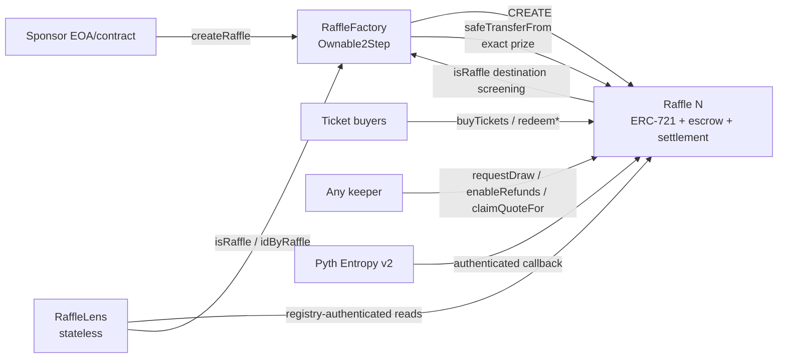
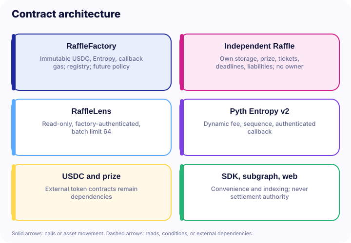
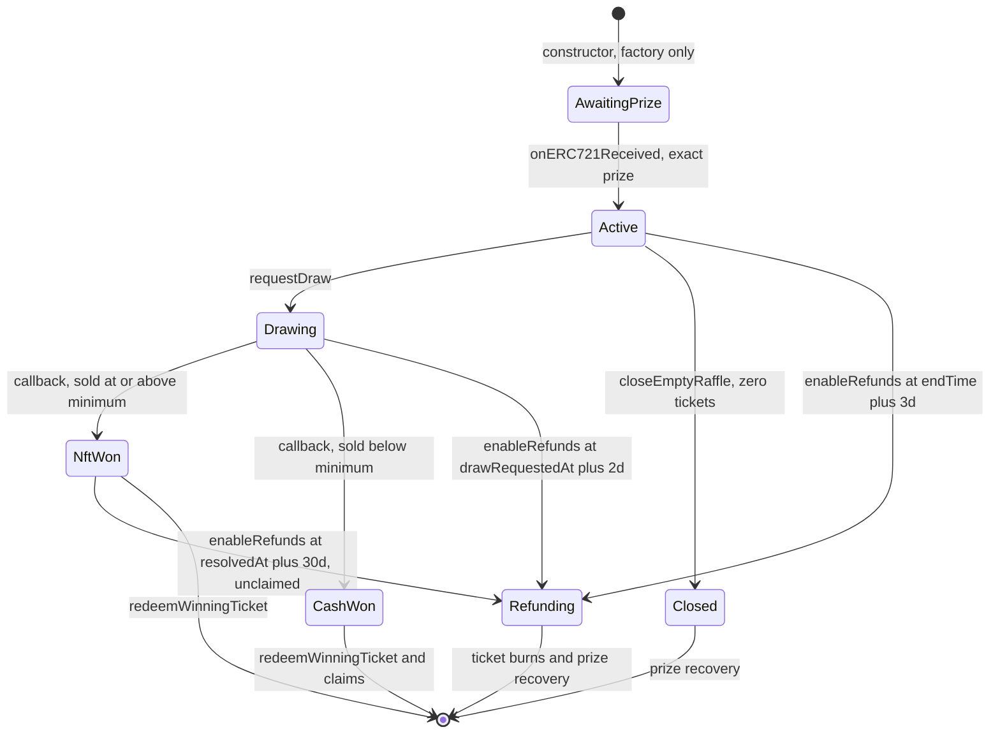
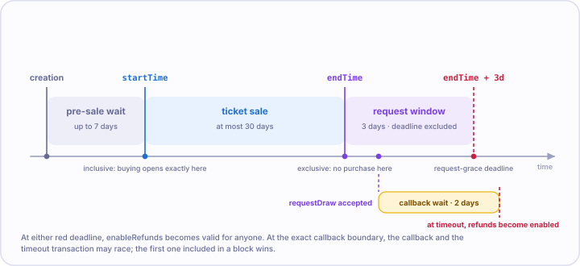
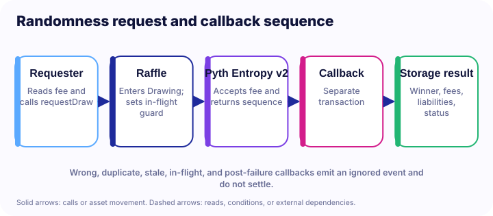
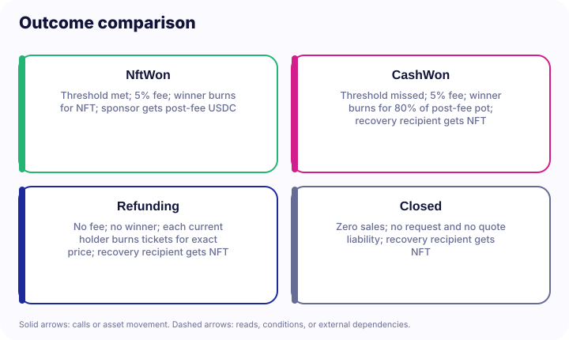
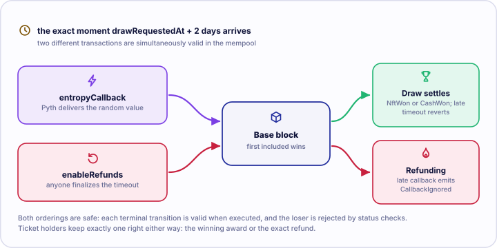
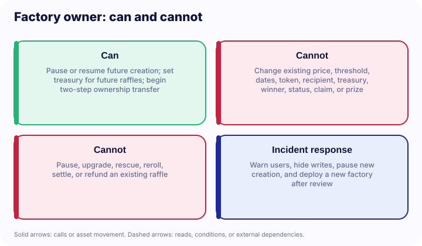
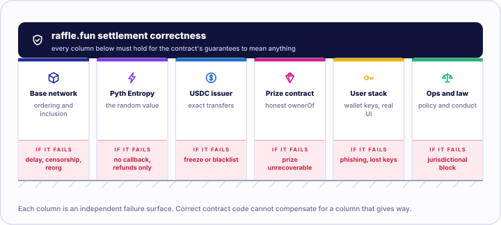

# raffle.fun: A Technical Whitepaper

> **Historical snapshot:** This document describes the pre-migration Base/Pyth design at
> the commits listed below. It is not the current Ethereum/Chainlink VRF specification.
> Use the production Solidity plus the current
> [`RANDOMNESS.md`](../RANDOMNESS.md) and [`DEPLOYMENT.md`](../DEPLOYMENT.md) runbooks for
> the migrated design.

**An immutable, administrator-free NFT raffle protocol with bearer ERC-721 tickets,
oracle-bounded liveness, and three-origin refund fallback.**

| Field                 | Value                                                                                                     |
| --------------------- | --------------------------------------------------------------------------------------------------------- |
| **Version**           | Contracts `2.0.0`                                                                                         |
| **Protocol commit**   | `5772e54ba89c06646815ed52a881cd8940f094ca` (production Solidity)                                          |
| **Evidence commit**   | `38dcf02` — current-commit campaign and audit ledger; no production Solidity changed                      |
| **Document date**     | 2026-08-16                                                                                                |
| **Audience**          | Security auditors, protocol engineers, researchers, integrators, sophisticated participants               |
| **Target chain**      | Base (8453) / Base Sepolia (84532)                                                                        |
| **Compiler**          | Solidity `0.8.36`, exact pragma, EVM target `cancun`, optimizer 1,000 runs, via-IR disabled in production |
| **Deployment status** | **Not deployed.** No deployment record exists for any network.                                            |
| **Audit status**      | **Not independently audited.**                                                                            |

---

## 0. Scope, precedence, and non-claims

### 0.1 Precedence

This document describes the production Solidity in `packages/contracts/src/` at the commit
above. Where any other artifact disagrees — including this document — **the deployed
bytecode is authoritative for onchain behavior**.

Every substantive claim below is backed by a Fact ID in
[`docs/facts/raffle-fun-facts.md`](../facts/raffle-fun-facts.md), which cites the contract,
line, function, and test for each. Fact IDs appear inline as `[RF-nnn]`.

### 0.2 Current evidence of record

`packages/contracts/audit/CURRENT-*.md` (merged as `38dcf02`) is scoped explicitly to
production commit `5772e54` and supersedes every earlier audit report for current-behaviour
questions. Its findings are folded into §5.4, §6.5, §11, §13.1, §14 and §16. `docs/WHITEPAPER.md`
is a redirect stub pointing at this document set.

### 0.3 Superseded artifacts

Several documents in this repository describe an **earlier** architecture and must not be
relied on:

- `docs/WHITEPAPER.md` and `docs/whitepaper/**` — self-marked superseded; pinned to commit
  `f165e4c1d8f5d093fe0a36094f79a29857c26286`; predate the draw-time transfer lock, the
  NFT-delivery refund fallback, and the removal of `recoverProtocolOwnedClaim`.
- `packages/contracts/audit/INTERNAL-AUDIT.md`, `INDEPENDENT-SPECIFICATION.md`,
  `FINDINGS.md`, `MUTATION-TESTING.md`, `TEST-CAMPAIGN.md` — historical evidence tied to
  commit `a2120f5e163dc3641d9864773febbfedca047edb`; describe a cross-raffle recovery
  dispatcher that **no longer exists** `[RF-057]`.

### 0.4 Non-claims

This document does **not** assert that raffle.fun is audited, formally verified, trustless,
provably fair, risk-free, guaranteed, live, or production-ready. The project's own release
checklist states verbatim: _"Current status: not release-ready."_ `[RF-061]` These
restrictions are imposed by `packages/contracts/audit/RELEASE-CHECKLIST.md:117-119` and are
reproduced here deliberately.

### 0.5 Security objective (as stated by the project)

> For a supported standards-compliant ERC-721 prize whose ownership and safe transfers
> remain honest, and a non-rebasing exact-transfer ERC-20 whose transfers remain available,
> no protocol-controlled lifecycle may permanently prevent the rightful party from making
> the prize and every accounted quote liability claimable through bounded, permissionless
> progress.

The objective explicitly excludes lost keys, arbitrary user contracts incapable of calling,
malicious or upgraded token code, issuer freezes and blacklists, burned escrowed NFTs,
dishonest token reads, chain halt, universal censorship, and unrelated NFTs forced into
escrow. See §12 and §13.

---

## 1. Design goals and rationale

raffle.fun targets a narrow problem: run a single-prize NFT raffle onchain such that no
party — including the protocol operator — can alter the outcome, withhold settlement, or
strand assets, while keeping every execution path bounded in gas.

Five design decisions follow from that and shape everything else.

**G1 — One raffle, one contract, no shared mutable state.** Each raffle is an ordinary
`CREATE` deployment with all configuration in `immutable` slots `[RF-007]`. There is no
proxy, clone, initializer, CREATE2 salt, or upgrade path. The cost is deployment gas
(~3.6M at the audit baseline); the benefit is that "immutable" requires no argument beyond
reading the constructor.

**G2 — No administrator on the settlement contract.** `Raffle` exposes no owner, role,
pause, rescue, or override `[RF-008]`. Every state transition is gated only by lifecycle
status, `block.timestamp`, and asset ownership. This eliminates an entire class of
governance and key-compromise risk, at the cost of eliminating all remediation.

**G3 — Bearer credentials, not a claim registry.** The ticket ERC-721 _is_ the claim
`[RF-020]`. Settlement never consults purchase history. This makes secondary markets work
natively and makes redemption a single ownership check, but it moves destination risk
entirely onto the user.

**G4 — Bounded liveness with terminal fallback.** Every way the protocol can stall has a
deadline after which a **permissionless** function converts the raffle to full,
fee-free refunds `[RF-039]`. There are exactly three such origins (§9).

**G5 — Pull payments and exact-delta verification.** No settlement path pushes value to an
address that could revert and block others `[RF-049]`, and both incoming and outgoing ERC-20
movements are verified by balance delta `[RF-015]`, `[RF-051]`.

### 1.1 Explicit non-goals

- Multi-prize, multi-winner, or tiered raffles.
- Multiple quote tokens per factory.
- Any form of privacy `[RF-071]`.
- Reroll, second oracle, or randomness fallback.
- Cross-raffle asset recovery. This was implemented once and deliberately removed `[RF-057]`.

---

## 2. System architecture





### 2.1 Contract responsibilities

| Contract        | Holds assets                                      | Mutable state                                                          | Authority                                         |
| --------------- | ------------------------------------------------- | ---------------------------------------------------------------------- | ------------------------------------------------- |
| `RaffleFactory` | No                                                | `protocolTreasury`, `creationPaused`, registry mappings, `raffleCount` | Two-step owner; two future-only levers `[RF-002]` |
| `Raffle`        | Yes — one ERC-721 prize + quote-token liabilities | Lifecycle, liabilities, ERC-721 ledger                                 | **None** `[RF-008]`                               |
| `RaffleLens`    | No                                                | None                                                                   | Read-only `[RF-053]`                              |

### 2.2 Inheritance

`Raffle is IRaffle, ERC721, ReentrancyGuard, IERC721Receiver, IEntropyConsumer`.

`RaffleFactory is IRaffleFactory, Ownable2Step, ReentrancyGuard`.

Dependencies are pinned: OpenZeppelin Contracts `5.6.1`, Pyth Entropy Solidity SDK `2.2.1`,
forge-std `37a36ca389095b2f677abb07642634573ba7e265` `[RF-060]`.

### 2.3 Bytecode footprint

Measured at commit `b992b23` (`EXTREME-TESTING-2026-08-13.md`) `[RF-070]`:

| Contract        |      Runtime | EIP-170 margin |
| --------------- | -----------: | -------------: |
| `Raffle`        |     16,726 B |        7,850 B |
| `RaffleFactory` | **24,267 B** |      **309 B** |
| `RaffleLens`    |      6,954 B |       17,622 B |

> **Auditor note.** `RaffleFactory` has 309 bytes of headroom. Any production change must
> repeat the size gate. This is a release-sensitive constraint, not a comfort margin.

---

## 3. Formal lifecycle

### 3.1 The `Status` enum

`IRaffle.Status` is the sole lifecycle _and_ economic-outcome representation. There is no
second outcome enum.

| Ordinal | Name            | Meaning                                                     |
| ------: | --------------- | ----------------------------------------------------------- |
|       0 | `AwaitingPrize` | Exists only inside the creation transaction                 |
|       1 | `Active`        | Prize escrowed; sale window governs purchases               |
|       2 | `Drawing`       | Exactly one Entropy sequence pending; all transfers frozen  |
|       3 | `NftWon`        | Threshold met; pot still escrowed pending verified delivery |
|       4 | `CashWon`       | Threshold missed; all liabilities already recorded          |
|       5 | `Refunding`     | A liveness deadline expired; full gross pot refundable      |
|       6 | `Closed`        | Zero tickets sold; prize recoverable                        |

### 3.2 Transition graph



`CashWon`, `Closed`, and `Refunding` are absorbing. `NftWon` is absorbing **only after**
`prizeClaimed` becomes true; before that it retains one outbound edge to `Refunding`.

### 3.3 Transition guards

| From → To                  | Trigger            | Guards                                                                                                                            |
| -------------------------- | ------------------ | --------------------------------------------------------------------------------------------------------------------------------- |
| `—` → `AwaitingPrize`      | `constructor`      | `msg.sender == params.factory`; no zero parties/dependencies; recovery recipient and treasury are not known protocol destinations |
| `AwaitingPrize` → `Active` | `onERC721Received` | `msg.sender == prizeToken` ∧ `tokenId == prizeTokenId` ∧ `from == sponsor` ∧ `operator == factory`                                |
| `Active` → `Drawing`       | `requestDraw`      | `now >= endTime` ∧ `totalTickets != 0` ∧ `now < endTime + 3d` ∧ `msg.value >= fee`                                                |
| `Active` → `Closed`        | `closeEmptyRaffle` | `totalTickets == 0` ∧ (`now >= endTime` ∨ `msg.sender == sponsor`)                                                                |
| `Active` → `Refunding`     | `enableRefunds`    | `totalTickets != 0` ∧ `now >= endTime + 3d`                                                                                       |
| `Drawing` → `NftWon`       | `entropyCallback`  | authenticated sender ∧ `!_requestInFlight` ∧ `sequence == entropySequenceNumber` ∧ `totalTickets >= minimumTickets`               |
| `Drawing` → `CashWon`      | `entropyCallback`  | same, with `totalTickets < minimumTickets`                                                                                        |
| `Drawing` → `Refunding`    | `enableRefunds`    | `now >= drawRequestedAt + 2d`                                                                                                     |
| `NftWon` → `Refunding`     | `enableRefunds`    | `!prizeClaimed` ∧ `now >= resolvedAt + 30d`                                                                                       |

### 3.4 Timing envelope



All constants from `RaffleConstants.sol`:

| Constant                    |   Value |
| --------------------------- | ------: |
| `MAX_START_DELAY`           |  7 days |
| `MAX_SALE_DURATION`         | 30 days |
| `DRAW_REQUEST_GRACE_PERIOD` |  3 days |
| `DRAW_CALLBACK_TIMEOUT`     |  2 days |
| `NFT_REDEMPTION_TIMEOUT`    | 30 days |

**Worst-case custody bound.** From creation, the longest interval before _some_ terminal
asset path is unconditionally available is:

```text
7d (start delay) + 30d (sale) + 3d (request grace) + 2d (callback timeout) + 30d (NFT redemption) = 72 days
```

Sale boundaries are **inclusive start, exclusive end** `[RF-026]`; `requestDraw` requires
`now >= endTime`, so the sale and draw windows abut exactly with no dead interval.

---

## 4. Creation and prize escrow

### 4.1 Atomic construction

`RaffleFactory.createRaffle` performs, in a single transaction:

1. `creationPaused` check, then `_validateCreateParams` (§4.2).
2. Timestamp normalization and bounds (`startTime == 0 → block.timestamp`; delay ≤ 7d;
   `endTime > startTime`; duration ≤ 30d).
3. `recoveryRecipient = params.sponsorPrizeRecoveryRecipient == 0 ? msg.sender : params...`.
4. `raffleId = ++raffleCount`; `new Raffle(...)` → status `AwaitingPrize`.
5. Registry writes: `raffleById`, `idByRaffle`, `isRaffle`.
6. `emit RaffleCreated(...)` (indexer-complete, 14 fields).
7. `prizeToken.safeTransferFrom(msg.sender, raffle, prizeTokenId)` → triggers the raffle's
   receiver hook → status `Active`.
8. **Post-conditions:** `ownerOf(prizeTokenId) == raffle` **and**
   `IRaffle(raffle).status() == Active`, else `PrizeEscrowVerificationFailed`.

Any failure reverts everything including the `CREATE` `[RF-010]`. **No registered raffle can
remain in `AwaitingPrize`** — this is checked as a stateful invariant.

> **Auditor note.** The double post-condition is deliberate. `ownerOf` alone would not catch
> a token that invokes the receiver hook without transferring; the status check alone would
> not catch a token that transfers without invoking the hook. Both together still route
> through the prize contract, so a fully dishonest ERC-721 defeats both `[RF-068]`.

### 4.2 Creation parameter validation

| Check                                                                                  | Failure                 |
| -------------------------------------------------------------------------------------- | ----------------------- |
| `prizeToken.code.length != 0`                                                          | `NotContract`           |
| `supportsInterface(type(IERC721).interfaceId)` returns true; a throwing call is caught | `UnsupportedPrizeToken` |
| `ticketPrice != 0`                                                                     | `ZeroTicketPrice`       |
| `minimumTickets != 0`                                                                  | `ZeroMinimumTickets`    |
| `bytes(metadataURI).length <= 2048`                                                    | `MetadataURITooLong`    |

`minimumTickets` is unbounded above. A sponsor may set an unreachable threshold to force the
cash branch deterministically — this is permitted and should be surfaced by frontends.

### 4.3 Receiver authentication

`onERC721Received` reverts with `UnexpectedPrize(token, tokenId, from, operator)` unless all
five conditions hold `[RF-011]`. Because `AwaitingPrize` is unreachable after activation, a
duplicate deposit of the same token is rejected. Unsafe `transferFrom` bypasses the hook
entirely; such tokens are never accounted and have no rescue path `[RF-056]`.

---

## 5. Ticket model

### 5.1 Issuance

`buyTickets(address recipient, uint256 quantity)`:

```text
require status == Active
require startTime <= block.timestamp < endTime
require recipient != 0
require 1 <= quantity <= 100
require ticketPrice <= type(uint256).max / quantity        // GrossAmountOverflow
grossAmount = ticketPrice * quantity
before = quoteToken.balanceOf(this)
quoteToken.safeTransferFrom(msg.sender, this, grossAmount)
require quoteToken.balanceOf(this) - before == grossAmount // UnsupportedQuoteToken
grossSales   += grossAmount
unsettledPot += grossAmount
firstTicketId = totalTickets + 1
lastTicketId  = totalTickets + quantity
totalTickets  = lastTicketId
for offset in [0, quantity): _safeMint(recipient, firstTicketId + offset)
```

The overflow guard precedes all token interaction. The balance-delta equality makes
fee-on-transfer and rebasing tokens unusable by construction `[RF-015]`. `_safeMint` invokes
`onERC721Received` on contract recipients; a revert propagates and rolls back the entire
purchase including the payment `[RF-018]`. `nonReentrant` prevents nested purchases from a
malicious receiver or a reentrant token.

**Invariant:** `grossSales == ticketPrice * totalTickets` at all times `[RF-017]`.

### 5.2 Bearer semantics

Redemption authorization is `msg.sender == ownerOf(ticketId)` — nothing else. Approvals and
operator approvals are **insufficient** `[RF-020]`. Both redemption paths `_burn` before any
external asset transfer, so a right is consumed exactly once `[RF-021]`; a reverting transfer
rolls the burn back and permits retry.

### 5.3 Transfer lock lattice

The `transferFrom` override implements:

```text
lock ⟺ status == Drawing
     ∨ ((status == NftWon ∨ status == CashWon) ∧ tokenId == winningTicketId)
```

| Status      | Non-winning ticket | Winning ticket                  |
| ----------- | ------------------ | ------------------------------- |
| `Active`    | transferable       | n/a                             |
| `Drawing`   | **locked**         | **locked**                      |
| `NftWon`    | transferable       | **locked**                      |
| `CashWon`   | transferable       | **locked**                      |
| `Refunding` | transferable       | transferable (no special right) |
| `Closed`    | n/a (no tickets)   | n/a                             |

> **Integrator notes.**
>
> 1. OpenZeppelin 5.x `safeTransferFrom` routes through `transferFrom`, so both overloads
>    are covered `[RF-022]`.
> 2. `_burn` and `_safeMint` call `_update` directly and **do not** route through the
>    override. This is why redemption burns succeed while the winning ticket is "locked".
> 3. `approve` / `setApprovalForAll` are **not** blocked during `Drawing`. Approvals may be
>    granted; the resulting transfer reverts. Marketplaces should read `status` before
>    displaying a listing as executable.
> 4. After a `NftWon → Refunding` transition, `winningTicketId` **retains its historical
>    nonzero value** but confers no rights. Indexers that assume `winningTicketId == 0`
>    outside `NftWon`/`CashWon` are wrong; this exact assumption was a real Echidna oracle
>    defect found and corrected during the campaign
>    (`DEEP-TESTING-2026-08-13.md:51-58`).

### 5.4 Destination screening

```solidity
_isKnownProtocolDestination(d) =
      d == address(this)
   || d == factory
   || d == address(quoteToken)
   || d == address(entropy)
   || d == address(prizeToken)
   || (d.code.length != 0 && IRaffleFactory(factory).isRaffle(d))
```

Applied at: `transferFrom` (when `to != 0`), `_transferQuoteExact`, the NFT branch of
`redeemWinningTicket`, and `claimSponsorPrize`. A constructor-time analogue screens the
recovery recipient and treasury; `RaffleFactory.setProtocolTreasury` applies the same test
`[RF-025]`.

> **Auditor note — the residual gap.** The `isRaffle` branch fires only when the destination
> **already has code**. An address that is code-less today and later becomes a registered
> raffle is _explicitly unsupported_ `[RF-056]`. An earlier design closed this with a
> permissionless `recoverProtocolOwnedClaim` dispatcher; that dispatcher was itself
> exploitable — a permissionless `CREATE` caller could capture a predicted address and drain
> claims assigned before deployment (ETHSkills `ES-01`) — and was **removed** `[RF-057]`. The
> gap is accepted in preference to reintroducing a seizure-capable executor. Regression:
> `testRegressionCapturedFutureRaffleCannotExerciseRemovedRecoveryPath`.

> **Auditor note — screening is same-factory only.** `isRaffle` resolves against _this
> raffle's_ factory registry. A ticket minted by a **different** factory is invisible to the
> check and can be escrowed as a prize; if that inner raffle later locks the ticket, the
> outer prize is stranded. Outer buyers still recover in full through the NFT-delivery
> timeout, so quote solvency holds. `CURRENT-COMP-01`, Medium, accepted `[RF-074]`.
> Regression: `testCrossFactoryNestedWinnerLockPreservesBuyerRefundButCanStrandPrize`; the
> same-factory case is rejected at creation by
> `testSameFactoryNestedRaffleTicketPrizeRevertsAtomically`.

> **Gas note.** Every transfer to an address with code performs an external `isRaffle` call
> to the factory. Integrators batching transfers should budget for it.

---

## 6. Randomness integration

### 6.1 Request path

```solidity
function requestDraw() external payable nonReentrant returns (uint64 sequenceNumber)
```

```text
require status == Active ∧ now >= endTime ∧ totalTickets != 0
require now < endTime + DRAW_REQUEST_GRACE_PERIOD          // DrawRequestWindowExpired
fee = entropy.getFeeV2(callbackGasLimit)
require msg.value >= fee                                    // InsufficientEntropyFee
status = Drawing;  drawRequestedAt = now;  _requestInFlight = true
sequenceNumber = entropy.requestV2{value: fee}(callbackGasLimit)
entropySequenceNumber = sequenceNumber
_requestInFlight = false
excess = msg.value - fee
if excess != 0: raw call(gas(), msg.sender, excess, 0,0,0,0)  // zero returndata copy
                require success                               // NativeRefundFailed
```

Key properties:

- **Exactly one request per raffle.** The `status = Drawing` write precedes the external
  call, so a second `requestDraw` fails the `Active` check `[RF-029]`.
- **Fee quote and request use the same `callbackGasLimit`** — no quote/request mismatch
  `[RF-030]`.
- **Excess is returned synchronously or the whole request reverts.** The raffle never holds
  a native balance; `receive()` reverts with `DirectNativeTransfer` `[RF-052]`.
- **Zero return-data copy.** The refund uses raw assembly with `retOffset = retSize = 0`,
  neutralizing a return-data bomb from a malicious requester (fix for ETHSkills `ES-09`).
- **Failure is not consuming.** A reverting fee read or request reverts the whole
  transaction, restoring `Active` and preserving the grace window `[RF-031]`.

Observed Base mainnet fee at fork block 49,752,968: `10,000,000,000,000` wei. Pyth may apply
a provider minimum gas limit above the requested value — the fork run observed a 500,000
effective limit against a local callback consumption of 95,078 gas
(`FORK-VALIDATION.md:39-43`).



### 6.2 Callback authentication

Authentication is layered:

1. **Transport** — Pyth's `IEntropyConsumer` external entry point requires
   `msg.sender == getEntropy()`, and `Raffle.getEntropy()` returns the `immutable` entropy
   address `[RF-032]`.
2. **Application** — `entropyCallback` early-returns (emitting `EntropyCallbackIgnored`)
   when any of:
   - `_requestInFlight` — blocks a synchronous callback settling before the returned
     sequence is stored;
   - `status != Drawing` — blocks stale and duplicate callbacks;
   - `sequence != entropySequenceNumber` — blocks wrong-sequence callbacks.

> **Auditor note.** The handler **returns rather than reverts** on rejection `[RF-033]`.
> This is deliberate: reverting inside a Pyth callback can have provider-side consequences.
> The trade-off is that a rejected callback is observable only as an event. Monitoring
> should alert on `EntropyCallbackIgnored`.

### 6.3 Resolution

```text
resolvedTicketId = (uint256(randomNumber) % totalTickets) + 1
grossPot         = unsettledPot
protocolFee      = mulDiv(grossPot, 500, 10_000)
distributablePot = grossPot - protocolFee
winningTicketId  = resolvedTicketId
resolvedAt       = block.timestamp

if totalTickets >= minimumTickets:
    status = NftWon
    // unsettledPot UNCHANGED; no claim credited
    sponsorCashAmount = distributablePot        // event field only
else:
    status = CashWon
    unsettledPot = 0
    winnerCashAmount   = mulDiv(distributablePot, 8_000, 10_000)
    winnerCashLiability = winnerCashAmount
    sponsorCashAmount  = distributablePot - winnerCashAmount
    _creditQuote(protocolTreasury, protocolFee)
    _creditQuote(sponsor,          sponsorCashAmount)

emit RaffleResolved(sequence, resolvedTicketId, status, protocolFee, winnerCashAmount, sponsorCashAmount)
```

The callback performs **bounded storage work and zero external calls** — no ERC-20, no
ERC-721, no user address, no loop `[RF-034]`. A unit test asserts local callback consumption
stays below 80% of the configured limit.

> **Integrator note.** In the `NftWon` branch, `RaffleResolved.sponsorCashAmount` is
> _advisory_: no claim has been credited, and the amount will be zero if the raffle later
> falls through to refunds. Do not treat it as a realized payable. A mutation test
> specifically targeted this event field (`DEEP-TESTING-2026-08-13.md:78-86`).

### 6.4 Modulo bias

`(random mod n) + 1` over a 256-bit domain is non-uniform whenever `n ∤ 2^256`. For
`n ≤ 2^64` the total variation distance from uniform is bounded by roughly `n / 2^256`,
which is cryptographically negligible for any realistic ticket count. It is **not zero**,
and the protocol documents it as accepted finding ETHSkills `ES-10` rather than claiming
uniformity `[RF-035]`. No rejection sampling is performed; doing so would require either an
unbounded callback loop or a second oracle round.

### 6.5 The unresolved oracle trust assumption

This is the protocol's most significant open problem and is stated without softening.

Pyth documents that an Entropy provider can know the final word before reveal and may
selectively withhold it. The `Drawing` transfer lock closes _post-request winner
acquisition_. It does **not** address a provider that already held tickets before the
request was made. Such a provider faces:

| Provider outcome            | Provider action | Result                                      |
| --------------------------- | --------------- | ------------------------------------------- |
| Provider's ticket drawn     | reveal          | provider wins the prize                     |
| Provider's ticket not drawn | withhold        | callback timeout → provider refunded at par |

The payoff is asymmetric and strictly non-negative. The 2026-08-16 campaign models it:
for a provider owning fraction `f` of tickets against gross pot `G`, the advantage over
always revealing is

```text
advantage(f) = f · G · (1 − f)      maximised at G/4 when f = 0.5
```

so a provider holding half the tickets captures up to a quarter of the pot in expectation
(`CURRENT-FINDINGS.md`, `CURRENT-EXT-01`, High, unresolved). The model quantifies the
capability; it does not remediate it. Named remediation options, **none implemented**:
provider pinning with monitoring, composed entropy, an alternative RNG, independent
sources, or bonds/slashing.

Disposition in `ETHSKILLS-REVIEW-2026-08-13.md` is `ES-02`, **High, partly fixed,
unresolved** `[RF-065]`.
`RELEASE-CHECKLIST.md:30-31` and `:88` require either pinning and callback-checking a
reviewed provider, or replacing the RNG integration with an independently reviewed design,
before release. Both items are **unchecked**. The current integration uses Entropy's mutable
default provider.

**Consequence for public communication:** raffle.fun must not be described as provably fair
or trustless.

---

## 7. Economic model

### 7.1 Constants

| Constant           |  Value | Meaning                                                 |
| ------------------ | -----: | ------------------------------------------------------- |
| `BPS`              | 10,000 | basis-point denominator                                 |
| `PROTOCOL_FEE_BPS` |    500 | 5% protocol fee                                         |
| `CASH_WINNER_BPS`  |  8,000 | 80% winner share of the post-fee pot in the cash branch |

Both are compile-time constants embedded in every deployed raffle. Neither can be changed
for an existing raffle by any party `[RF-046]`.

### 7.2 The sponsor's position

The threshold is not a safety rail bolted onto a raffle; it is the sponsor's **ask**.

```text
ask = ticketPrice x minimumTickets
```

Settlement is therefore a binary on whether gross sales cleared that ask, and the sponsor is
paid either way:

| Condition              | Branch    | Sponsor receives                            | Prize                   |
| ---------------------- | --------- | ------------------------------------------- | ----------------------- |
| `grossSales >= ask`    | `NftWon`  | `0.95 x grossSales`, uncapped above the ask | to the winning ticket   |
| `0 < grossSales < ask` | `CashWon` | `0.19 x grossSales`                         | retained by the sponsor |
| `grossSales = 0`       | `Closed`  | nothing                                     | retained by the sponsor |

The `0.19` is exact: `(1 - 0.05) x (1 - 0.80) = 0.19` `[RF-038]`, `[RF-046]`.

This is structurally a **covered call**. The sponsor writes an option on an asset they hold;
ticket buyers pay the premium; if the strike is cleared the asset is delivered, and if it is
not, the writer keeps both the asset and the premium. `minimumTickets` is the strike,
`ticketPrice x quantity` is the premium paid by each buyer, and `endTime` is expiry. Two
differences from a conventional covered call matter:

1. **Exercise is probabilistic per buyer but deterministic in aggregate.** Clearing the ask
   guarantees the NFT transfers; which buyer receives it is the random part.
2. **The writer cannot close the position early.** The prize is escrowed until settlement
   `[RF-012]`, so there is no buy-back.

For an integrator, the practical consequence is that `minimumTickets` and `ticketPrice`
should be surfaced to a sponsor as one derived figure — the ask — rather than as two
unrelated parameters.

### 7.3 Fee

```text
protocolFee = floor(grossPot × 500 / 10_000)
```

Computed via `Math.mulDiv` in exactly two locations: the `CashWon` arm of `entropyCallback`,
and the `NftWon` arm of `redeemWinningTicket`. Charged on **neither** of the three refund
origins nor on empty closure `[RF-044]`.

### 7.4 Branch settlement



**NFT branch (`totalTickets >= minimumTickets`).** No liability is created at resolution.
On `redeemWinningTicket(to)`:

```text
_burn(winningTicketId)
prizeClaimed = true
prizeToken.safeTransferFrom(this, to, prizeTokenId)
require prizeToken.ownerOf(prizeTokenId) == to      // PrizeDeliveryVerificationFailed
protocolFee = mulDiv(unsettledPot, 500, 10_000)
unsettledPot = 0
_creditQuote(protocolTreasury, protocolFee)
_creditQuote(sponsor,          grossPot - protocolFee)
```

Fee and sponsor proceeds are created **atomically with verified delivery** — never before
`[RF-037]`. This is the fix for ETHSkills `ES-03`.

**Cash branch (`totalTickets < minimumTickets`).** All three liabilities are recorded in the
callback `[RF-038]`:

```text
winnerCash  = floor(distributablePot × 8_000 / 10_000)
sponsorCash = distributablePot − winnerCash
```

**Refund branches.** `remainingRefundLiability = unsettledPot`, `unsettledPot = 0`; each
burned ticket pays exactly `ticketPrice` `[RF-043]`.

### 7.5 Conservation

Both floor divisions assign their remainder to the sponsor via subtraction, so value is
conserved exactly in raw token units `[RF-047]`:

```text
NftWon  : protocolFee + sponsorProceeds                = grossPot
CashWon : protocolFee + winnerCash + sponsorCash       = grossPot
Refund  : Σ (ticketPrice per burned ticket)            = grossPot
```

**Worked example (adversarial rounding).** `grossPot = 999,999` raw units:

| Quantity           | Computation                       |         Value |
| ------------------ | --------------------------------- | ------------: |
| `protocolFee`      | `floor(999,999 × 500 / 10,000)`   |        49,999 |
| `distributablePot` | `999,999 − 49,999`                |       950,000 |
| `winnerCash`       | `floor(950,000 × 8,000 / 10,000)` |       760,000 |
| `sponsorCash`      | `950,000 − 760,000`               |       190,000 |
| **Sum**            | `49,999 + 760,000 + 190,000`      | **999,999** ✓ |

Accepted as ETHSkills `ES-11` (sub-unit remainder accrues to the sponsor).

### 7.6 Canonical cash-branch example

80 tickets × 1.00 USDC, `minimumTickets = 100`:

| Recipient                  |     Amount |
| -------------------------- | ---------: |
| Protocol treasury          |  4.00 USDC |
| Winning ticket             | 60.80 USDC |
| Sponsor                    | 15.20 USDC |
| Sponsor recovery recipient |    the NFT |

---

## 8. Accounting and solvency

### 8.1 The identity

```text
accountedQuoteBalance()
  = unsettledPot
  + remainingRefundLiability
  + winnerCashLiability
  + totalClaimableQuote
```

### 8.2 Solvency invariant

```text
quoteToken.balanceOf(raffle) >= accountedQuoteBalance()
```

Surplus arises only from direct donations and never becomes a liability `[RF-050]`. There is
no sweep function; donated quote tokens are unrecoverable, a deliberate consequence of G2.

### 8.3 Liability lifecycle by status

| Status                | `unsettledPot`   | `remainingRefundLiability` | `winnerCashLiability` | `totalClaimableQuote` |
| --------------------- | ---------------- | -------------------------- | --------------------- | --------------------- |
| `Active`              | grows with sales | 0                          | 0                     | 0                     |
| `Drawing`             | frozen at gross  | 0                          | 0                     | 0                     |
| `NftWon` (unredeemed) | **full gross**   | 0                          | 0                     | 0                     |
| `NftWon` (redeemed)   | 0                | 0                          | 0                     | fee + sponsor         |
| `CashWon`             | 0                | 0                          | winner share          | fee + sponsor         |
| `Refunding`           | 0                | full gross (decreasing)    | 0                     | 0                     |
| `Closed`              | 0                | 0                          | 0                     | 0                     |

### 8.4 Exact-transfer verification

`_transferQuoteExact(to, amount)` verifies **both sides**:

```text
require !_isKnownProtocolDestination(to)                   // InvalidQuoteDestination
raffleBefore = balanceOf(this);  recipientBefore = balanceOf(to)
safeTransfer(to, amount)
debited  = raffleBefore  - balanceOf(this)     (saturating at 0)
credited = balanceOf(to) - recipientBefore     (saturating at 0)
require debited == amount && credited == amount // UnsupportedQuoteTokenTransfer
```

Checking both sides catches recipient-bonus tokens (credit > debit) and sender-rebate tokens
(debit < amount) that a one-sided check would miss `[RF-051]`. On revert, the ticket burn,
the cleared claim, and the decremented liability are all restored, so the claim survives for
a later retry. This preserves the onchain claim across a USDC blacklist event — it cannot
force the transfer `[RF-066]`.

---

## 9. Liveness analysis

### 9.1 The three refund origins

`enableRefunds()` is permissionless and dispatches on status:

|   # | From                           | Deadline               | `requestWasAccepted` | Interpretation                   |
| --: | ------------------------------ | ---------------------- | :------------------: | -------------------------------- |
|   1 | `Active` (`totalTickets != 0`) | `endTime + 3d`         |       `false`        | No successful randomness request |
|   2 | `Drawing`                      | `drawRequestedAt + 2d` |        `true`        | Request accepted, no callback    |
|   3 | `NftWon` ∧ `!prizeClaimed`     | `resolvedAt + 30d`     |        `true`        | NFT delivery not completed       |

Any other status reverts with `InvalidStatus`. Before the deadline: `RefundsNotAvailable`.

> **Integrator note.** `requestWasAccepted` does **not** distinguish origin 2 from origin 3 —
> both emit `true`. Disambiguate by the status immediately preceding the event. Mutation
> testing found that both timeout events could be corrupted without failing the pre-existing
> suite; exact assertions for all three origins were added and both mutants died
> (`EXTREME-TESTING-2026-08-13.md:11-16`).

### 9.2 First-included-transition semantics



**A deadline does not mutate state.** At and after each boundary, both the "success"
transaction and `enableRefunds()` are valid; whichever is included first wins and the other
becomes a harmless no-op `[RF-041]`, `[RF-042]`.

Consequences an auditor should confirm:

- A valid callback arriving arbitrarily late still resolves the raffle if nobody finalized
  refunds. `RaffleExtreme.t.sol` tests a callback and an NFT redemption one year past their
  deadlines.
- Once `Refunding` is entered, a subsequent callback is ignored by the `status != Drawing`
  guard — it cannot resurrect settlement.
- Mutual exclusion of "callback settles" and "timeout refunds" is checked symbolically:
  `check_resolutionExcludesTimeout` and `check_timeoutExcludesLateCallback`.

### 9.3 Origin 3 in detail

Origin 3 exists because `NftWon` leaves the **full gross pot** in `unsettledPot`. When it
fires, that entire amount becomes refund liability and no fee or sponsor claim is ever
created `[RF-042]`. It covers three distinct scenarios with one mechanism:

1. Prize collection paused, upgraded, or the token burned — delivery reverts.
2. Winner's chosen destination persistently rejects the NFT.
3. Winner is simply absent for 30 days.

In scenario 3 the absent winner is refunded for their winning ticket like any other holder.

### 9.4 Refund redemption

```solidity
function redeemRefundTickets(uint256[] calldata ticketIds, address to) external returns (uint256 amount)
```

Requires `status == Refunding`, `to != 0`, `1 <= ticketIds.length <= 100`. Each ID must be
owned by `msg.sender`; each is burned. Then `amount = ticketPrice * quantity`,
`remainingRefundLiability -= amount`, `_transferQuoteExact(to, amount)`.

The batch is **atomic**: a duplicate ID fails on the second `ownerOf` (the first burn cleared
the owner), and a foreign ID fails ownership — either reverts the whole batch. The SDK
rejects duplicate, empty, non-positive, and oversized batches before simulation
(`packages/sdk/src/actions.ts:168-190`).

### 9.5 What liveness does _not_ guarantee

Deadlines are deterministic **given inclusion**. They cannot defeat Base sequencer
censorship, a halted chain, or a chain reorganization `[RF-067]`. The requester of a draw
pays the Entropy fee from their own funds with no protocol reimbursement; the economic
assumption is that a ticket holder or the sponsor is motivated to pay it `[RF-029]`.

---

## 10. Authority model

### 10.1 Complete authority matrix

| Capability                                  | Sponsor | Recovery recipient | Ticket holder  |  Factory owner  | Treasury | Anyone |
| ------------------------------------------- | :-----: | :----------------: | :------------: | :-------------: | :------: | :----: |
| Create a raffle                             |    ✓    |         —          |       —        |        —        |    —     |   ✓    |
| Change any existing raffle parameter        |    ✗    |         ✗          |       ✗        |      **✗**      |    ✗     |   ✗    |
| Cancel / pause an existing raffle           |    ✗    |         ✗          |       ✗        |      **✗**      |    ✗     |   ✗    |
| Close a zero-sale raffle before `endTime`   |    ✓    |         —          |       —        |        ✗        |    ✗     |   ✗    |
| Close a zero-sale raffle at/after `endTime` |    ✓    |         ✓          |       ✓        |        ✓        |    ✓     |   ✓    |
| Request the draw                            |    ✓    |         ✓          |       ✓        |        ✓        |    ✓     |   ✓    |
| Choose or override the winner               |    ✗    |         ✗          |       ✗        |      **✗**      |    ✗     |   ✗    |
| Enable refunds after a deadline             |    ✓    |         ✓          |       ✓        |        ✓        |    ✓     |   ✓    |
| Redeem the winning ticket                   |    —    |         —          | ✓ (owner only) |        ✗        |    ✗     |   ✗    |
| Redeem refund tickets                       |    —    |         —          | ✓ (owner only) |        ✗        |    ✗     |   ✗    |
| Withdraw the escrowed NFT                   |    ✗    |   ✓ (3 statuses)   |       ✗        |        ✗        |    ✗     |   ✗    |
| Withdraw own quote claim                    |    ✓    |         —          |       —        |        ✗        |    ✓     |   ✗    |
| Push another party's claim to that party    |    ✓    |         ✓          |       ✓        |        ✓        |    ✓     |   ✓    |
| Change treasury for **future** raffles      |    ✗    |         ✗          |       ✗        |        ✓        |    ✗     |   ✗    |
| Pause creation of **future** raffles        |    ✗    |         ✗          |       ✗        |        ✓        |    ✗     |   ✗    |
| Renounce factory ownership                  |    —    |         —          |       —        | **✗ (reverts)** |    —     |   —    |
| Rescue arbitrary assets                     |    ✗    |         ✗          |       ✗        |      **✗**      |    ✗     |   ✗    |

### 10.2 Factory ownership



`Ownable2Step` — a proposed owner must actively accept, so a mistyped address cannot strand
the role. `renounceOwnership()` is overridden `pure` and always reverts with
`OwnershipRenunciationDisabled` `[RF-005]`; ETHSkills `ES-04` found that renouncing while
`creationPaused == true` would permanently brick creation.

Every `Raffle` captures `protocolTreasury` as an `immutable` at construction, so
`setProtocolTreasury` is provably future-only `[RF-003]`. `creationPaused` is read only at
the top of `createRaffle` `[RF-004]`.

### 10.3 Incident response envelope

Existing raffles cannot be upgraded, paused, or patched. A confirmed vulnerability permits
only: pause creation, warn users, remove frontend exposure, deploy a new factory version
`[RF-009]`. Raffles already running proceed to their own terminal states.

---

## 11. Failure mode analysis

| Failure                                                | Detection                     | Outcome                                         | Fee charged | Fact     |
| ------------------------------------------------------ | ----------------------------- | ----------------------------------------------- | :---------: | -------- |
| Prize transfer fails at creation                       | post-condition                | entire creation reverts                         |      —      | `RF-010` |
| Quote token under-delivers on purchase                 | balance delta                 | purchase reverts, no tickets                    |      —      | `RF-015` |
| Ticket receiver reverts                                | `_safeMint`                   | purchase fully reverts                          |      —      | `RF-018` |
| Zero tickets sold                                      | `totalTickets == 0`           | `Closed`; NFT recovered                         |     no      | `RF-045` |
| Entropy fee read reverts                               | try in `requestDraw`          | tx reverts, stays `Active`, grace preserved     |      —      | `RF-031` |
| Native excess refund fails                             | raw call result               | whole request reverts                           |      —      | `RF-030` |
| No draw request in 3 days                              | `enableRefunds` origin 1      | full refunds                                    |   **no**    | `RF-040` |
| No callback in 2 days                                  | `enableRefunds` origin 2      | full refunds                                    |   **no**    | `RF-041` |
| Wrong / stale / duplicate callback                     | 3 application guards          | ignored, event emitted                          |      —      | `RF-033` |
| Prize undeliverable at redemption                      | `ownerOf` post-check          | tx reverts; retry possible                      |      —      | `RF-037` |
| Prize still undelivered at 30 days                     | `enableRefunds` origin 3      | **full** refunds, gross pot                     |   **no**    | `RF-042` |
| Quote payout under/over-delivers                       | two-sided delta               | reverts; claim preserved                        |      —      | `RF-051` |
| Payout destination is a protocol sink                  | `_isKnownProtocolDestination` | reverts; claim preserved                        |      —      | `RF-025` |
| Direct ETH sent to raffle                              | `receive()`                   | reverts                                         |      —      | `RF-052` |
| Forced ETH (`SELFDESTRUCT`)                            | none                          | outside accounting; unrecoverable               |      —      | `RF-052` |
| Direct quote-token donation                            | none                          | surplus; unrecoverable                          |      —      | `RF-050` |
| Unrelated NFT via unsafe transfer                      | none                          | outside accounting; unrecoverable               |      —      | `RF-056` |
| Ticket sent to incapable contract                      | none                          | claim forfeit; **no recovery**                  |      —      | `RF-069` |
| Claim assigned to future code-less raffle address      | none                          | **unsupported**                                 |      —      | `RF-057` |
| Prize is another factory's raffle ticket, later locked | none                          | prize stranded; **buyers still fully refunded** |     no      | `RF-074` |
| Losing tickets after settlement                        | none                          | remain valid, tradable, worth nothing           |      —      | `RF-075` |

---

## 12. Trust assumptions

Ordered by the project's own severity assessment.



### T1 — Pyth Entropy provider (HIGH, unresolved)

See §6.5. The provider must be trusted for both liveness and honest reveal. **Unresolved**
`[RF-065]`.

### T2 — Quote-token issuer

The intended quote token is USDC. Circle can pause, freeze, blacklist, or upgrade it.
Exact-delta checks preserve onchain claims across a failed transfer but cannot force one
`[RF-066]`. Note: the Solidity is **not** hard-coded to USDC — the factory accepts any
address with code, and "USDC" is enforced by deployment validation (six decimals, unpaused
state) and human review `[RF-055]`.

### T3 — Base chain and sequencer

Ordering at deadline boundaries, request/callback delay, individual censorship, halt, and
reorganization are all outside protocol control `[RF-067]`. ETHSkills `ES-08`, accepted.

### T4 — Prize ERC-721 honesty

ERC-165 support is self-reported; `ownerOf` verification routes through the same contract
that could be lying. A malicious or upgradeable collection can defeat both checks, and no
contract can assess whether a prize has value `[RF-068]`.

### T5 — Factory owner key

Compromise permits redirecting the fee on _future_ raffles and pausing creation. It cannot
touch any existing raffle `[RF-002]`. Mitigation is a reviewed multisig — **not yet
selected** `[RF-073]`.

### T6 — User destination choices

Arbitrary non-callable ticket and payout destinations are deliberately unsolved `[RF-069]`;
accepted internal finding `I-01`.

---

## 13. Verification evidence

> These are the maintainers' own campaign results. They are evidence of testing depth, not
> proof of correctness, and **not an audit** `[RF-063]`, `[RF-064]`.

### 13.1 Current-commit campaign (2026-08-16)

The evidence of record for this commit is `packages/contracts/audit/CURRENT-*.md`, scoped
explicitly to production commit `5772e54` rather than to historical reports. It reports
**0 Critical and 0 High production defects**, against 13 findings:

| Class                       | Count | Notable                                                                                                                       |
| --------------------------- | ----: | ----------------------------------------------------------------------------------------------------------------------------- |
| Unresolved external trust   |     1 | `CURRENT-EXT-01` Entropy selective reveal, High (§6.5)                                                                        |
| Composition limitation      |     1 | `CURRENT-COMP-01` cross-factory nested prize, Medium (§5.4)                                                                   |
| Test-quality defects, fixed |     4 | incl. an invariant run spending 17,263 calls on an always-reverting setup action                                              |
| Off-chain / release gaps    |     6 | SDK quantity validation, subgraph coverage, deployment binding, EIP-170 headroom, dependency advisory, superseded public docs |
| Informational               |     1 | historical documents describe superseded behaviour                                                                            |

It added six tests — raising the Foundry suite to **94 passed, 0 failed, 1 RPC-gated
skip** — and cleared a High upstream `nanoid` advisory.

> **Auditor note.** `CURRENT-TEST-01` matters when reading the older numbers below: an
> ordinary invariant campaign was spending a large share of its calls on a setup-only
> action that always reverted. Earlier call counts are upper bounds on useful exploration,
> not effective coverage.

### 13.2 Prior campaign

`EXTREME-TESTING-2026-08-13.md`, production contracts at commit `b992b23` (the commit
immediately preceding this document's HEAD, which adds tests only):

| Campaign                        |                                                           Result |
| ------------------------------- | ---------------------------------------------------------------: |
| Foundry aggregate               |                   88 passed, 0 failed, 1 RPC-gated suite skipped |
| Hardhat integration/deployment  |                                               9 passed, 0 failed |
| Fleet invariants, 3 seeds       |                 3,072,000 calls, 0 handler reverts, 0 violations |
| Arithmetic/value fuzzing        |                                                    600,000 cases |
| Independent differential model  |                                      100,000 lifecycle sequences |
| Echidna 2.3.3 (dual harness)    |                                1,000,747 calls, 12/12 properties |
| Medusa 1.5.1 (dual harness)     |                                       523,017 calls, 46/46 tests |
| Gambit 1.0.6 (targeted sample)  |                                   36/36 compiling mutants killed |
| Halmos 0.3.3 / Z3 4.12.6        |                           5 checks, 9 feasible paths, 0 failures |
| Slither 0.11.6                  |                            49 contracts, 64 detectors, 0 results |
| Compiler differentials          |            canonical, via-IR, optimizer-off, Prague — all passed |
| Storage-layout differential     |                               identical under default and via-IR |
| Pinned + latest-head Base forks |                                                           passed |
| Production coverage             | 99.74% lines, 98.78% statements, 94.38% branches, 100% functions |

An earlier strict-invariant campaign recorded **197,195,776 handler calls with zero reverts**
under `fail_on_revert = true` (`DEEP-TESTING-2026-08-13.md:27`), subject to the exploration
caveat above.

### 13.3 Invariant catalog

`docs/SECURITY-INVARIANTS.md` enumerates **110 practical invariants** mapped to unit, fuzz,
stateful, strict, Echidna/Medusa, Halmos, fork, and static evidence. `RELEASE-CHECKLIST.md:48`
notes that a full reconciliation of all 110 against the _remediated_ state machine is still
**unchecked**.

### 13.4 Fork validation

Pinned Base 49,752,968 / Base Sepolia 45,263,498; latest-head Base 49,923,565 / Base Sepolia
45,434,095. Official addresses used `[RF-059]`:

| Chain                | USDC                                         | Pyth Entropy v2                              |
| -------------------- | -------------------------------------------- | -------------------------------------------- |
| Base (8453)          | `0x833589fCD6eDb6E08f4c7C32D4f71b54bdA02913` | `0x6E7D74FA7d5c90FEF9F0512987605a6d546181Bb` |
| Base Sepolia (84532) | `0x036CbD53842c5426634e7929541eC2318f3dCF7c` | `0x41c9e39574F40Ad34c79f1C99B66A45eFB830d4c` |

Fork tests read public state through local forks only. **No transaction has been broadcast.**
They do not impersonate Pyth to deliver a real production callback.

### 13.5 Acknowledged tooling limits

- SMTChecker could not model much of the dependency graph and is not represented as proof.
- Mythril was never executed (no compatible Python runtime).
- Semgrep's community Solidity rules are primarily pattern/performance checks.
- Fuzzing, symbolic execution, mutation testing, and coverage cannot enumerate all states or
  external behaviors (`RESIDUAL-RISKS.md:53-59`).

### 13.6 Test-suite defects found and corrected

Worth noting for auditors assessing evidence quality — the campaign found defects in its own
oracles, not only in the contracts:

- A stale Echidna property incorrectly required `winningTicketId` to reset outside
  `NftWon`/`CashWon`; shrunk to a four-step counterexample and corrected.
- Two Halmos checks were vacuous because the symbolic test contract was also the factory, so
  the destination guard rejected every payout and all paths reverted.
- Two mutation survivors: over-broad `enableRefunds` status matching, and a zeroed sponsor
  amount in the NFT `RaffleResolved` event.

---

## 14. Integration guide

### 14.1 Authenticating a raffle

**Never trust a contract because it looks like a raffle.** Authenticate through the registry:

```solidity
require(factory.isRaffle(candidate), "not canonical");
```

`RaffleLens` performs this check before forwarding any read `[RF-053]`.

### 14.2 Reading state

```solidity
IRaffleLens.RaffleView memory v = lens.getRaffleState(raffle, account);   // account may be 0
IRaffleLens.RaffleView[] memory vs = lens.getRaffleStates(raffles, account); // ≤ 64
```

The `RaffleView` struct carries lifecycle, all four liabilities, deadlines, bearer ownership,
the dynamic Entropy fee, and per-account action flags (`canBuy`, `canDraw`,
`canEnableRefunds`, `canRedeemWinningTicket`, `canRedeemRefundTickets`, `canClaimQuote`,
`canClaimSponsorPrize`).

Caveats:

- Action flags are computed against `block.timestamp` at read time. They are **advisory**;
  simulate before writing.
- A failing `getEntropyFee()` is caught and surfaced as `entropyFeeAvailable == false`
  rather than failing the whole read.
- `RaffleLens` is a separately deployed contract and is **not** covered by
  `_isKnownProtocolDestination`. A ticket unsafe-transferred to the Lens is lost (accepted
  finding `I-01`).

### 14.3 Write paths

All first-party SDK actions simulate against live chain state before writing
(`packages/sdk/src/actions.ts`). The subgraph is **never** authoritative for transactions.

| Action                         | Notes                                                                                                              |
| ------------------------------ | ------------------------------------------------------------------------------------------------------------------ |
| `createRaffle`                 | requires prior ERC-721 approval                                                                                    |
| `buyTickets`                   | requires prior ERC-20 approval; `validatePurchaseQuantity` rejects quantities outside `1..100` before any RPC call |
| `requestDraw`                  | payable; quote `getEntropyFee()` immediately before, and overpay to absorb fee drift — excess is returned          |
| `enableRefunds`                | permissionless; check the relevant deadline first                                                                  |
| `redeemWinningTicket`          | caller must be `ownerOf(winningTicketId)`; `to` must not be a protocol destination                                 |
| `redeemRefundTickets`          | batch ≤ 100, deduplicated, all owned by caller                                                                     |
| `claimQuote` / `claimQuoteFor` | `claimQuoteFor` pays only the named account                                                                        |
| `claimSponsorPrize`            | only `sponsorPrizeRecoveryRecipient`, only in `CashWon`/`Refunding`/`Closed`                                       |

### 14.4 Indexing pitfalls

1. `winningTicketId` persists after `NftWon → Refunding`. Do not infer "resolved" from it —
   key on `resolvedAt` and `status`.
2. `RaffleResolved.sponsorCashAmount` is advisory in the NFT branch (§6.3).
3. `RefundsEnabled.requestWasAccepted` is `true` for both origin 2 and origin 3 (§9.1).
4. `EntropyCallbackIgnored` is emitted without a state change — it is a monitoring signal,
   not a lifecycle event. **The subgraph does not index it** (`CURRENT-SUBGRAPH-01`, Low,
   open) `[RF-076]`, so monitoring must read it from chain logs directly.
5. Losing tickets are never burned. After settlement they remain valid, transferable
   ERC-721s worth nothing; a marketplace integration must not present them as live
   `[RF-075]`.
6. Each raffle captures its own `protocolTreasury`; do not read the factory's current value.
7. Ticket burns emit ERC-721 `Transfer` to the zero address and do **not** route through the
   overridden `transferFrom`.

### 14.5 Gas characteristics

Callback consumption measured at 95,078 gas on fork against a 300,000 configured limit
(`FORK-VALIDATION.md:41`). Raffle creation is approximately 3.61M gas at the audit baseline
(`AUDIT-BASELINE.md:90-94`; measured at an earlier commit — re-measure before relying on it).
Refund redemption scales with batch size up to the 100-ticket bound. Transfers to
code-bearing addresses incur an external `isRaffle` call.

---

## 15. Deployment and operational requirements

Full procedure: `docs/DEPLOYMENT.md`. Executable gate list:
`packages/contracts/audit/RELEASE-CHECKLIST.md`.

### 15.1 Current state

`deployments/` contains only `schema.json`. `packages/config/src/deployments.ts` exports an
**empty** record map, so `protocolIsConfigured === false` in the web app and all writes are
disabled `[RF-062]`. There is no default mainnet deployment command.

### 15.2 Deployment-time verification (must pass before any record is published)

- Official Base chain ID and current Pyth Entropy v2 address verified from primary sources
  **on release day**.
- Official USDC address verified; six decimals; unpaused; runtime code present; issuer
  control surface reviewed.
- `callbackGasLimit` re-measured against **exact deployed bytecode**.
- Factory owner and treasury are reviewed contract wallets on mainnet; two-step ownership
  **accepted** (`owner == Safe` ∧ `pendingOwner == address(0)`).
- Verified source matching deployed runtime bytecode byte-for-byte.
- Entropy provider pinned and callback-checked, **or** the selective-reveal risk explicitly
  accepted by independent review (§6.5).

### 15.3 Monitoring surface

Creation failures; draw requests; the three deadline classes; `EntropyCallbackIgnored`;
refund enablement; `remainingRefundLiability` and `winnerCashLiability`; quote solvency
(§8.2); USDC pause/blacklist indicators; redemptions; owner / pending-owner changes;
creation pause; treasury events.

---

## 16. Open problems and limitations

|   # | Problem                                                       | Status                                                                                               |
| --: | ------------------------------------------------------------- | ---------------------------------------------------------------------------------------------------- |
|   1 | Entropy provider selective reveal                             | **Unresolved, High.** Requires provider pinning or an RNG redesign `[RF-065]`                        |
|   2 | Claims assigned to future code-less addresses                 | Accepted unsupported; the fix was itself exploitable and removed `[RF-057]`                          |
|   3 | Arbitrary non-callable ticket destinations                    | Deliberately unsolved; undecidable from bytecode `[RF-069]`                                          |
|   4 | Modulo bias                                                   | Accepted, negligible, documented `[RF-035]`                                                          |
|   5 | Cross-factory raffle-ticket prize can be stranded             | Accepted; the campaign's policy option is to document raffle-ticket prizes as unsupported `[RF-074]` |
|   6 | Ignored Entropy callbacks absent from the subgraph            | Open, Low `[RF-076]`                                                                                 |
|   7 | `RaffleFactory` EIP-170 headroom (309 B)                      | Release-sensitive constraint `[RF-070]`                                                              |
|   8 | Requester must fund the Entropy fee                           | Economic assumption; no protocol keeper `[RF-029]`                                                   |
|   9 | Independent audit                                             | **Not performed** `[RF-064]`                                                                         |
|  10 | Monitored Base Sepolia soak                                   | **Not performed** `[RF-073]`                                                                         |
|  11 | Jurisdiction-specific legal review                            | **Not performed** `[RF-072]`                                                                         |
|  12 | Operational runbooks, dashboards, bounty                      | **Not in place** `[RF-073]`                                                                          |
|  13 | 110-invariant reconciliation for the remediated state machine | **Unchecked** on the release checklist                                                               |

---

## Appendix A — Constants

| Constant                           |       Value |
| ---------------------------------- | ----------: |
| `BPS`                              |      10,000 |
| `PROTOCOL_FEE_BPS`                 |         500 |
| `CASH_WINNER_BPS`                  |       8,000 |
| `MAX_TICKETS_PER_PURCHASE`         |         100 |
| `MAX_REFUND_REDEMPTION_BATCH_SIZE` |         100 |
| `MAX_START_DELAY`                  |      7 days |
| `MAX_SALE_DURATION`                |     30 days |
| `DRAW_REQUEST_GRACE_PERIOD`        |      3 days |
| `DRAW_CALLBACK_TIMEOUT`            |      2 days |
| `NFT_REDEMPTION_TIMEOUT`           |     30 days |
| `MAX_METADATA_URI_LENGTH`          | 2,048 bytes |
| `RaffleLens.MAX_BATCH_SIZE`        |          64 |

## Appendix B — External function reference

### B.1 `Raffle`

| Signature                                                  | Mutability  | Authorization                              |
| ---------------------------------------------------------- | ----------- | ------------------------------------------ |
| `buyTickets(address,uint256) → (uint256,uint256)`          | nonpayable  | any; status/window gated                   |
| `closeEmptyRaffle()`                                       | nonpayable  | sponsor before `endTime`; any at/after     |
| `requestDraw() → uint64`                                   | **payable** | any; window gated                          |
| `enableRefunds()`                                          | nonpayable  | any; deadline gated                        |
| `redeemWinningTicket(address) → uint256`                   | nonpayable  | `ownerOf(winningTicketId)`                 |
| `redeemRefundTickets(uint256[],address) → uint256`         | nonpayable  | owner of every listed ticket               |
| `claimQuote(address) → uint256`                            | nonpayable  | the claimant                               |
| `claimQuoteFor(address) → uint256`                         | nonpayable  | any; pays only the named account           |
| `claimSponsorPrize(address)`                               | nonpayable  | `sponsorPrizeRecoveryRecipient`            |
| `getEntropyFee() → uint256`                                | view        | —                                          |
| `requestGraceDeadline() → uint256`                         | view        | —                                          |
| `callbackDeadline() → uint256`                             | view        | 0 before a request                         |
| `nftRedemptionDeadline() → uint256`                        | view        | 0 unless unredeemed `NftWon`               |
| `winningTicketRedeemed() → bool`                           | view        | —                                          |
| `accountedQuoteBalance() → uint256`                        | view        | —                                          |
| `transferFrom(address,address,uint256)`                    | nonpayable  | **overridden** — lock + destination screen |
| `onERC721Received(address,address,uint256,bytes) → bytes4` | nonpayable  | exact prize only                           |
| `receive()`                                                | payable     | **always reverts**                         |

Plus all `immutable` and public state getters declared in `IRaffle`.

### B.2 `RaffleFactory`

| Signature                                                         | Authorization       |
| ----------------------------------------------------------------- | ------------------- |
| `createRaffle(CreateRaffleParams) → address`                      | any (unless paused) |
| `setProtocolTreasury(address)`                                    | `onlyOwner`         |
| `setCreationPaused(bool)`                                         | `onlyOwner`         |
| `renounceOwnership()`                                             | **always reverts**  |
| `transferOwnership(address)` / `acceptOwnership()`                | `Ownable2Step`      |
| `quoteToken()`, `entropy()`, `callbackGasLimit()`                 | view, immutable     |
| `protocolTreasury()`, `raffleCount()`, `creationPaused()`         | view                |
| `isRaffle(address)`, `raffleById(uint256)`, `idByRaffle(address)` | view                |

### B.3 `RaffleLens`

| Signature                                           | Notes                            |
| --------------------------------------------------- | -------------------------------- |
| `getRaffleState(address,address) → RaffleView`      | reverts `UnregisteredRaffle`     |
| `getRaffleStates(address[],address) → RaffleView[]` | reverts `BatchTooLarge` above 64 |
| `MAX_BATCH_SIZE()`, `factory()`                     | view                             |

## Appendix C — Event reference

### `Raffle`

`PrizeDeposited(address indexed prizeToken, uint256 indexed prizeTokenId, address indexed sponsor)`
· `TicketsPurchased(address indexed buyer, address indexed recipient, uint256 quantity, uint256 firstTicketId, uint256 lastTicketId, uint256 grossAmount)`
· `EmptyRaffleClosed(address indexed caller, address indexed prizeRecoveryRecipient)`
· `DrawRequested(uint64 indexed sequenceNumber, address indexed requester, uint256 fee, uint256 excessReturned, uint256 drawRequestedAt, uint256 callbackDeadline)`
· `EntropyCallbackIgnored(uint64 indexed receivedSequence, uint64 indexed expectedSequence, Status status)`
· `RaffleResolved(uint64 indexed sequenceNumber, uint256 indexed winningTicketId, Status indexed result, uint256 protocolFee, uint256 winnerCashAmount, uint256 sponsorCashAmount)`
· `RefundsEnabled(address indexed finalizer, bool indexed requestWasAccepted, uint256 remainingRefundLiability)`
· `WinningTicketRedeemed(uint256 indexed ticketId, address indexed owner, address indexed to, Status result, uint256 cashAmount)`
· `RefundTicketsRedeemed(address indexed owner, address indexed to, uint256 quantity, uint256 amount, uint256 remainingRefundLiability)`
· `QuoteClaimed(address indexed account, address indexed to, uint256 amount)`
· `SponsorPrizeClaimed(address indexed recipient, address indexed to, address indexed prizeToken, uint256 prizeTokenId)`

### `RaffleFactory`

`RaffleCreated(...)` (14 fields) · `ProtocolTreasuryUpdated(address indexed previous, address indexed next)`
· `CreationPauseUpdated(bool previous, bool next)`

## Appendix D — Error reference

**`IRaffle`** — `OnlyFactory`, `ZeroAddress`, `InvalidStatus`, `UnexpectedPrize`,
`SaleNotStarted`, `SaleEnded`, `InvalidRecipient`, `InvalidQuantity`, `GrossAmountOverflow`,
`UnsupportedQuoteToken`, `UnsupportedQuoteTokenTransfer`, `InvalidQuoteDestination`,
`OnlySponsor`, `TicketsWereSold`, `RaffleNotEnded`, `NoTicketsSold`,
`DrawRequestWindowExpired`, `RefundsNotAvailable`, `InsufficientEntropyFee`,
`NativeRefundFailed`, `NoQuoteClaim`, `UnsafeProtocolDestination`, `TicketTransferLocked`,
`NotTicketOwner`, `SponsorPrizeUnavailable`, `OnlyPrizeRecoveryRecipient`,
`PrizeAlreadyClaimed`, `PrizeDeliveryVerificationFailed`.
**`Raffle` (local)** — `DirectNativeTransfer`.

**`IRaffleFactory`** — `ZeroAddress`, `NotContract`, `UnsupportedPrizeToken`,
`CreationPaused`, `ZeroTicketPrice`, `ZeroMinimumTickets`, `StartTimeInPast`,
`StartTimeTooDistant`, `InvalidEndTime`, `SaleDurationTooLong`, `MetadataURITooLong`,
`ZeroCallbackGasLimit`, `UnsafeProtocolDestination`, `PrizeEscrowVerificationFailed`,
`OwnershipRenunciationDisabled`.

**`IRaffleLens`** — `UnregisteredRaffle`, `BatchTooLarge`, `InvalidFactory`.

## Appendix E — Primary sources

| Topic             | Source                                                                                                                 |
| ----------------- | ---------------------------------------------------------------------------------------------------------------------- |
| Contracts         | `packages/contracts/src/{Raffle,RaffleFactory,RaffleLens}.sol`, `src/interfaces/`, `src/libraries/RaffleConstants.sol` |
| Fact registry     | `docs/facts/raffle-fun-facts.md`                                                                                       |
| Lifecycle         | `docs/STATE-MACHINE.md`                                                                                                |
| Economics         | `docs/ECONOMICS.md`                                                                                                    |
| Randomness        | `docs/RANDOMNESS.md`                                                                                                   |
| Threat model      | `docs/THREAT-MODEL.md`                                                                                                 |
| Invariants (110)  | `docs/SECURITY-INVARIANTS.md`                                                                                          |
| Deployment        | `docs/DEPLOYMENT.md`                                                                                                   |
| Latest review     | `packages/contracts/audit/ETHSKILLS-REVIEW-2026-08-13.md`                                                              |
| Latest campaigns  | `packages/contracts/audit/{DEEP,EXTREME}-TESTING-2026-08-13.md`                                                        |
| Residual risks    | `packages/contracts/audit/RESIDUAL-RISKS.md`                                                                           |
| Release gates     | `packages/contracts/audit/RELEASE-CHECKLIST.md`                                                                        |
| Disclosure policy | `SECURITY.md`                                                                                                          |
| Pyth Entropy      | https://docs.pyth.network/entropy/protocol-design                                                                      |
| USDC addresses    | https://developers.circle.com/stablecoins/usdc-contract-addresses                                                      |

---

_Report vulnerabilities privately through GitHub's private vulnerability reporting, as
described in [`SECURITY.md`](../../SECURITY.md). Do not publish an unpatched vulnerability._
