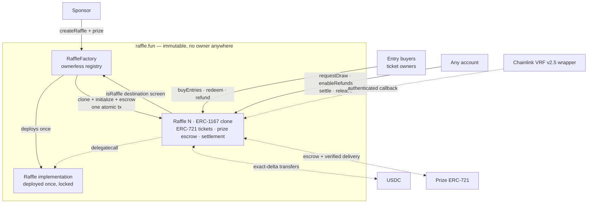
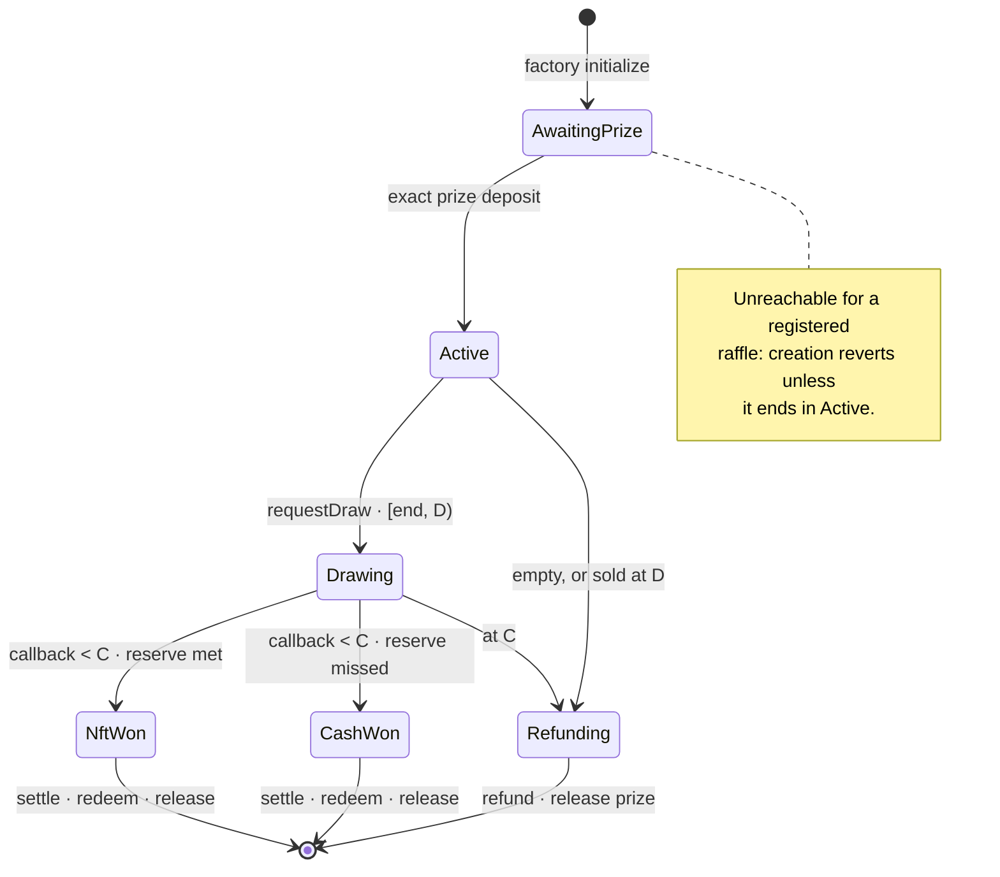
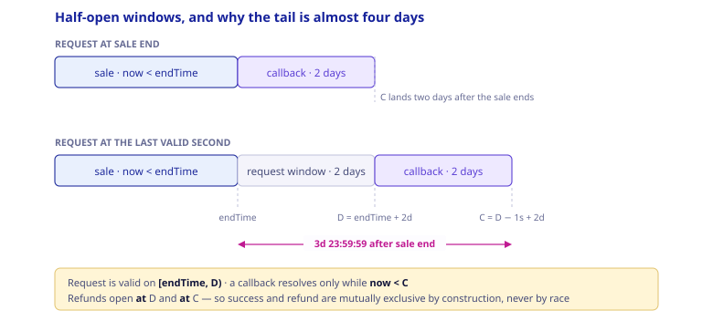
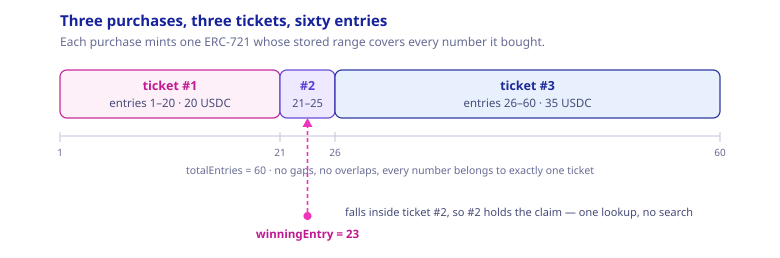
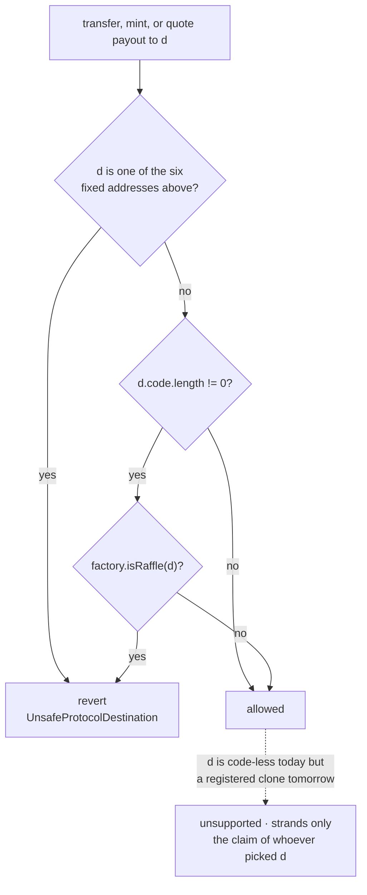
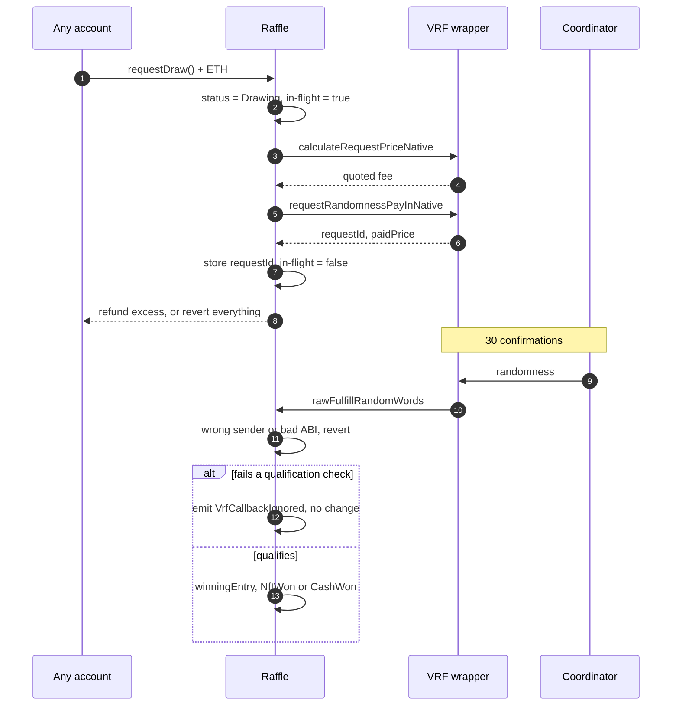
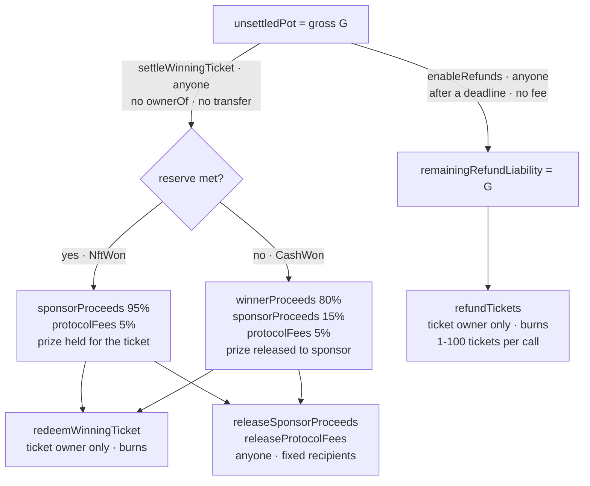
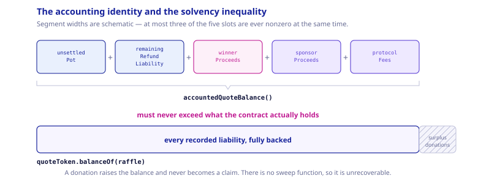
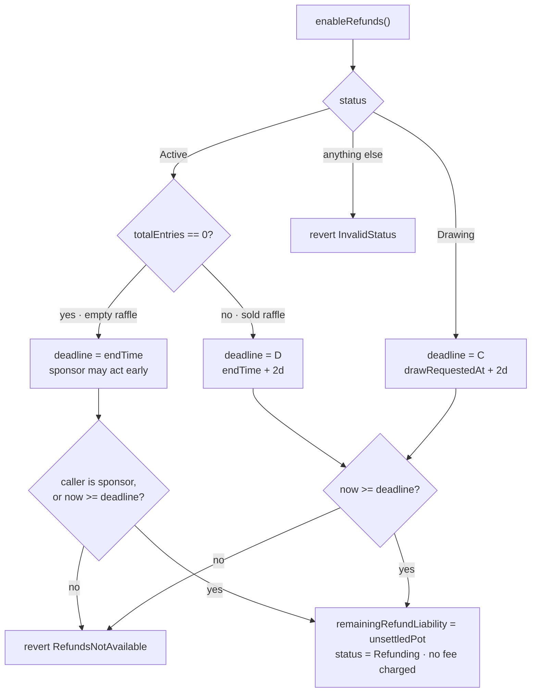

# raffle.fun: A Technical Whitepaper

**An immutable, administrator-free NFT raffle protocol with constant-time range tickets,
bearer settlement, and hard-bounded oracle liveness.**

| Field                 | Value                                                                                                |
| --------------------- | ---------------------------------------------------------------------------------------------------- |
| **Version**           | Contracts `1.0.0`                                                                                    |
| **Protocol commit**   | `e65e1e5f89a548ed03a0ebe0a0b722d609244d18` (production Solidity)                                     |
| **Document date**     | 2026-08-20                                                                                           |
| **Audience**          | Security auditors, protocol engineers, researchers, integrators, sophisticated participants          |
| **Target chain**      | Ethereum mainnet (1); Sepolia (11155111) required first                                              |
| **Compiler**          | Solidity `0.8.36`, exact pragma, EVM target `cancun`, optimizer enabled at 200 runs, via-IR disabled |
| **Dependencies**      | `@openzeppelin/contracts@5.6.1`, `@chainlink/contracts@1.5.0`                                        |
| **Deployment status** | **Not deployed.** No deployment record exists for any network.                                       |
| **Audit status**      | **Not independently audited.**                                                                       |

---

## 0. Scope, precedence, and non-claims

### 0.1 Precedence

This document describes the production Solidity in `packages/contracts/src/` at the commit
above. Where any other artifact disagrees — including this document — **the deployed
bytecode is authoritative for onchain behavior**.

Every substantive claim below is backed by a Fact ID in
[`docs/facts/raffle-fun-facts.md`](../facts/raffle-fun-facts.md), which cites the contract,
line, function, and test for each. Fact IDs appear inline as `[RF-nnn]`.

### 0.2 Evidence of record

`packages/contracts/audit/CURRENT-*.md` is the internal evidence set for this candidate.
`V12-REVIEW-2026-08-20.md` is an independent review of a supplied third-party finding
export at commit `3da958f`; it promoted none of its fifteen entries to a confirmed
in-scope exploit and states explicitly that it "is not a mainnet go-ahead" `[RF-066]`.

A freshness caveat applies throughout §13: the recorded campaign totals were captured at
implementation SHA `92eccb4`, before the hard request/callback-boundary remediation, the
official Chainlink consumer-base migration, the bearer-redemption redesign, and the
ownerless-factory change. Behavioral statements in this document are read from current
source; the **numeric** totals are preserved evidence for earlier SHAs and must be
reproduced from a clean checkout of the release SHA.

<!-- retired-reference:start -->

### 0.3 Superseded artifacts

Several documents in this repository describe an **earlier** architecture — a Base
deployment, Pyth Entropy randomness, a read-aggregator Lens, an `Ownable2Step` factory,
per-ticket minting, and a variable ticket price — and must not be relied on:

- `docs/whitepaper/**` (the retired generation's source, build pipeline, fact-check
  register, and pre-generated SVG figures). Its fact generator still requires symbols that
  no longer exist in production Solidity, so `pnpm docs:whitepaper` cannot run.
- `packages/contracts/audit/` reports dated 2026-08-13 or earlier, plus
  `INTERNAL-AUDIT.md`, `INDEPENDENT-SPECIFICATION.md`, `FINDINGS.md`,
  `MUTATION-TESTING.md`, `TEST-CAMPAIGN.md`, `RESIDUAL-RISKS.md`, and
  `RELEASE-READINESS-2026-08-17.md`.

§16.2 tabulates precisely what was removed, so a future writer cannot reintroduce retired
behavior from a historical report.

<!-- retired-reference:end -->

### 0.4 Non-claims

This document does **not** assert that raffle.fun is audited, formally verified,
trustless, provably fair, risk-free, guaranteed, live, or production-ready. The project's
own campaign record states the disposition verbatim: internally audit-ready for
independent review; **not mainnet-ready** `[RF-064]`. Nine release-verification gaps
(`V1-REL-01` … `V1-REL-09`) remain open.

### 0.5 Security objective (as stated by the project)

> For an honest standards-compliant ERC-721 prize and available exact-transfer official
> USDC, no unauthorized party can select the winner, seize or duplicate a supported asset,
> create an unfunded liability, redirect a fixed recipient's balance, or make work scale
> with total entries. A sold raffle has a bounded two-day request window followed, if a
> request succeeds, by a bounded two-day callback window, each with an exact full-refund
> recovery boundary — subject to external asset and chain availability.

The objective explicitly excludes lost keys, contracts incapable of acting, malicious or
upgraded token code, issuer freezes and blocklists, burned escrowed NFTs, dishonest token
reads, chain halt, universal censorship, and unrelated assets forced into the contract.
See §12 and §13.

---

## 1. Design goals and rationale

raffle.fun targets a narrow problem: run a single-prize NFT raffle onchain such that no
party — including the protocol operator — can alter the outcome, withhold settlement, or
strand assets, while keeping every execution path bounded in gas **independently of how
much was sold**.

Six design decisions follow from that and shape everything else.

**G1 — No administrator anywhere in the system.** Neither the factory nor any raffle has
an owner, role, pause, upgrade, rescue, or mutable configuration `[RF-001]`, `[RF-008]`.
Every transition is gated only by lifecycle status, `block.timestamp`, ERC-721 ownership,
and wrapper authentication. This eliminates governance and key-compromise risk entirely,
at the cost of eliminating all remediation `[RF-009]`.

**G2 — One implementation, many clones.** Each factory deploys one locked `Raffle`
implementation and creates fixed-target ERC-1167 minimal proxies `[RF-006]`. Every
canonical raffle provably runs identical code; there is no proxy admin, beacon, CREATE2
salt, or upgrade path. The clone's 45-byte runtime hard-codes its implementation, so
"immutable" needs no argument beyond reading the factory constructor.

**G3 — Range tickets, not per-entry tokens.** One purchase mints one ERC-721 holding an
inclusive `[firstEntry,lastEntry]` `uint128` range `[RF-017]`. Buying one entry and buying
a million entries cost the same in mints and storage writes. This is what makes purchase,
resolution, and winner proof O(1) in entry count `[RF-063]`.

**G4 — Bearer credentials, and settlement that never reads ownership.**
`settleWinningTicket` proves which ticket contains the winning entry and allocates every
liability without calling `ownerOf`, burning, or transferring `[RF-041]`. The ticket stays
an ordinary transferable ERC-721 — in _every_ status, including after the winner is
known — until its current owner burns it to redeem `[RF-021]`. Secondary markets work
natively; destination risk moves entirely onto the user.

**G5 — Hard-bounded liveness with terminal fallback.** Both ways the protocol can stall
have an exact deadline, after which a **permissionless** function converts the raffle to
full, fee-free refunds `[RF-050]`. Requests and callbacks are excluded _at_ their
deadlines and refunds open _at_ them, so the two are mutually exclusive by construction
rather than by race `[RF-028]`, `[RF-029]`.

**G6 — Fixed recipients and exact-delta verification.** No caller can name a payout
destination: value goes to the current ticket owner, the immutable `sponsorRecipient`, or
the immutable `protocolTreasury` `[RF-044]`. Both incoming and outgoing ERC-20 movements
are verified by two-sided balance delta `[RF-016]`, `[RF-055]`, and NFT delivery is
verified by `ownerOf` post-condition `[RF-043]`.

### 1.1 Explicit non-goals

- Multi-prize, multi-winner, or tiered raffles.
- Multiple quote tokens, or a variable entry price, per factory.
- Any form of privacy `[RF-077]`.
- Reroll, second oracle, or randomness fallback `[RF-059]`.
- Any onchain economic value ceiling `[RF-073]`.
- Cross-raffle asset recovery. This was implemented once, found exploitable, and
  deliberately removed (§16.2).

---

## 2. System architecture



There are exactly **two** production contracts and no offchain privileged component. There
is no read-aggregator Lens: integrators read raffles directly and authenticate them
through the factory registry (§14.1).

### 2.1 Contract responsibilities

| Contract         | Holds assets                                      | Mutable state                            | Authority           |
| ---------------- | ------------------------------------------------- | ---------------------------------------- | ------------------- |
| `RaffleFactory`  | No                                                | Registry mappings and `raffleCount` only | **None** `[RF-001]` |
| `Raffle` (clone) | Yes — one ERC-721 prize + quote-token liabilities | Lifecycle, liabilities, ERC-721 ledger   | **None** `[RF-008]` |

Both rows read "None". That is the whole point of the design, and it is checked as an
ABI-surface property, not merely asserted.

### 2.2 Inheritance

```text
Raffle        is IRaffle, ERC721, ReentrancyGuard, IERC721Receiver, VRFV2PlusWrapperConsumerBase
RaffleFactory is IRaffleFactory, ReentrancyGuard
```

`VRFV2PlusWrapperConsumerBase`, `IVRFV2PlusWrapper`, and `VRFV2PlusClient` come from the
exact-pinned official `@chainlink/contracts@1.5.0` `[RF-034]`. The protocol does not
reimplement a coordinator or wrapper, and native direct funding means no raffle creates or
manages a VRF subscription.

### 2.3 Bytecode footprint

Measured with `forge build --sizes` at this document's commit `[RF-062]`:

| Contract        | Runtime (B) | Initcode (B) | Runtime margin (B) | Initcode margin (B) |
| --------------- | ----------: | -----------: | -----------------: | ------------------: |
| `Raffle`        |      17,459 |       18,569 |              7,117 |              30,583 |
| `RaffleFactory` |       3,973 |       23,476 |             20,603 |              25,676 |

Runtime margin is against EIP-170 (24,576 B); initcode margin against EIP-3860
(49,152 B). The factory's runtime is small because the protocol logic lives in the cloned
implementation; its **initcode** is large because its constructor deploys that
implementation.

> **Auditor note.** The retired generation carried a 309-byte EIP-170 margin on the
> factory and treated the size gate as release-sensitive. The clone architecture removed
> that constraint. Re-measure on the frozen release SHA anyway.

---

## 3. Formal lifecycle

### 3.1 The `Status` enum

`IRaffle.Status` is the sole lifecycle **and** economic-outcome representation. There is no
second outcome enum and no `Closed` state.

| Ordinal | Name            | Meaning                                                 |
| ------: | --------------- | ------------------------------------------------------- |
|       0 | `AwaitingPrize` | Exists only inside the creation transaction `[RF-011]`  |
|       1 | `Active`        | Prize escrowed; sale open while `now < endTime`         |
|       2 | `Drawing`       | Exactly one VRF request pending                         |
|       3 | `NftWon`        | Reserve met; prize reserved for the winning ticket      |
|       4 | `CashWon`       | Reserve missed; prize returns to the sponsor side       |
|       5 | `Refunding`     | A liveness deadline expired, or the raffle sold nothing |

> **Auditor note.** Ordinal `0` is unreachable for any _registered_ raffle: creation's
> post-condition requires `Active`, so a raffle that fails to activate is never registered
> `[RF-011]`. It is, however, the live status of the locked implementation, which the
> constructor parks in `Refunding` with zero liability `[RF-007]`.

### 3.2 Transition graph



`NftWon`, `CashWon`, and `Refunding` are **absorbing**. Unlike the retired design, `NftWon`
has no outbound edge to `Refunding`: a resolved result is final `[RF-040]`. §9.5 states the
consequence without softening.

### 3.3 Transition guards

Let `D = drawRequestDeadline() = endTime + 2 days` and
`C = callbackDeadline() = drawRequestedAt + 2 days`.

| From → To                  | Trigger              | Guards                                                                                                                              |
| -------------------------- | -------------------- | ----------------------------------------------------------------------------------------------------------------------------------- |
| `—` → `AwaitingPrize`      | `initialize`         | `!initialized` ∧ `msg.sender == factory` ∧ no zero party ∧ no party is a known protocol destination `[RF-007]`                      |
| `AwaitingPrize` → `Active` | `onERC721Received`   | `msg.sender == prizeToken` ∧ `tokenId == prizeTokenId` ∧ `from == sponsor` ∧ `operator == factory` `[RF-012]`                       |
| `Active` → `Drawing`       | `requestDraw`        | `now >= endTime` ∧ `totalEntries != 0` ∧ `now < D` ∧ `msg.value >= quotedFee` `[RF-028]`, `[RF-030]`                                |
| `Active` → `Refunding`     | `enableRefunds`      | `totalEntries == 0` ∧ (`msg.sender == sponsor` ∨ `now >= endTime`) — **or** — `totalEntries != 0` ∧ `now >= D`                      |
| `Drawing` → `NftWon`       | `fulfillRandomWords` | wrapper-authenticated ∧ `!_requestInFlight` ∧ `requestId == vrfRequestId` ∧ one word ∧ `now < C` ∧ `totalEntries >= reserveEntries` |
| `Drawing` → `CashWon`      | `fulfillRandomWords` | same, with `totalEntries < reserveEntries`                                                                                          |
| `Drawing` → `Refunding`    | `enableRefunds`      | `now >= C`                                                                                                                          |

Any other `enableRefunds` status reverts `InvalidStatus`; before the applicable deadline it
reverts `RefundsNotAvailable(deadline, now)`.

### 3.4 Timing envelope

All constants from `RaffleConstants.sol` `[RF-027]`, `[RF-028]`, `[RF-029]`:

| Constant                       |   Value |
| ------------------------------ | ------: |
| `MAX_SALE_DURATION`            | 30 days |
| `DRAW_REQUEST_TIMEOUT`         |  2 days |
| `DRAW_CALLBACK_TIMEOUT`        |  2 days |
| `MAX_REFUND_TICKET_BATCH_SIZE` |     100 |

There is no start delay and no NFT-redemption timeout. The sale begins the moment the
prize deposit activates the clone, inside the creation transaction `[RF-015]`.

**Worst-case custody bound.** From creation, the longest interval before _some_ terminal
asset path is unconditionally available is:

```text
30d (sale) + 2d (request window) + 2d (callback window) = 34 days
```

**The almost-four-days subtlety.** The two windows are two days each, but they are
sequential rather than overlapping, and the second one starts when the request lands. A
request included at `D − 1` receives a _full fresh_ two-day callback window, so the last
nominal boundary after sale end is

```text
(2 days − 1 second) + 2 days  ≈  3 days 23:59:59
```

— just under four days, not two. Integrators and monitoring must key on
`callbackDeadline()`, never on `endTime + 4 days` as a constant.



Sale boundaries are **exclusive end**, and the request window opens inclusively at the same
instant, so the sale and draw windows abut with no dead interval `[RF-026]`.

---

## 4. Creation and prize escrow

### 4.1 Atomic construction

`RaffleFactory.createRaffle` performs, in a single transaction `[RF-010]`:

1. `_validateCreateParams` (§4.2).
2. `endTime > block.timestamp` and `endTime − now <= MAX_SALE_DURATION`.
3. `raffleId = ++raffleCount`.
4. `raffle = Clones.clone(raffleImplementation)` — a standard EIP-1167 minimal proxy.
5. `IRaffle(raffle).initialize(...)` with `sponsor = msg.sender`, the factory's immutable
   `protocolTreasury`, and the caller's `sponsorRecipient`, `prizeToken`, `prizeTokenId`,
   `reserveEntries`, `endTime`. Status becomes `AwaitingPrize`.
6. Registry writes: `raffleById`, `idByRaffle`, `isRaffle` `[RF-005]`.
7. `prizeToken.safeTransferFrom(msg.sender, raffle, prizeTokenId)` → triggers the clone's
   receiver hook → status `Active`.
8. **Post-conditions:** `ownerOf(prizeTokenId) == raffle` **and**
   `IRaffle(raffle).status() == Active`, else `PrizeEscrowVerificationFailed`.
9. `emit RaffleCreated(...)` (ten fields, indexer-complete).

Any failure reverts everything, including the clone deployment and every registry write.
**No registered raffle can remain in `AwaitingPrize`** `[RF-011]`.

> **Auditor note.** The double post-condition is deliberate. `ownerOf` alone would not
> catch a token that invokes the receiver hook without transferring; the status check alone
> would not catch a token that transfers without invoking the hook. Both together still
> route through the prize contract, so a fully dishonest ERC-721 defeats both `[RF-056]`.
> `createRaffle` is `nonReentrant`, and a prize attempting to reenter during escrow is
> rejected atomically.

> **Auditor note — initialization ordering.** `initialize` writes `initialized = true`
> _before_ validating its parameters. That is safe precisely because creation is atomic: a
> rejected parameter reverts the whole transaction, so a clone can never be left
> half-configured but flagged initialized. Slither's fixed-clone initialization heuristic
> is suppressed at exactly this call with its rationale in source; no detector is disabled
> globally `[RF-067]`.

### 4.2 Creation parameter validation

| Check                                                                                   | Failure                     |
| --------------------------------------------------------------------------------------- | --------------------------- |
| `prizeToken.code.length != 0`                                                           | `NotContract`               |
| `sponsorRecipient != address(0)`                                                        | `ZeroAddress`               |
| `prizeToken` ∉ {factory, quoteToken, vrfWrapper, implementation, any registered raffle} | `UnsafeProtocolDestination` |
| `sponsorRecipient` ∉ same set ∪ {`prizeToken`}                                          | `UnsafeProtocolDestination` |
| `supportsInterface(type(IERC721).interfaceId)` returns true; a throwing call is caught  | `UnsupportedPrizeToken`     |
| `reserveEntries != 0`                                                                   | `ZeroReserveEntries`        |
| `endTime > block.timestamp`                                                             | `InvalidEndTime`            |
| `endTime − block.timestamp <= 30 days`                                                  | `SaleDurationTooLong`       |

`reserveEntries` is unbounded above. A sponsor may set an unreachable threshold to force the
cash branch deterministically — permitted, and frontends should surface it `[RF-038]`.

The clone's own `initialize` re-screens `sponsor`, `sponsorRecipient`, and
`protocolTreasury` against `_isInitializationProtocolDestination`, which additionally
covers the raffle itself and the implementation `[RF-025]`.

### 4.3 Receiver authentication

`onERC721Received` reverts with `UnexpectedPrize(token, tokenId, from, operator)` unless
all five conditions hold: correct status, correct token contract, correct token ID, sent by
the sponsor, operated by the factory `[RF-012]`. Because `AwaitingPrize` is unreachable
after activation, a duplicate deposit of the same token is rejected. Unsafe `transferFrom`
bypasses the hook entirely; such tokens are never accounted and have no rescue path
`[RF-058]`.

---

## 5. Ticket model

### 5.1 Issuance

`buyEntries(address recipient, uint128 entryCount) → uint256 ticketId`:

```text
require status == Active                                   // InvalidStatus
require block.timestamp < endTime                          // SaleEnded
require recipient != 0                                     // InvalidRecipient
require entryCount != 0                                    // ZeroEntryCount
require entryCount <= type(uint128).max - totalEntries     // TotalEntriesOverflow

grossAmount = uint256(entryCount) * ENTRY_PRICE            // uint128 * 1e6 cannot overflow
before      = quoteToken.balanceOf(this)
quoteToken.safeTransferFrom(msg.sender, this, grossAmount)
received    = saturatingSub(quoteToken.balanceOf(this), before)
require received == grossAmount                            // UnsupportedQuoteToken

firstEntry  = totalEntries + 1
lastEntry   = totalEntries + entryCount
ticketId    = ticketCount + 1

totalEntries = lastEntry
ticketCount += 1
_ticketRanges[ticketId] = TicketRange(firstEntry, lastEntry)
unsettledPot += grossAmount

_safeMint(recipient, ticketId)
emit TicketPurchased(msg.sender, recipient, ticketId, firstEntry, lastEntry, entryCount, grossAmount)
```

The overflow guard precedes all token interaction `[RF-019]`. The balance-delta equality
makes fee-on-transfer and rebasing tokens unusable by construction `[RF-016]`. `_safeMint`
invokes `onERC721Received` on contract recipients; a revert propagates and rolls back the
entire purchase including the payment `[RF-020]`. `nonReentrant` prevents nested purchases
from a malicious receiver or a reentrant token.

**Invariants.** `grossSales() == totalEntries * ENTRY_PRICE` by construction, because
`grossSales()` is a derived view with no backing storage `[RF-049]`. Ranges partition
`[1, totalEntries]` exactly, with no gaps and no overlaps `[RF-018]`.



> **Integrator note.** `totalEntries` and `ticketCount` advance **independently**. A
> purchase of 20 entries advances the first by 20 and the second by 1. Code that conflates
> them is wrong. Both are `uint128` and uncapped; they must remain `bigint` end to end,
> because a JavaScript `number` conversion silently corrupts values above 2^53
> `[RF-017]`.

### 5.2 Bearer semantics

Redemption and refund authorization is `msg.sender == ownerOf(ticketId)` — nothing else.
Approvals and operator approvals are **insufficient** `[RF-022]`: an approval is a transfer
right, not a claim right, so an operator wanting to redeem must first take the token. Both
consuming paths `_burn` before any external asset transfer, so a right is consumed exactly
once `[RF-023]`; a reverting transfer rolls the burn back and permits retry.

### 5.3 There is no transfer lock

```text
lock ⟺ false
```

The `_update` override imposes exactly one restriction, and it is about _destination_, not
_timing_:

```solidity
if (to != address(0) && _isKnownProtocolDestination(to)) revert UnsafeProtocolDestination(to);
```

| Status      | Non-winning ticket | Winning ticket |
| ----------- | ------------------ | -------------- |
| `Active`    | transferable       | n/a            |
| `Drawing`   | transferable       | transferable   |
| `NftWon`    | transferable       | transferable   |
| `CashWon`   | transferable       | transferable   |
| `Refunding` | transferable       | transferable   |

> **Auditor note — this reverses the retired design.** The previous generation froze all
> transfers during the draw and locked the winning ticket permanently after resolution. Both
> locks are gone `[RF-021]`. The reason is the settlement split (§9 and §6.5): because
> `settleWinningTicket` never reads `ownerOf`, a post-resolution transfer cannot corrupt
> accounting — it only changes who may later burn the ticket. The consequence is that a
> **known-winning** ticket is freely tradeable after settlement. That is intended behavior,
> not an oversight, and any marketplace integration must price it accordingly.

> **Integrator notes.**
>
> 1. OpenZeppelin 5.x routes every transfer and both `safeTransferFrom` overloads through
>    `_update`, so the destination screen is universal.
> 2. `_burn` also routes through `_update`, with `to == address(0)`; the guard's
>    `to != address(0)` condition is what allows burns to succeed.
> 3. Losing tickets are **never** burned. After settlement they remain valid, transferable
>    ERC-721s worth nothing `[RF-024]`. Do not present them as live claims.
> 4. `ticketRange()` is persistent historical metadata: it keeps returning a burned
>    ticket's range. Live-ticket semantics must come from `ownerOf()` `[RF-018]`.

### 5.4 Destination screening

```solidity
_isKnownProtocolDestination(d) =
      d == address(this)
   || d == factory
   || d == address(quoteToken)
   || d == address(i_vrfV2PlusWrapper)
   || d == address(prizeToken)
   || d == IRaffleFactory(factory).raffleImplementation()
   || (d.code.length != 0 && IRaffleFactory(factory).isRaffle(d))
```

Applied at `_update` (non-burn transfers) and `_transferQuoteExact`. An initialization-time
analogue screens `sponsor`, `sponsorRecipient`, and `protocolTreasury`; the factory applies
the same test to `prizeToken` and `sponsorRecipient` at creation, and to
`protocolTreasury` in its own constructor `[RF-025]`, `[RF-003]`.



> **Auditor note — the code-length residual.** The `isRaffle` branch fires only when the
> destination **already has code**. An address that is code-less today and later becomes a
> registered clone is _explicitly unsupported_ `[RF-058]`. This is reachable — the
> repository tests it — but it is **owner-controlled self-stranding**: the holder must
> themselves choose the predicted address, and the regression is named
> `testFutureCanonicalCloneCanBrickOnlyItsOwnWinnerRedemption`. The retired design closed
> this gap with a permissionless recovery dispatcher; that dispatcher was itself
> exploitable — a permissionless `CREATE` caller could capture a predicted address and
> drain claims assigned before deployment — and was removed. The gap is accepted in
> preference to reintroducing a seizure-capable executor `[RF-072]`.

> **Auditor note — screening is same-factory only.** `isRaffle` resolves against _this_
> raffle's factory registry. A different factory's raffle is invisible to the check.

> **Auditor note — the treasury variant is a deployment trap, not a runtime one.** A
> factory deployed with a code-less address that later becomes a registered clone as its
> treasury can eventually halt creation at that nonce. The intended mainnet validator
> rejects a code-less treasury, making this a deployment control `[RF-071]`.

> **Gas note.** Every ticket transfer to an address with code performs an external
> `isRaffle` call to the factory. Integrators batching transfers should budget for it.

---

## 6. Randomness integration

### 6.1 Request path

```solidity
function requestDraw() external payable nonReentrant returns (uint256 requestId)
```

```text
require status == Active                                     // InvalidStatus
require block.timestamp >= endTime                           // RaffleNotEnded
require totalEntries != 0                                    // NoEntriesSold
require block.timestamp < drawRequestDeadline()              // DrawRequestWindowExpired

quotedFee = i_vrfV2PlusWrapper.calculateRequestPriceNative(callbackGasLimit, 1)
require msg.value >= quotedFee                               // InsufficientVrfFee

status          = Drawing                    // written BEFORE the external call
drawRequestedAt = uint64(block.timestamp)
_requestInFlight = true
extraArgs        = ExtraArgsV1({ nativePayment: true })
(requestId, paidPrice) = requestRandomnessPayInNative(callbackGasLimit, requestConfirmations, 1, extraArgs)
require paidPrice <= msg.value                               // InsufficientVrfFee
vrfRequestId     = requestId
_requestInFlight = false

excess = msg.value - paidPrice
if excess != 0:
    raw call(gas(), msg.sender, excess, 0, 0, 0, 0)          // zero return-data copy
    require success                                          // NativeRefundFailed

emit DrawRequested(requestId, msg.sender, paidPrice, excess, drawRequestedAt, callbackDeadline())
```

Key properties:

- **Exactly one request per raffle.** The `status = Drawing` write precedes the external
  call, so a second `requestDraw` fails the `Active` check, and a wrapper attempting to
  reenter `requestDraw` is rejected `[RF-030]`.
- **Quote and request use identical parameters.** Both pass `callbackGasLimit` and a word
  count of `1`, so a quote/request mismatch is structurally impossible `[RF-033]`.
- **The fee is paid from the caller's ETH, never the pot.** The USDC pot is untouched by
  the draw `[RF-030]`.
- **Excess is returned synchronously or the whole request reverts** `[RF-031]`. The raffle
  never holds a native balance: `receive()` reverts with `DirectNativeTransfer`.
- **Zero return-data copy.** The refund uses raw assembly with `retOffset = retSize = 0`,
  neutralizing a return-data bomb from a malicious requester.
- **Failure is not consuming.** A reverting fee read or request reverts the whole
  transaction, restoring `Active` with `drawRequestedAt == 0` and `vrfRequestId == 0`,
  preserving the request window for a retry `[RF-032]`.

### 6.2 Callback authentication

Authentication is layered, and each layer fails differently — which matters when reading
logs:

1. **Transport (reverts).** The inherited `rawFulfillRandomWords` requires
   `msg.sender == i_vrfV2PlusWrapper`, the immutable wrapper. Anything else reverts.
2. **Decoding (reverts).** Calldata that cannot ABI-decode into `(uint256, uint256[])`
   reverts inside Solidity's decoder, before the handler body executes.
3. **Application (ignored, with an event).** `fulfillRandomWords` early-returns, emitting
   `VrfCallbackIgnored(receivedRequestId, expectedRequestId, status)`, when **any** of:
   - `_requestInFlight` — a synchronous callback arriving before `vrfRequestId` is stored;
   - `status != Drawing` — stale, duplicate, or post-refund delivery;
   - `requestId != vrfRequestId` — wrong request;
   - `randomWords.length != 1` — wrong word count;
   - `block.timestamp >= callbackDeadline()` — expired.



> **Auditor note.** The handler **returns rather than reverts** on rejection `[RF-035]`.
> This is deliberate: reverting inside an oracle callback can have provider-side
> consequences. The trade-off is that a rejected callback is observable only as an event.
> Monitoring must alert on `VrfCallbackIgnored`; the subgraph indexes it as an immutable
> diagnostic entity with a per-raffle counter (`V1-SUBGRAPH-01`, closed).

> **Auditor note — the in-flight guard.** `_requestInFlight` is the narrow defense for the
> window in which `vrfRequestId` is still zero `[RF-036]`. Without it, a wrapper that calls
> back synchronously — with request ID `0`, matching the not-yet-written slot — could
> resolve the raffle before the request even returned. Regressions cover the synchronous
> valid, wrong-ID, duplicate, and zero-ID attempts.

### 6.3 Resolution

```text
resolvedEntry = uint128((randomWords[0] % uint256(totalEntries)) + 1)
winningEntry  = resolvedEntry
resolvedAt    = uint64(block.timestamp)
status        = totalEntries >= reserveEntries ? NftWon : CashWon
emit RaffleResolved(requestId, resolvedEntry, status)
```

That is the **entire** callback body after qualification. It performs bounded storage work
and **zero external calls** — no ERC-20, no ERC-721, no user address, no loop, no ticket
search `[RF-037]`. This is what makes a fixed 300,000-unit callback limit safe for a raffle
with any number of entries or tickets, and it is asserted by a gas regression that holds
both branches below the budget and shows callback cost does not scale with ticket count
`[RF-063]`.

> **Integrator note.** `RaffleResolved` carries **no economic fields**. Unlike the retired
> design, the callback credits nothing: every liability is recorded later, by
> `settleWinningTicket` (§9). Index `WinningTicketSettled` for amounts, not `RaffleResolved`.

### 6.4 Modulo bias

`(random mod n) + 1` over a 256-bit domain is non-uniform whenever `n ∤ 2^256`. For
`n ≤ 2^128` the total variation distance from uniform is bounded by roughly `n / 2^256`,
so the absolute per-entry probability difference sits at the `2^-256` scale — negligible
for any realistic entry count. It is **not zero**, and the protocol documents it rather
than claiming uniformity `[RF-039]`, `[RF-075]`. No rejection sampling is performed; doing
so would require either an unbounded callback loop or a second oracle round.

**Consequence for public communication:** raffle.fun must not be described as provably
fair.

### 6.5 The oracle trust assumption

The randomness source is Chainlink VRF v2.5 through the official native direct-funding
wrapper, using the exact-pinned official consumer base `[RF-034]`. Correctness of the
drawn word rests on Chainlink's cryptographic and operational security model; the protocol
adds no second source, no reroll, and no manual override `[RF-059]`.

Two properties are worth stating precisely for a reviewer:

**Availability, not honesty, is the bounded failure.** If the wrapper or coordinator is
unavailable, misconfigured, or censored, the raffle does not hang: it falls to full,
fee-free refunds at whichever deadline applies (§9). The contract cannot switch providers
or raise its immutable 300,000-unit callback limit `[RF-059]`.

**The request-time acquisition window is closed by ordering, not by a lock.** Because the
result is decided by a word delivered after `requestConfirmations = 30` confirmations, and
because tickets are freely transferable, an observer who learns the word before it lands
could in principle try to acquire the containing ticket. This is bounded by Chainlink's own
model — the word is not revealed to the consumer before the callback — and by the fact that
acquisition requires a willing counterparty who does not yet know the outcome either. It is
**not** closed by a transfer lock, because there is none.

> **Auditor note.** A counterfeit _configured_ wrapper would defeat all of this outright by
> choosing words. That is a deployment-validation concern, not a runtime one: the deployment
> validator pins and live-checks the official Chainlink wrapper, and the wrapper address is
> immutable thereafter (`V12` entry `243758`, `[RF-034]`).

---

## 7. Economic model

### 7.1 Constants

| Constant               |     Value | Meaning                                          |
| ---------------------- | --------: | ------------------------------------------------ |
| `BPS`                  |    10,000 | basis-point denominator                          |
| `PROTOCOL_FEE_BPS`     |       500 | 5% protocol fee on gross                         |
| `CASH_WINNER_BPS`      |     8,000 | 80% winner share **of gross** in the cash branch |
| `ENTRY_PRICE`          | 1,000,000 | one entry = 1 USDC at six decimals               |
| `QUOTE_TOKEN_DECIMALS` |         6 | enforced by the factory constructor              |

All are compile-time constants embedded in the shared implementation. Neither rate can be
changed for an existing raffle by any party, because no party exists `[RF-045]`, `[RF-002]`.

> **Auditor note — the split base changed.** The retired design computed the winner's 80%
> against a _post-fee_ pot, yielding an effective 76/5/19. The current design takes all
> three shares from **gross**, yielding 80/5/15 `[RF-047]`. Any comparison against a
> historical report must account for this.

### 7.2 The sponsor's position

The reserve is not a safety rail bolted onto a raffle; it is the sponsor's **ask**, and
because every entry is exactly one dollar, the reserve _is_ the gross ask in whole USDC:

```text
ask = reserveEntries × 1 USDC
```

Settlement is a binary on whether gross sales cleared that ask, and the sponsor is paid
either way:

| Condition                        | Branch      | Sponsor receives                            | Prize                 |
| -------------------------------- | ----------- | ------------------------------------------- | --------------------- |
| `totalEntries >= reserveEntries` | `NftWon`    | `0.95 × grossSales`, uncapped above the ask | to the winning ticket |
| `0 < totalEntries < reserve`     | `CashWon`   | `0.15 × grossSales` **and the NFT back**    | returned to sponsor   |
| `totalEntries == 0`              | `Refunding` | nothing                                     | returned to sponsor   |

If a sponsor wants a particular **net** amount, the gross reserve is
`reserveEntries = ceil(ask / 0.95)`.

This is structurally a **covered call**. The sponsor writes an option on an asset they
hold; entry buyers pay the premium; if the strike is cleared the asset is delivered, and if
it is not, the writer keeps both the asset and a share of the premium. `reserveEntries` is
the strike, one dollar per entry is the premium unit, and `endTime` is expiry. Three
differences from a conventional covered call matter:

1. **Exercise is probabilistic per buyer but deterministic in aggregate.** Clearing the ask
   guarantees the NFT transfers; which buyer receives it is the random part.
2. **The writer cannot close the position early.** The prize is escrowed until settlement
   `[RF-013]`, so there is no buy-back and no cancellation.
3. **The unexercised premium is shared, not kept whole.** In the cash branch the sponsor
   keeps 15% of gross, not the full premium, because 80% is paid to the drawn ticket.

### 7.3 Fee

```text
protocolFee = floor(grossPot × 500 / 10_000)
```

Computed via `Math.mulDiv` in exactly **one** location — `_settleWinningTicket` — over the
whole pot rather than per purchase, which avoids per-purchase rounding accumulation.
Charged on neither refund origin nor on an empty raffle `[RF-045]`, `[RF-053]`.

### 7.4 Branch settlement

Settlement is a single private routine reached from either `settleWinningTicket` or
`redeemWinningTicket` `[RF-041]`:

```text
require !settlementComplete                                  // SettlementAlreadyComplete
require status ∈ {NftWon, CashWon}                           // InvalidStatus
require ticketRange(ticketId) contains winningEntry          // TicketDoesNotContainWinningEntry

grossPot    = unsettledPot
protocolFee = mulDiv(grossPot, 500, 10_000)

if status == NftWon:
    sponsorAmount = grossPot - protocolFee                   //  95%
else:
    cashAmount    = mulDiv(grossPot, 8_000, 10_000)          //  80%
    sponsorAmount = grossPot - protocolFee - cashAmount      //  15%
    winnerProceeds = cashAmount

settlementComplete = true
winningTicketId    = ticketId
unsettledPot       = 0
sponsorProceeds    = sponsorAmount
protocolFees       = protocolFee

emit WinningTicketSettled(ticketId, msg.sender, status, cashAmount, protocolFee, sponsorAmount)
```

Note what is absent: no `ownerOf`, no `_burn`, no token transfer, no user call. Settlement
is pure accounting `[RF-041]`.



**Refund branches.** `remainingRefundLiability = unsettledPot`, `unsettledPot = 0`; each
burned ticket pays exactly `(lastEntry − firstEntry + 1) × ENTRY_PRICE` `[RF-052]`.

### 7.5 Conservation

Both floor divisions assign their remainder to the sponsor via subtraction, so value is
conserved exactly in raw token units `[RF-048]`:

```text
NftWon    : protocolFee + sponsorProceeds                   = grossPot
CashWon   : protocolFee + winnerProceeds + sponsorProceeds  = grossPot
Refunding : Σ (range weight × ENTRY_PRICE per burned ticket) = grossPot
```

**Worked example (adversarial rounding).** The subtraction rule is what makes conservation
hold even for a pot that is not a clean multiple. For `grossPot = 999,999` raw units:

| Quantity          | Computation                       |         Value |
| ----------------- | --------------------------------- | ------------: |
| `protocolFee`     | `floor(999,999 × 500 / 10,000)`   |        49,999 |
| `winnerProceeds`  | `floor(999,999 × 8,000 / 10,000)` |       799,999 |
| `sponsorProceeds` | `999,999 − 49,999 − 799,999`      |       150,001 |
| **Sum**           |                                   | **999,999** ✓ |

> **Auditor note.** In practice `grossPot` is always a multiple of `1,000,000`, because
> entries are whole dollars and the entry price is fixed `[RF-014]`. Both floors are
> therefore exact and the remainder is zero. The example above is unreachable through
> `buyEntries`; it is included to show the accounting is correct regardless, which is what a
> fuzz campaign over the arithmetic actually exercises.

### 7.6 Canonical cash-branch example

80 entries against a 100-entry reserve, gross 80.00 USDC:

| Recipient                      |     Amount |
| ------------------------------ | ---------: |
| Winning ticket (current owner) | 64.00 USDC |
| Protocol treasury              |  4.00 USDC |
| Sponsor recipient              | 12.00 USDC |
| Sponsor recipient              |    the NFT |

### 7.7 Canonical NFT-branch example

100 entries against a 100-entry reserve — equality meets the reserve `[RF-038]` — gross
100.00 USDC:

| Recipient                      |     Amount |
| ------------------------------ | ---------: |
| Winning ticket (current owner) |    the NFT |
| Protocol treasury              |  5.00 USDC |
| Sponsor recipient              | 95.00 USDC |

---

## 8. Accounting and solvency

### 8.1 The identity

```text
accountedQuoteBalance()
  = unsettledPot
  + remainingRefundLiability
  + winnerProceeds
  + sponsorProceeds
  + protocolFees
```

### 8.2 Solvency invariant

```text
quoteToken.balanceOf(raffle) >= accountedQuoteBalance()
```



Surplus arises only from direct donations and never becomes a liability `[RF-054]`. There
is no sweep function; donated quote tokens are unrecoverable, a deliberate consequence of
G1.

### 8.3 Liability lifecycle by status

| Status                | `unsettledPot`   | `remainingRefundLiability` | `winnerProceeds` | `sponsorProceeds` | `protocolFees` |
| --------------------- | ---------------- | -------------------------- | ---------------- | ----------------- | -------------- |
| `Active`              | grows with sales | 0                          | 0                | 0                 | 0              |
| `Drawing`             | frozen at gross  | 0                          | 0                | 0                 | 0              |
| `NftWon` (unsettled)  | **full gross**   | 0                          | 0                | 0                 | 0              |
| `NftWon` (settled)    | 0                | 0                          | 0                | 95%               | 5%             |
| `CashWon` (unsettled) | **full gross**   | 0                          | 0                | 0                 | 0              |
| `CashWon` (settled)   | 0                | 0                          | 80%              | 15%               | 5%             |
| `Refunding`           | 0                | full gross (decreasing)    | 0                | 0                 | 0              |

> **Auditor note.** Both resolved branches sit at "full gross in `unsettledPot`" until
> somebody settles. Settlement is permissionless and free of external interaction
> specifically so that this state is trivially exitable by any party `[RF-041]`.

### 8.4 Exact-transfer verification

`_transferQuoteExact(to, amount)` verifies **both sides** `[RF-055]`:

```text
require !_isKnownProtocolDestination(to)                   // InvalidQuoteDestination
raffleBefore = balanceOf(this);  recipientBefore = balanceOf(to)
safeTransfer(to, amount)
debited  = saturatingSub(raffleBefore, balanceOf(this))
credited = saturatingSub(balanceOf(to), recipientBefore)
require debited == amount && credited == amount            // UnsupportedQuoteTokenTransfer
```

Checking both sides catches recipient-bonus tokens (credit > debit) and sender-rebate
tokens (debit < amount) that a one-sided check would miss. On revert, the ticket burn, the
zeroed liability slot, and the decremented refund liability are all restored, so the claim
survives for a later retry. This preserves the onchain claim across a USDC blocklist
event — it cannot force the transfer `[RF-069]`.

Incoming payment is verified symmetrically at `buyEntries` `[RF-016]`. Settlement performs
**no** external asset interaction at all, so there is nothing to verify there.

---

## 9. Liveness analysis

### 9.1 The refund origins

`enableRefunds()` is permissionless and dispatches on status `[RF-050]`:

|   # | From                          | Deadline                | Who may call                      | Interpretation                      |
| --: | ----------------------------- | ----------------------- | --------------------------------- | ----------------------------------- |
|   1 | `Active`, `totalEntries == 0` | `endTime`               | sponsor any time; anyone at/after | Empty raffle, zero liability        |
|   2 | `Active`, `totalEntries != 0` | `drawRequestDeadline()` | anyone at/after                   | No randomness request was accepted  |
|   3 | `Drawing`                     | `callbackDeadline()`    | anyone at/after                   | Request accepted, no valid callback |

Any other status reverts `InvalidStatus`. Before the deadline: `RefundsNotAvailable`.



> **Auditor note.** Origin 1 is the **only** sponsor-specific timing privilege anywhere in
> the protocol, and it can be exercised only when there is no buyer money at stake
> `[RF-051]`. It replaces the retired design's separate `Closed` state; an empty raffle
> simply becomes zero-liability `Refunding`, from which `releaseSponsorPrize` returns the
> NFT.

### 9.2 Hard cutoffs, not races

**A deadline does not mutate state.** It changes which transactions are valid. The design
makes success and refund _mutually exclusive by construction_ rather than by inclusion
order `[RF-028]`, `[RF-029]`:

- `requestDraw` requires `now < D`; refund origin 2 requires `now >= D`.
- A callback resolves only when `now < C`; refund origin 3 requires `now >= C`.

So at the exact boundary instant, the "success" transaction is already invalid and only the
refund transition is available. A late callback is not merely losing a race — it is ignored
outright, emitting `VrfCallbackIgnored`, **even if `enableRefunds` has not yet been
called** `[RF-035]`. Regressions assert this at equality in both orderings.

> **Auditor note.** This differs materially from the retired design, where a late callback
> could still resolve the raffle if nobody had finalized refunds first. The current
> semantics remove that ambiguity, at the cost of turning any post-cutoff censorship or
> reorganization into a forced refund rather than a delayed success `[RF-070]`.

### 9.3 Refund redemption

```solidity
function refundTickets(uint256[] calldata ticketIds) external returns (uint256 amount)
```

Requires `status == Refunding` and `1 <= ticketIds.length <= 100`. Each ID must be owned by
`msg.sender`; each is burned and its range weight accumulated. Then
`amount = aggregateEntries × ENTRY_PRICE`, `remainingRefundLiability -= amount`, and
`_transferQuoteExact(msg.sender, amount)` `[RF-052]`.

The batch is **atomic**: a duplicate ID fails on the second `ownerOf` (the first burn
cleared the owner), and a foreign ID fails ownership — either reverts the whole batch.

> **Integrator note — the bound is on tickets, not entries.** One hundred is the maximum
> number of **ticket IDs** per call. A single ticket may carry any `uint128` entry count, so
> one call can refund an arbitrarily large amount of USDC. Refund gas scales with the batch
> length, not with the entries inside the tickets `[RF-063]`.

### 9.4 Redemption liveness

The winner never depends on a third party. `redeemWinningTicket` performs settlement
inline when settlement has not yet occurred, so the owner can settle and redeem in one
transaction `[RF-042]`. Conversely, if settlement was already committed by someone else,
the winner's claim is unaffected and the sponsor and treasury claims are independently
releasable `[RF-044]`, so winner inactivity or a broken prize cannot block those.

### 9.5 What liveness does **not** guarantee

Three limits, stated plainly:

1. **Deadlines are deterministic only given inclusion.** They cannot defeat validator or
   builder censorship, a halted chain, or a reorganization. Censorship or a reorganization
   that removes an otherwise valid request or callback _after_ its cutoff prevents replay
   and forces the refund branch `[RF-070]`.
2. **Nobody is obliged to request the draw.** The requester pays Chainlink's fee from their
   own funds with no protocol reimbursement. The economic assumption is that a ticket holder
   or the sponsor is motivated to pay it; if nobody does, the raffle refunds in full
   `[RF-030]`.
3. **A resolved result is final, including when the prize cannot be delivered.** There is no
   post-result refund timeout in either branch `[RF-040]`. If the prize collection is later
   paused, upgraded, frozen, burned, or hostile, the NFT winner's claim can be blocked
   indefinitely and buyers are **not** refunded — while the sponsor and treasury quote
   claims remain releasable. This is the sharpest consequence of the bearer redesign and the
   single most material launch consideration `[RF-068]`; §12 T3 and §16 restate it.

---

## 10. Authority model

### 10.1 Complete authority matrix

| Capability                                   | Sponsor | Sponsor recipient |  Ticket owner  | Treasury | Anyone |
| -------------------------------------------- | :-----: | :---------------: | :------------: | :------: | :----: |
| Create a raffle                              |    ✓    |         —         |       —        |    —     |   ✓    |
| Change any existing raffle parameter         |  **✗**  |       **✗**       |     **✗**      |  **✗**   | **✗**  |
| Cancel or pause a **sold** raffle            |  **✗**  |       **✗**       |     **✗**      |  **✗**   | **✗**  |
| Pause or reconfigure the factory             |  **✗**  |       **✗**       |     **✗**      |  **✗**   | **✗**  |
| Close a zero-sale raffle before `endTime`    |    ✓    |         ✗         |       ✗        |    ✗     |   ✗    |
| Close a zero-sale raffle at/after `endTime`  |    ✓    |         ✓         |       ✓        |    ✓     |   ✓    |
| Request the draw                             |    ✓    |         ✓         |       ✓        |    ✓     |   ✓    |
| Choose or override the winner                |  **✗**  |       **✗**       |     **✗**      |  **✗**   | **✗**  |
| Enable refunds after a deadline              |    ✓    |         ✓         |       ✓        |    ✓     |   ✓    |
| Settle the winning ticket                    |    ✓    |         ✓         |       ✓        |    ✓     |   ✓    |
| Redirect settlement value                    |  **✗**  |       **✗**       |     **✗**      |  **✗**   | **✗**  |
| Redeem the winning ticket                    |    —    |         —         | ✓ (owner only) |    ✗     |   ✗    |
| Refund tickets                               |    —    |         —         | ✓ (owner only) |    ✗     |   ✗    |
| Trigger release of sponsor proceeds          |    ✓    |         ✓         |       ✓        |    ✓     |   ✓    |
| Trigger release of protocol fees             |    ✓    |         ✓         |       ✓        |    ✓     |   ✓    |
| Trigger return of the prize (Cash/Refunding) |    ✓    |         ✓         |       ✓        |    ✓     |   ✓    |
| Rescue arbitrary assets                      |  **✗**  |       **✗**       |     **✗**      |  **✗**   | **✗**  |

Read the "Anyone" column together with the "Redirect" row: many actions are permissionless
to _trigger_, and none of them let the caller choose a destination `[RF-044]`.

### 10.2 There is no factory owner

`RaffleFactory` inherits only `IRaffleFactory` and `ReentrancyGuard`. It declares no
`Ownable`, no role, no `onlyOwner` modifier, no setter, and no pause flag. Its entire
external mutating surface is `createRaffle` `[RF-001]`, `[RF-004]`.

Everything a factory owner could once reach is now fixed at factory deployment: the quote
token, the VRF wrapper, the protocol treasury, the raffle implementation, the callback gas
limit, and the confirmation count are all `immutable` or `constant` `[RF-002]`. Changing any
of them requires deploying a new factory; existing raffles are unaffected by, and invisible
to, a newer factory.

> **Auditor note.** This removes the retired design's owner-key trust assumption, its
> treasury setter, its creation pause, and the renunciation-bricking hazard, all at once.
> The corresponding cost is in §10.3 and is not small.

### 10.3 Incident response envelope

Existing raffles cannot be upgraded, paused, or patched, and **new creation cannot be
stopped onchain** `[RF-009]`, `[RF-074]`. A confirmed vulnerability permits only:
warn users, disable first-party frontend writes and sponsor onboarding, monitor, and deploy
a new factory version. Raffles already running proceed to their own terminal states
regardless.

---

## 11. Failure mode analysis

| Failure                                             | Detection                     | Outcome                                              | Fee charged | Fact     |
| --------------------------------------------------- | ----------------------------- | ---------------------------------------------------- | :---------: | -------- |
| Prize transfer or activation fails at creation      | double post-condition         | entire creation reverts, clone discarded             |      —      | `RF-010` |
| Prize reenters during escrow                        | `nonReentrant`                | creation reverts atomically                          |      —      | `RF-010` |
| Quote token under- or over-delivers on purchase     | balance delta                 | purchase reverts, no ticket                          |      —      | `RF-016` |
| Ticket receiver reverts                             | `_safeMint`                   | purchase fully reverts, payment returned             |      —      | `RF-020` |
| Cumulative entry overflow                           | pre-transfer guard            | reverts before payment                               |      —      | `RF-019` |
| Zero entries sold                                   | `totalEntries == 0`           | zero-liability `Refunding`; NFT returned             |   **no**    | `RF-051` |
| VRF fee read or request reverts                     | no `try/catch`                | tx reverts, stays `Active`, window preserved         |      —      | `RF-032` |
| Native excess refund fails                          | raw call result               | whole request reverts                                |      —      | `RF-031` |
| Direct ETH sent to raffle                           | `receive()`                   | reverts                                              |      —      | `RF-031` |
| No draw request within 2 days of sale end           | `enableRefunds` origin 2      | full refunds                                         |   **no**    | `RF-050` |
| No valid callback within 2 days of the request      | `enableRefunds` origin 3      | full refunds                                         |   **no**    | `RF-050` |
| Synchronous / wrong-ID / stale / duplicate callback | five application guards       | ignored, `VrfCallbackIgnored` emitted                |      —      | `RF-035` |
| Wrong word count                                    | `randomWords.length != 1`     | ignored, event emitted                               |      —      | `RF-035` |
| Callback at or after `callbackDeadline()`           | timestamp guard               | ignored, refunds available                           |      —      | `RF-035` |
| Unauthorized or undecodable callback calldata       | transport / ABI decoder       | reverts                                              |      —      | `RF-035` |
| Non-winning ticket supplied to settlement           | range containment             | reverts `TicketDoesNotContainWinningEntry`           |      —      | `RF-041` |
| Second settlement attempt                           | `settlementComplete`          | reverts                                              |      —      | `RF-041` |
| Non-owner attempts redemption                       | `ownerOf` check               | reverts `NotTicketOwner`                             |      —      | `RF-022` |
| Prize undeliverable at redemption                   | `ownerOf` post-check          | tx reverts; burn rolled back; retry possible         |      —      | `RF-043` |
| Prize permanently undeliverable                     | none                          | **winner claim blocked; buyers are NOT refunded**    |    yes\*    | `RF-068` |
| Quote payout under/over-delivers                    | two-sided delta               | reverts; claim preserved                             |      —      | `RF-055` |
| Payout or ticket destination is a protocol sink     | `_isKnownProtocolDestination` | reverts; claim preserved                             |      —      | `RF-025` |
| Forced ETH (`SELFDESTRUCT`)                         | none                          | outside accounting; unrecoverable                    |      —      | `RF-058` |
| Direct quote-token donation                         | none                          | surplus; unrecoverable                               |      —      | `RF-054` |
| Unrelated NFT via unsafe transfer                   | none                          | outside accounting; unrecoverable                    |      —      | `RF-058` |
| Ticket sent to an incapable contract                | none                          | claim forfeit; **no recovery**                       |      —      | `RF-072` |
| Claim assigned to a future code-less clone address  | none                          | **unsupported**; strands only that party's own claim |      —      | `RF-058` |
| Losing tickets after settlement                     | none                          | remain valid, tradable, worth nothing                |      —      | `RF-024` |

\* The fee and sponsor proceeds are recorded at settlement and remain releasable even when
prize delivery is permanently blocked. That asymmetry is deliberate — one broken recipient
must not roll back another's allocation — and it is exactly why prize-collection review is a
product control (§12 T3).

---

## 12. Trust assumptions

Ordered by the project's own severity assessment.

### T1 — Chainlink VRF v2.5 wrapper and coordinator

The configured wrapper and coordinator must be the official deployments and must remain
available, correctly priced, and within the coordinator's maximum gas. An outage,
configuration change, coordinator failure, or prolonged censorship yields refunds rather
than a wrong result `[RF-059]`. A _counterfeit configured_ wrapper would be able to choose
words outright — hence deployment pinning is a mandatory gate, not a convenience
`[RF-034]`.

Deployment validation must confirm the 300,000-unit consumer limit plus wrapper overhead
plus Chainlink's EIP-150 compensation, `floor(callbackGasLimit / 63) + 1`, fits the live
coordinator maximum, at the finalized release block (`V1-DEPLOY-01`, closed) `[RF-033]`.

### T2 — Quote-token issuer

The intended quote token is USDC. Circle can pause, freeze, blocklist, or upgrade it.
Exact-delta checks preserve onchain claims across a failed transfer but cannot force one
`[RF-069]`. The Solidity is **not** hard-coded to USDC — the factory accepts any
code-bearing address reporting six decimals, and "official USDC" is enforced by deployment
validation and human review `[RF-057]`.

### T3 — Prize ERC-721 honesty (most material)

ERC-165 support is self-reported, and `ownerOf` verification routes through the same
contract that could be lying. A malicious, upgradeable, pausable, transfer-restricted, or
later-hostile collection can forge custody statements at creation or permanently block
delivery after a final result, and no contract can assess whether a prize has value
`[RF-056]`, `[RF-068]`.

Because §9.5(3) removes the post-result refund fallback, this dependency is the most
material launch consideration in the current risk set. Prize admission and collection
review are product controls, and per-raffle collection verification belongs at the purchase
decision, not only in general documentation.

### T4 — Ethereum inclusion, ordering, and finality

Ordering at deadline boundaries, request/callback delay, individual censorship, halt, and
reorganization are all outside protocol control. Thirty confirmations materially reduce
ordinary reorganization risk without creating a mathematical finality guarantee
`[RF-070]`.

### T5 — Deployment configuration and the treasury wallet

The factory's immutables cannot be corrected after deployment. The treasury must be an
independently reviewed contract wallet with tested signer, recovery, module, and monitoring
policies; a code-less or predicted-clone treasury can poison a factory `[RF-071]`,
`[RF-079]`. Verified source, runtime hashes, the canonical clone target, and official
dependency addresses must all be checked against a finalized release-day block.

### T6 — User destination choices

Arbitrary non-callable ticket, proceeds, and prize destinations are deliberately unsolved
because they are undecidable from bytecode `[RF-072]`. Every reachable case is
self-stranding: the party choosing the destination is the only party harmed.

---

## 13. Verification evidence

> These are the maintainers' own campaign results. They are evidence of testing depth, not
> proof of correctness, and **not an audit** `[RF-066]`.

### 13.1 Freshness caveat (read first)

The totals in §13.2 were captured at implementation SHA `92eccb4` with mutation evidence at
`e9e0e73`. They predate the hard request/callback-boundary remediation, the official
Chainlink consumer-base migration, the bearer-redemption redesign, and the ownerless-factory
change. They are preserved evidence for those SHAs and **do not** validate the current
source `[RF-067]`.

The deterministic suites were reproduced at **this document's commit** and are the only
totals here that describe the current source:

| Suite                        |                                 Result at `e65e1e5` |
| ---------------------------- | --------------------------------------------------: |
| Foundry (81 tests)           | **80 passed, 0 failed, 1 skipped** (RPC-gated fork) |
| Hardhat deployment + journey |                             **21 passed, 0 failed** |

This matches the independent run recorded in `V12-REVIEW-2026-08-20.md` at SHA `3da958f`.
Everything in §13.2 other than these two rows still requires reproduction from a clean
checkout of the frozen release SHA (`V1-REL-02`).

### 13.2 Recorded campaign totals

| Gate                                          |                                                Result |
| --------------------------------------------- | ----------------------------------------------------: |
| Foundry deterministic/security/fuzz/invariant |                                   72 passed, 0 failed |
| RPC-gated Ethereum fork test                  |                     1 **skipped** without an endpoint |
| Hardhat deployment and journey suite          |                                   22 passed, 0 failed |
| Independent Python protocol model             |                                   11 passed, 0 failed |
| Declared mutation campaign                    |                               52 of 52 mutants killed |
| Deterministic gas suite                       |                                   57 passed, 0 failed |
| SDK / web / subgraph                          |                          14 / 15 / 7 passed, 0 failed |
| Production-only coverage                      |     100.00% lines, 100.00% functions, 94.12% branches |
| Slither                                       |                 47 contracts, 64 detectors, 0 results |
| Gitleaks                                      | tracked worktree and 25-commit history scans: 0 leaks |

Eight Foundry fuzz properties passed the 1,000-case default campaign and the 100,000-case
audit profile. Seven stateful invariants passed the default 16,384-call/property profile and
the 256,000-call/property audit and strict profiles; the strict profile enables
`fail_on_revert` and completed with zero handler reverts.

### 13.3 Invariant catalog

The "seven stateful invariants" above is the count at SHA `92eccb4`. The current source
ships **nine**, the two additions covering the hard deadline boundaries and the
settlement/redemption markers introduced by the remediation:

| Invariant                                                                   | Property                                    |
| --------------------------------------------------------------------------- | ------------------------------------------- |
| `invariantTicketIdsAreSequential`                                           | ticket IDs are dense and ordered            |
| `invariantRangesPartitionEverySoldEntryExactlyOnce`                         | ranges partition `[1, totalEntries]`        |
| `invariantWinningEntryHasExactlyOneReceiptProof`                            | exactly one ticket can satisfy winner proof |
| `invariantQuoteAccountingIsExactAndSolvent`                                 | §8.1 identity and §8.2 solvency hold        |
| `invariantBranchEconomicsRemainEightyFifteenFiveNinetyFiveFiveOrFullRefund` | §7.5 conservation in all three branches     |
| `invariantStatusAndTerminalTransitionsAreMonotonic`                         | terminal statuses are absorbing             |
| `invariantDrawAndCallbackDeadlinesAreHardAndOrdered`                        | §9.2 hard cutoffs                           |
| `invariantSettlementAndRedemptionMarkersMatchTicketState`                   | markers agree with the ERC-721 ledger       |
| `invariantPrizeCustodyMatchesClaimMarker`                                   | `prizeClaimed` agrees with actual custody   |

`docs/SECURITY-INVARIANTS.md` enumerates 64 review-level invariants mapped to unit,
adversarial, fuzz, stateful, Echidna, fork, and static evidence.

### 13.4 Fork validation

Two RPC-gated cases exist — `testEthereumMainnetChainlinkVrfUsdcAndRangeReceipt` and
`testEthereumSepoliaChainlinkVrfUsdcAndRangeReceipt` — reading live USDC and Chainlink
wrapper state. **Both were compiled but skipped in the recorded runs; no RPC-backed result
is claimed for this candidate** `[RF-034]`. **No transaction has been broadcast on any
network** `[RF-065]`.

### 13.5 Acknowledged tooling limits

- The Echidna harness compiles, but **no current runtime campaign is claimed** because the
  executable was unavailable (`V1-REL-05`).
- The 52-mutant result covers a declared, hand-selected compiling set. It is **not** an
  exhaustive mutation-space claim.
- Fuzzing, stateful invariants, differential modelling, and coverage cannot enumerate all
  states or external behaviors.
- Static analysis, dependency, signature, secrets, ABI-drift, gas, size, coverage, source
  verification, and deployment validation must all be rerun on the frozen release SHA
  (`V1-REL-02`, `V1-REL-03`).

### 13.6 Independent review of a third-party export

`V12-REVIEW-2026-08-20.md` reviewed a fifteen-entry third-party finding export against
SHA `3da958f` and promoted **none** of it to a confirmed in-scope exploit. Several entries
remain useful as residual-risk evidence and are folded into §11 and §12:

| Entry                      | Subject                                          | Disposition here              |
| -------------------------- | ------------------------------------------------ | ----------------------------- |
| `243747`                   | Untrusted prize tokens can forge escrow/delivery | §12 T3, `RF-056`              |
| `243754`                   | Unavailable prize can lock winner claims         | §9.5(3), §12 T3, `RF-068`     |
| `243748`/`243749`/`243759` | Future-clone claim trapping                      | §5.4, `RF-072`                |
| `243750`                   | Future-clone treasury poisons a factory          | §12 T5, `RF-071`              |
| `243751`/`243752`          | `uint64` timestamp wrap                          | Invalid on Ethereum, `RF-027` |
| `243757`/`243758`          | Quote/wrapper admission breadth                  | §12 T1, T2, deployment gates  |
| `243760`                   | `ticketRange()` lacks live-existence semantics   | §5.3 integrator note          |

The review's own follow-up list — direct refund regressions for duplicate/nonexistent IDs
and an exactly-100 batch, a fully lying ERC-721 mock, a predicted-treasury regression, and
per-raffle collection warnings at the purchase decision — remains open hardening work.

---

## 14. Integration guide

### 14.1 Authenticating a raffle

**Never trust a contract because it looks like a raffle.** There is no Lens to do this for
you. Authenticate through the registry `[RF-005]`:

```solidity
require(factory.isRaffle(candidate), "not canonical");
```

Bytecode shape is not proof: an ERC-1167 clone of the same implementation deployed outside
the factory is unregistered and must be rejected. Conversely `isRaffle` proves canonical
deployment only — never the quality or legitimacy of the prize collection `[RF-004]`.

### 14.2 Reading state

Read the raffle directly. The relevant views:

| Group       | Views                                                                                                                                                |
| ----------- | ---------------------------------------------------------------------------------------------------------------------------------------------------- |
| Lifecycle   | `status()`, `endTime()`, `drawRequestDeadline()`, `callbackDeadline()`, `drawRequestedAt()`, `resolvedAt()`                                          |
| Sale        | `totalEntries()`, `ticketCount()`, `grossSales()`, `reserveEntries()`, `ENTRY_PRICE()`                                                               |
| Tickets     | `ticketRange(id)`, `ownerOf(id)`, `winningEntry()`, `winningTicketId()`                                                                              |
| Liabilities | `unsettledPot()`, `remainingRefundLiability()`, `winnerProceeds()`, `sponsorProceeds()`, `protocolFees()`, `accountedQuoteBalance()`                 |
| Markers     | `settlementComplete()`, `winnerRedeemed()`, `prizeClaimed()`, `winnerRecipient()`                                                                    |
| Fixed       | `factory()`, `quoteToken()`, `vrfWrapper()`, `prizeToken()`, `prizeTokenId()`, `sponsor()`, `sponsorRecipient()`, `protocolTreasury()`, `raffleId()` |
| VRF pricing | `getVrfRequestPrice()`, `estimateVrfRequestPrice(gasPriceWei)`                                                                                       |

Caveats:

- `callbackDeadline()` returns **0** before any request. Do not render it as an epoch.
- `getVrfRequestPrice()` is a live wrapper quote and moves with gas pricing. Quote
  immediately before sending, and overpay to absorb drift — excess is returned `[RF-031]`.
  `estimateVrfRequestPrice` exists for what-if pricing at a hypothetical gas price.
- `grossSales()` counts everything ever sold; it is **not** the remaining pot `[RF-049]`.

### 14.3 Write paths

All first-party SDK actions simulate against live chain state before writing. The subgraph
is **never** authoritative for transactions.

| Action                                                                   | Notes                                                                                        |
| ------------------------------------------------------------------------ | -------------------------------------------------------------------------------------------- |
| `createRaffle`                                                           | requires prior ERC-721 approval; sale starts immediately on success                          |
| `buyEntries`                                                             | requires prior ERC-20 approval for `entryCount × 1 USDC`; any positive `uint128` count       |
| `requestDraw`                                                            | **payable**; quote immediately before, overpay to absorb drift; valid only in `[endTime, D)` |
| `enableRefunds`                                                          | permissionless; check the applicable deadline first                                          |
| `settleWinningTicket`                                                    | permissionless; supply the ticket ID whose range contains `winningEntry`                     |
| `redeemWinningTicket`                                                    | caller must be `ownerOf(ticketId)`; settles inline if needed                                 |
| `refundTickets`                                                          | batch of 1–100 **ticket IDs**, deduplicated, all owned by the caller                         |
| `releaseSponsorProceeds` / `releaseProtocolFees` / `releaseSponsorPrize` | permissionless; always pay the fixed recipient                                               |

### 14.4 Indexing pitfalls

1. `RaffleResolved` carries **no amounts**. Index `WinningTicketSettled` for the fee,
   sponsor, and winner allocations (§6.3).
2. `winningTicketId` is `0` until settlement, even though `winningEntry` is set at
   resolution. Key "resolved" on `resolvedAt`/`status`, and "settled" on
   `settlementComplete`.
3. Tickets are transferable in **every** status, including after settlement. An indexer
   must track ERC-721 `Transfer` events throughout the lifecycle and must not assume the
   settler or the resolution-time owner is the eventual redeemer `[RF-021]`.
4. Losing tickets are never burned and remain transferable forever `[RF-024]`.
   `ticketRange()` also survives a burn, so use `ownerOf()` for live-ticket semantics.
5. `VrfCallbackIgnored` is emitted **without** a state change — a monitoring signal, not a
   lifecycle event. It is indexed as an immutable diagnostic with a per-raffle counter;
   production alerting should also consume finalized raw logs `[RF-035]`.
6. `totalEntries` and `ticketCount` are independent counters. Keep both, and keep both as
   `bigint` `[RF-017]`.
7. Ticket burns emit ERC-721 `Transfer` to the zero address and are the only ticket
   destruction path.
8. Each raffle captures its own `protocolTreasury` immutably; read the raffle, not the
   factory.

### 14.5 Gas characteristics

Purchase is one payment plus one mint regardless of entry count; the callback is one modulo
plus bounded writes; winner proof is one range load `[RF-063]`. Regressions assert that
callback gas does not scale with ticket count, that both terminal branches stay below the
300,000-unit budget, and that purchase and refund gas do not scale with the entries inside a
ticket. Refund cost scales with batch length up to the 100-ticket bound. Ticket transfers to
code-bearing addresses incur one external `isRaffle` call `[RF-025]`. The committed
deterministic gas snapshot is the reference; re-measure on the release SHA.

---

## 15. Deployment and operational requirements

Full procedure: [`docs/DEPLOYMENT.md`](../DEPLOYMENT.md). Executable gate list:
`packages/contracts/audit/RELEASE-CHECKLIST.md`.

### 15.1 Current state

`deployments/` contains only `schema.json`, and `packages/config/src/deployments.ts`
exports an **empty** record map, so `protocolIsConfigured === false` in the web app and all
writes are disabled. There is no default mainnet deployment command `[RF-065]`.

### 15.2 Deployment-time verification (must pass before any record is published)

- Official Ethereum chain ID and the current Chainlink VRF v2.5 native wrapper address
  verified from primary sources **on release day**; wrapper and coordinator code and
  configuration live-checked.
- Consumer callback limit + wrapper overhead + EIP-150 compensation confirmed to fit the
  live coordinator maximum.
- Official USDC address verified; six decimals; unpaused; runtime code present; issuer
  control surface reviewed.
- Treasury is a reviewed contract wallet, code-bearing, and not a predicted clone address.
- Verified published source matching deployed runtime byte-for-byte, with `Proxy === "0"`,
  an exactly empty `Implementation` field, and no similar-match address (`V1-DEPLOY-02`).
- Factory ABI confirmed ownerless — no owner, role, pause, upgrade, or setter selector.
- Canonical ERC-1167 clone target compared against the deployed implementation at a
  finalized block.

### 15.3 Monitoring surface

Creation events; purchases; draw requests and `DrawRequested` fee/excess fields; the two
deadline classes; `VrfCallbackIgnored` (from finalized raw logs, not only the subgraph);
`RaffleResolved`; `WinningTicketSettled` and `WinningTicketRedeemed`; refund enablement and
`remainingRefundLiability` drawdown; the §8.2 solvency inequality per raffle; USDC
pause/blocklist indicators; prize-collection pause/upgrade indicators; and sponsor/treasury
release events.

---

## 16. Open problems and limitations

### 16.1 Open problems

|   # | Problem                                                   | Status                                                                   |
| --: | --------------------------------------------------------- | ------------------------------------------------------------------------ |
|   1 | Prize collection can permanently block a final NFT result | **Accepted, most material.** No post-result refund exists `[RF-068]`     |
|   2 | Claims assigned to future code-less clone addresses       | Accepted unsupported; the previous fix was itself exploitable `[RF-072]` |
|   3 | Arbitrary non-callable ticket and payout destinations     | Deliberately unsolved; undecidable from bytecode `[RF-072]`              |
|   4 | Modulo bias                                               | Accepted, negligible, documented `[RF-075]`                              |
|   5 | No onchain economic value ceiling                         | Accepted; requires an explicit launch-policy decision `[RF-073]`         |
|   6 | Immutability removes every remediation lever              | Accepted consequence of G1 `[RF-074]`                                    |
|   7 | Requester must fund the VRF fee                           | Economic assumption; no protocol keeper `[RF-030]`                       |
|   8 | Deployer misconfiguration can poison a factory            | Deployment control, not runtime `[RF-071]`                               |
|   9 | Independent audit                                         | **Not performed** `[RF-066]`                                             |
|  10 | RPC-backed fork validation for this candidate             | **Not performed** — both cases skipped `[RF-067]`                        |
|  11 | External-fuzzer runtime campaign                          | **Not performed** — harness compiles only `[RF-067]`                     |
|  12 | Monitored Sepolia soak and incident drill                 | **Not performed** `[RF-079]`                                             |
|  13 | Jurisdiction-specific legal review                        | **Not performed** `[RF-078]`                                             |
|  14 | Production treasury Safe selection and review             | **Not performed** `[RF-079]`                                             |

<!-- retired-reference:start -->

### 16.2 What this design retired

Historical audit reports in this repository still describe the following. None of it exists
in the current source, and none of it may be reintroduced into a public document from those
reports.

| Retired                                                  | Current                                                  |
| -------------------------------------------------------- | -------------------------------------------------------- |
| Pyth Entropy v2 randomness                               | Chainlink VRF v2.5 native direct funding (§6)            |
| Base / Base Sepolia target chain                         | Ethereum mainnet / Sepolia (§0)                          |
| `RaffleLens` read aggregator                             | Nothing. Read raffles directly (§14.1)                   |
| `Ownable2Step` factory, treasury setter, creation pause  | An ownerless factory with no admin surface (§10.2)       |
| One `CREATE` deployment per raffle                       | Fixed-target ERC-1167 clones (§2)                        |
| Variable `ticketPrice`, `minimumTickets`                 | Fixed 1 USDC `ENTRY_PRICE`, `reserveEntries` (§7.1)      |
| One ERC-721 per ticket, `1..100` per purchase            | One range ticket per purchase, any positive count (§5.1) |
| `Closed` status for zero-sale raffles                    | Zero-liability `Refunding` (§9.1)                        |
| Transfer lock during `Drawing` and on the winning ticket | No lock in any status (§5.3)                             |
| `MAX_START_DELAY` scheduled starts                       | Sale begins at creation (§3.4)                           |
| 3-day `DRAW_REQUEST_GRACE_PERIOD`                        | 2-day `DRAW_REQUEST_TIMEOUT` (§3.4)                      |
| 30-day `NFT_REDEMPTION_TIMEOUT` and `NftWon → Refunding` | Nothing. A resolved result is final (§9.5)               |
| Claims credited inside the oracle callback               | Separate permissionless `settleWinningTicket` (§7.4)     |
| Cash split of 80/20 on a post-fee pot                    | 80/5/15 of **gross** (§7.1)                              |
| `recoverProtocolOwnedClaim` recovery dispatcher          | Nothing. It was exploitable and was removed (§5.4)       |
| `claimQuote` / `claimQuoteFor` pull ledger               | Fixed-recipient release functions (§10.1)                |
| `sponsorPrizeRecoveryRecipient` as a distinct role       | The single immutable `sponsorRecipient` (§7.2)           |
| `metadataURI` and `MAX_METADATA_URI_LENGTH`              | Nothing. No onchain metadata parameter                   |
| 309-byte EIP-170 headroom on the factory                 | 20,603 bytes of runtime margin (§2.3)                    |

<!-- retired-reference:end -->

---

## Appendix A — Constants

| Constant                       |     Value |
| ------------------------------ | --------: |
| `BPS`                          |    10,000 |
| `PROTOCOL_FEE_BPS`             |       500 |
| `CASH_WINNER_BPS`              |     8,000 |
| `ENTRY_PRICE`                  | 1,000,000 |
| `QUOTE_TOKEN_DECIMALS`         |         6 |
| `MAX_REFUND_TICKET_BATCH_SIZE` |       100 |
| `MAX_SALE_DURATION`            |   30 days |
| `DRAW_REQUEST_TIMEOUT`         |    2 days |
| `DRAW_CALLBACK_TIMEOUT`        |    2 days |
| `VRF_CALLBACK_GAS_LIMIT`       |   300,000 |
| `VRF_REQUEST_CONFIRMATIONS`    |        30 |

## Appendix B — External function reference

### B.1 `Raffle`

| Signature                                                  | Mutability  | Authorization                                |
| ---------------------------------------------------------- | ----------- | -------------------------------------------- |
| `initialize(RaffleInitParams)`                             | nonpayable  | factory only, once                           |
| `buyEntries(address,uint128) → uint256`                    | nonpayable  | any; status and window gated                 |
| `requestDraw() → uint256`                                  | **payable** | any; window gated                            |
| `enableRefunds()`                                          | nonpayable  | any at the deadline; sponsor early if unsold |
| `settleWinningTicket(uint256) → uint256`                   | nonpayable  | **any**; ownership not read                  |
| `redeemWinningTicket(uint256) → uint256`                   | nonpayable  | `ownerOf(ticketId)` only                     |
| `refundTickets(uint256[]) → uint256`                       | nonpayable  | owner of every listed ticket                 |
| `releaseSponsorProceeds() → uint256`                       | nonpayable  | any; pays `sponsorRecipient`                 |
| `releaseProtocolFees() → uint256`                          | nonpayable  | any; pays `protocolTreasury`                 |
| `releaseSponsorPrize()`                                    | nonpayable  | any; pays `sponsorRecipient`                 |
| `getVrfRequestPrice() → uint256`                           | view        | —                                            |
| `estimateVrfRequestPrice(uint256) → uint256`               | view        | —                                            |
| `ticketRange(uint256) → (uint128,uint128)`                 | view        | historical metadata, survives burn           |
| `drawRequestDeadline() → uint256`                          | view        | —                                            |
| `callbackDeadline() → uint256`                             | view        | 0 before a request                           |
| `accountedQuoteBalance() → uint256`                        | view        | —                                            |
| `grossSales() → uint256`                                   | view        | derived, not stored                          |
| `onERC721Received(address,address,uint256,bytes) → bytes4` | nonpayable  | exact prize only                             |
| `receive()`                                                | payable     | **always reverts**                           |

Plus the ERC-721 surface and all public state getters declared in `IRaffle`.
`name()` is `"raffle.fun Ticket"`; `symbol()` is `"RAFFLE"`.

### B.2 `RaffleFactory`

| Signature                                                                          | Authorization   |
| ---------------------------------------------------------------------------------- | --------------- |
| `createRaffle(CreateRaffleParams) → address`                                       | **any, always** |
| `quoteToken()`, `vrfWrapper()`, `protocolTreasury()`, `raffleImplementation()`     | view, immutable |
| `callbackGasLimit()`, `requestConfirmations()`                                     | view, constant  |
| `raffleCount()`, `isRaffle(address)`, `raffleById(uint256)`, `idByRaffle(address)` | view            |

There is no owner, setter, pause, upgrade, or rescue function.

## Appendix C — Event reference

### `Raffle`

`PrizeDeposited(address indexed prizeToken, uint256 indexed prizeTokenId, address indexed sponsor)`
· `TicketPurchased(address indexed buyer, address indexed recipient, uint256 indexed ticketId, uint128 firstEntry, uint128 lastEntry, uint128 entryCount, uint256 grossAmount)`
· `DrawRequested(uint256 indexed requestId, address indexed requester, uint256 fee, uint256 excessReturned, uint256 drawRequestedAt, uint256 callbackDeadline)`
· `VrfCallbackIgnored(uint256 indexed receivedRequestId, uint256 indexed expectedRequestId, Status status)`
· `RaffleResolved(uint256 indexed requestId, uint128 indexed winningEntry, Status indexed result)`
· `RefundsEnabled(address indexed finalizer, uint256 remainingRefundLiability)`
· `WinningTicketSettled(uint256 indexed ticketId, address indexed settler, Status indexed result, uint256 cashAmount, uint256 protocolFee, uint256 sponsorAmount)`
· `WinningTicketRedeemed(uint256 indexed ticketId, address indexed winner, Status indexed result, uint256 cashAmount, address prizeToken, uint256 prizeTokenId)`
· `TicketsRefunded(address indexed owner, uint256 ticketQuantity, uint256 entryQuantity, uint256 amount, uint256 remainingRefundLiability)`
· `SponsorProceedsReleased(address indexed caller, address indexed recipient, uint256 amount)`
· `ProtocolFeesReleased(address indexed caller, address indexed treasury, uint256 amount)`
· `SponsorPrizeReleased(address indexed caller, address indexed recipient, address indexed prizeToken, uint256 prizeTokenId)`

### `RaffleFactory`

`RaffleCreated(uint256 indexed raffleId, address indexed raffle, address indexed sponsor, address sponsorRecipient, address prizeToken, uint256 prizeTokenId, address quoteToken, address protocolTreasury, uint128 reserveEntries, uint64 endTime)`

This is the only event the factory emits, and it is indexer-complete: an indexer never
needs to call back into the factory to reconstruct a raffle's fixed configuration.

## Appendix D — Error reference

**`IRaffle`** — `OnlyFactory`, `AlreadyInitialized`, `ZeroAddress`, `InvalidStatus`,
`UnexpectedPrize`, `SaleEnded`, `InvalidRecipient`, `ZeroEntryCount`,
`TotalEntriesOverflow`, `InvalidTicketBatchSize`, `UnsupportedQuoteToken`,
`UnsupportedQuoteTokenTransfer`, `InvalidQuoteDestination`, `OnlySponsor`,
`RaffleNotEnded`, `DrawRequestWindowExpired`, `NoEntriesSold`, `RefundsNotAvailable`,
`InsufficientVrfFee`, `NativeRefundFailed`, `NoWinnerProceeds`, `NoSponsorProceeds`,
`NoProtocolFees`, `UnsafeProtocolDestination`, `NotTicketOwner`,
`TicketDoesNotContainWinningEntry`, `SettlementAlreadyComplete`, `WinningTicketMismatch`,
`WinningTicketAlreadyRedeemed`, `SponsorPrizeUnavailable`, `PrizeAlreadyClaimed`,
`PrizeDeliveryVerificationFailed`.

**`Raffle` (local)** — `DirectNativeTransfer`.

**`IRaffleFactory`** — `ZeroAddress`, `NotContract`, `UnsupportedQuoteToken`,
`InvalidQuoteTokenDecimals`, `UnsupportedPrizeToken`, `UnsafeProtocolDestination`,
`ZeroReserveEntries`, `InvalidEndTime`, `SaleDurationTooLong`,
`PrizeEscrowVerificationFailed`.

## Appendix E — Primary sources

| Topic                 | Source                                                                                                      |
| --------------------- | ----------------------------------------------------------------------------------------------------------- |
| Contracts             | `packages/contracts/src/{Raffle,RaffleFactory}.sol`, `src/interfaces/`, `src/libraries/RaffleConstants.sol` |
| Fact registry         | [`docs/facts/raffle-fun-facts.md`](../facts/raffle-fun-facts.md)                                            |
| Architecture          | [`docs/ARCHITECTURE.md`](../ARCHITECTURE.md)                                                                |
| Lifecycle             | [`docs/STATE-MACHINE.md`](../STATE-MACHINE.md)                                                              |
| Economics             | [`docs/ECONOMICS.md`](../ECONOMICS.md)                                                                      |
| Randomness            | [`docs/RANDOMNESS.md`](../RANDOMNESS.md)                                                                    |
| Threat model          | [`docs/THREAT-MODEL.md`](../THREAT-MODEL.md)                                                                |
| Invariants            | [`docs/SECURITY-INVARIANTS.md`](../SECURITY-INVARIANTS.md)                                                  |
| Deployment            | [`docs/DEPLOYMENT.md`](../DEPLOYMENT.md)                                                                    |
| Monitoring            | [`docs/MONITORING.md`](../MONITORING.md)                                                                    |
| Incident response     | [`docs/INCIDENT-RESPONSE.md`](../INCIDENT-RESPONSE.md)                                                      |
| Current specification | `packages/contracts/audit/CURRENT-SPECIFICATION.md`                                                         |
| Current campaign      | `packages/contracts/audit/CURRENT-CAMPAIGN.md`, `CURRENT-TEST-MATRIX.md`                                    |
| Current findings      | `packages/contracts/audit/CURRENT-FINDINGS.md`, `CURRENT-RESIDUAL-RISKS.md`                                 |
| Latest review         | `packages/contracts/audit/V12-REVIEW-2026-08-20.md`                                                         |
| Release gates         | `packages/contracts/audit/RELEASE-CHECKLIST.md`, `RELEASE-READINESS-2026-08-18.md`                          |
| Disclosure policy     | [`SECURITY.md`](../../SECURITY.md)                                                                          |
| Chainlink VRF v2.5    | https://docs.chain.link/vrf                                                                                 |
| USDC addresses        | https://developers.circle.com/stablecoins/usdc-contract-addresses                                           |

---

_Report vulnerabilities privately through GitHub's private vulnerability reporting, as
described in [`SECURITY.md`](../../SECURITY.md). Do not publish an unpatched vulnerability._
