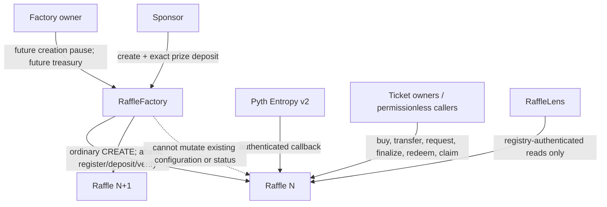
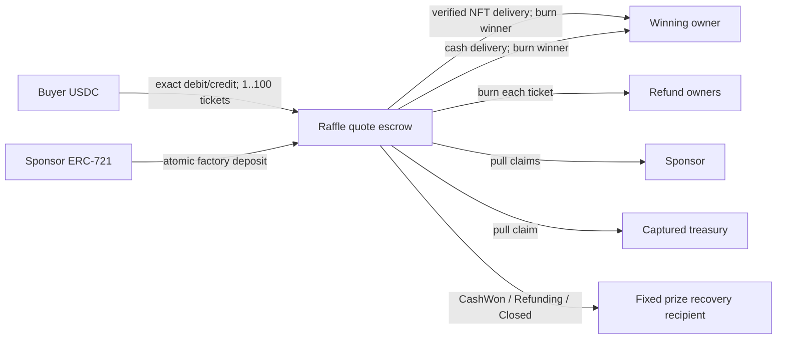
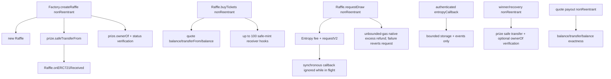

# Current-Commit Protocol Specification

**Evidence identity:** source-derived from commit `5772e54ba89c06646815ed52a881cd8940f094ca` on `main`, then reconciled with repository documentation on 2026-08-16. The tests and dependency lock may be changed by the campaign, but no production Solidity was changed. Historical audit reports are not evidence for this commit.

## Scope and source priority

The normative source order used here is current production Solidity and interfaces, current generated artifacts, then non-superseded operational documentation. The complete whitepaper and several historical audit files describe older settlement and transfer rules; their explicit superseded/historical labels are honored. They are not an oracle for current behavior.

The production graph contains three non-upgradeable contracts:

- `RaffleFactory`: ordinary `CREATE` deployment and registry, immutable quote token/Entropy/callback gas, future-only pause and treasury policy.
- `Raffle`: one immutable configuration, one escrowed ERC-721 prize, ERC-721 bearer tickets, exact quote liabilities, one Entropy v2 request, no administrator.
- `RaffleLens`: registry-authenticated, bounded, read-only aggregation. Its booleans are convenience data, never authorization.

There are no proxies, clones, initializers, upgrade paths, `CREATE2` guarantees, arbitrary calls, settlement overrides, generic rescue functions, or controls over an existing Raffle.

## Authority and mutability



Factory ownership is two-step and cannot be renounced. Compromise changes creation availability and the treasury captured by later Raffles only. Existing Raffles retain immutable sponsor, recovery recipient, treasury, quote token, Entropy, prize, schedule, threshold, callback gas, and economics.

## Construction and lifecycle

The Factory validates contract dependencies and sponsor-controlled bounds, deploys a Raffle in `AwaitingPrize`, writes the three registry indexes, emits `RaffleCreated`, safe-transfers the configured prize, verifies `ownerOf(prizeTokenId) == raffle`, and verifies `status == Active`. Any failure reverts deployment, indexes, count, event, and transfer.

Status ordinals are `AwaitingPrize=0`, `Active=1`, `Drawing=2`, `NftWon=3`, `CashWon=4`, `Refunding=5`, `Closed=6`.

```mermaid
stateDiagram-v2
  [*] --> AwaitingPrize: constructor
  AwaitingPrize --> Active: exact factory-operated prize deposit
  Active --> Drawing: requestDraw after end and before grace deadline
  Active --> Refunding: tickets sold; grace deadline reached
  Active --> Closed: no tickets; sponsor early or anyone at/after end
  Drawing --> NftWon: matching authenticated callback; threshold met
  Drawing --> CashWon: matching authenticated callback; threshold missed
  Drawing --> Refunding: callback deadline reached first
  NftWon --> Refunding: delivery deadline reached before verified delivery
```



Time never mutates status by itself. It only changes whether a call is permitted. Exact boundaries are:

- Sale: `startTime <= now < endTime`.
- Draw: `endTime <= now < endTime + 3 days`, with at least one ticket.
- Missed-request refund: `now >= endTime + 3 days`.
- Callback-timeout refund: `now >= drawRequestedAt + 2 days`.
- NFT-delivery-timeout refund: `now >= resolvedAt + 30 days` while `NftWon` and not claimed.
- Empty close: sponsor at any `Active` time with zero sales; anyone when `now >= endTime`.

At a timeout timestamp, the callback or winner delivery may still be valid until `enableRefunds` changes status. Inclusion order decides: a valid callback/delivery first makes the timeout finalizer invalid; finalization first makes a late callback ignored or delivery invalid. At the request-grace timestamp, `requestDraw` is invalid and refund finalization is valid, so there is no overlap. A purchase at `endTime` is invalid; empty close is valid.

`Refunding` remains the status after the last refund; `Closed` is exclusively the zero-sale path. Resolution fields are historical data after an NFT-timeout fallback.

## Tickets as bearer credentials

Tickets are sequential IDs starting at one. A purchase mints 1–100 safe ERC-721s and is atomic with the exact quote receipt. `grossSales == ticketPrice * totalTickets` because successful burns do not reduce cumulative sales.

Current owner—not an approved address or operator—is the economic claimant. The winning ticket burns for the NFT or cash. Each refundable ticket burns once for exactly `ticketPrice`; refund batches contain 1–100 IDs and are all-or-nothing. Burns clear approvals under ERC-721 behavior, and any later failed token/NFT interaction reverts the burn and liability changes.

All ticket transfers are frozen in `Drawing`. In `NftWon` and `CashWon`, only the selected winner is frozen; losing tickets remain transferable and may persist as souvenirs. In `Refunding`, outstanding tickets remain transferable until redeemed. All safe-transfer overloads route through the overridden `transferFrom`, so operators and overloads do not bypass locks.

Transfers reject the Raffle, its Factory, quote token, Entropy, prize collection, and already registered sibling Raffles. Constructor-fixed recovery and treasury destinations use a similar check. The contract cannot infer future capabilities: an arbitrary code-less address, a later-deployed contract, or an incapable third-party contract may still hold a credential. This is a bearer-asset limitation.

## Assets and liabilities



For gross pot `G`, integer arithmetic is:

```text
fee = floor(G * 500 / 10_000)
distributable = G - fee
cashWinner = floor(distributable * 8_000 / 10_000)
cashSponsor = distributable - cashWinner
```

On NFT success, quote proceeds remain `unsettledPot` until the prize is transferred and `ownerOf` verifies the destination. Only then are fee and sponsor pull claims credited. On cash success the callback clears `unsettledPot`, records winner cash, and credits sponsor and treasury. On every refund origin there is no protocol fee or sponsor quote claim; the whole unsettled pot becomes per-ticket refund liability. In `CashWon`, `Refunding`, and `Closed`, the fixed recovery recipient may claim the NFT once.

The authoritative identity is:

```text
accountedQuoteBalance
  = unsettledPot
  + remainingRefundLiability
  + winnerCashLiability
  + totalClaimableQuote
```

A supported quote token must maintain `balanceOf(raffle) >= accountedQuoteBalance`. Incoming purchases require the exact raffle balance delta. Outgoing payments require both exact raffle debit and exact recipient credit. Effects and burns occur before interactions under `nonReentrant`, and a failed check reverts them. Direct donations are surplus, do not become liabilities, and have no rescue path.

The supported quote asset is a six-decimal, non-rebasing, exact-transfer USDC deployment. Taxes, rebates, rebases, false/no-return anomalies, lying/reentrant `balanceOf`, proxy policy changes, pauses, and blacklists are either rejected atomically when detectable or may suspend progress. A fully malicious token or NFT can lie consistently; the protocol cannot make such an asset honest.

## External calls and reentrancy



All asset-moving public entry points are guarded. Receiver hooks may interact with siblings, but cannot reenter the same guarded operation. The Entropy callback authenticates the configured Entropy wrapper, rejects in-flight, wrong-state, and wrong-sequence attempts by emitting `EntropyCallbackIgnored`, and makes no token/user call.

## Randomness

`requestDraw` reads `getFeeV2(callbackGasLimit)`, forwards exactly that fee to `requestV2`, records its sequence, and returns all excess native value or reverts the entire request. Status changes to `Drawing` and `_requestInFlight` is set before the request call. Forced native currency is unaccounted and irrelevant.

A valid callback selects `(uint256(randomNumber) % totalTickets) + 1`. For `M=2^256`, writing `M=qN+r`, the first `r` zero-based residues occur `q+1` times and the rest `q` times. The per-ticket absolute probability difference is exactly `1/M` (`8.636168555094444625e-78`). Examples:

|               `N` |             `r` | maximum relative advantage over a low residue |
| ----------------: | --------------: | --------------------------------------------: |
|                 3 |               1 |                            `2.5908505665e-77` |
|                10 |               6 |                            `8.6361685551e-77` |
|               100 |              36 |                            `8.6361685551e-76` |
|         1,000,000 |         639,936 |                            `8.6361685551e-72` |
|     4,294,967,295 |               1 |                            `3.7092061498e-68` |
|     4,294,967,296 |               0 |                                          zero |
| 1,000,000,000,000 | 913,129,639,936 |                            `8.6361685551e-66` |

Modulo bias is mathematically nonzero except when `N` divides `2^256`, but negligible for plausible counts. This does not address the material provider selective-reveal assumption.

## Bounds and metadata

Factory start delay is at most 7 days, sale duration at most 30 days, metadata URI at most 2,048 bytes, ticket price and threshold nonzero, and callback gas nonzero. Purchase and refund loops are capped at 100; Lens batches are capped at 64. Settlement and callback never iterate over historical ticket count.

Metadata is untrusted text. The contracts do not interpret it. Frontends/indexers must not treat it as authorization or render it as trusted HTML.
