# Current protocol specification

Status: normative security-review summary for the uncommitted Ethereum v1 candidate.
Production Solidity and interfaces are authoritative if this document conflicts with code.

## Contract graph and fixed configuration

`RaffleFactory` deploys one locked `Raffle` implementation and creates canonical,
non-upgradeable ERC-1167 clones. Its two-step owner may pause future creation only.
Every clone shares the factory's immutable six-decimal quote token, Chainlink VRF v2.5
native direct-funding wrapper, protocol treasury, 300,000 callback gas limit, and 30
request confirmations.

Each raffle fixes its sponsor, immutable `sponsorRecipient`, prize contract and token ID,
reserve entry count, and exclusive sale end. The sponsor is `msg.sender` at creation;
the recipient may be a different operational or cold wallet. There is no Lens, raffle
administrator, upgrade path, generic call, rescue function, variable entry price, or
protocol-level gross-value cap.

## Creation, entries, and tickets

Creation clones, initializes, registers, escrows the exact NFT, and verifies custody and
`Active` status in one atomic transaction. Each entry costs exactly `1_000_000` raw quote
units. `buyEntries(recipient, entryCount)` collects `entryCount` dollars and mints one
ERC-721 ticket with a sequential ID. A separate mapping stores that ticket's inclusive
`uint128` entry range. Ranges start at one and partition all sold entries without gaps.

Unburned tickets remain transferable in every status. Current `ownerOf(ticketId)` is the
bearer credential at settlement or refund time. Purchase and winning-ticket verification
are O(1) in entry count; refunds loop over at most 100 supplied ticket IDs.

## Lifecycle and liveness

```text
0 AwaitingPrize
1 Active
2 Drawing
3 NftWon
4 CashWon
5 Refunding
```



```mermaid
stateDiagram-v2
  [*] --> AwaitingPrize: clone initialization
  AwaitingPrize --> Active: exact prize deposit
  Active --> Drawing: permissionless request after end
  Active --> Refunding: empty raffle closed
  Drawing --> NftWon: valid callback; reserve met
  Drawing --> CashWon: valid callback; reserve missed
  Drawing --> Refunding: callback timeout
```

Sales require `now < endTime`. For a nonempty raffle, `requestDraw` remains callable
forever from `endTime` until the first successful request; inactivity cannot enable
refunds. A request enters `Drawing` before calling the wrapper. If no valid callback
arrives within two days of the accepted request, anyone may enable full refunds. At the
deadline, callback and refund transactions follow first-valid-included ordering.

A valid callback records only `winningEntry`, `resolvedAt`, and the final `NftWon` or
`CashWon` status. Neither resolved status can later enter refunds. An empty raffle can
enter zero-liability `Refunding` immediately through the sponsor or after `endTime`
through anyone.

## Randomness

Any account may pay the live native wrapper price for one word. Exact fee is forwarded
and excess is returned atomically. Only the immutable wrapper is authorized. In-flight,
wrong-request, malformed, stale, and duplicate callbacks are ignored with an event.

```text
winningEntry = (randomWord % totalEntries) + 1
result = totalEntries >= reserveEntries ? NftWon : CashWon
```

The callback never searches tickets, loops over entries, transfers a token, or calls a
user. Its fixed gas-unit limit does not cap Ethereum's gas price; the wrapper's live
native quote changes with gas pricing.

## Settlement and fixed destinations

`settleWinningTicket(ticketId)` is permissionless. The contract proves the supplied
range contains `winningEntry`, reads its current owner, burns the ticket, and always
delivers to that owner. There is no caller-selected destination.

For gross sales `G`:

```text
protocolFee = floor(G * 500 / 10_000)
cashWinner  = floor(G * 8_000 / 10_000)
```

- `NftWon`: verified NFT delivery to the ticket owner; record `G - protocolFee` as
  `sponsorProceeds` and `protocolFee` as `protocolFees`.
- `CashWon`: pay `cashWinner` directly to the ticket owner; record `G - protocolFee -
cashWinner` for the sponsor and `protocolFee` for the protocol. The sponsor prize is
  independently releasable.
- `Refunding`: the current owner calls `refundTickets`, burns one to 100 owned tickets,
  and receives exactly their aggregate entry count times one USDC.

Anyone may call `releaseSponsorProceeds`, `releaseProtocolFees`, or
`releaseSponsorPrize`. They always pay the immutable `sponsorRecipient` or
`protocolTreasury`; the caller cannot redirect value.

NFT delivery deliberately uses ERC-721 `transferFrom` plus `ownerOf` verification so a
contract recipient cannot veto fixed delivery by rejecting a receiver callback. A
noncompliant prize contract remains outside the supported-asset model.

## Accounting

```text
accountedQuoteBalance
  = unsettledPot
  + remainingRefundLiability
  + sponsorProceeds
  + protocolFees
```

Incoming and outgoing quote transfers verify exact sender and recipient balance deltas.
Effects and burns occur before external interactions under reentrancy guards; a revert
restores the whole transaction. Direct quote donations are unaccounted surplus and have
no rescue path.

## Trust boundary

Correctness assumes available exact-transfer official USDC, an honest standards-compliant
ERC-721 prize, Ethereum inclusion/finality, and the configured Chainlink wrapper and
coordinator. Existing clones cannot be patched. Release blockers and accepted external
risks are tracked in `CURRENT-RESIDUAL-RISKS.md` and `RELEASE-CHECKLIST.md`.
